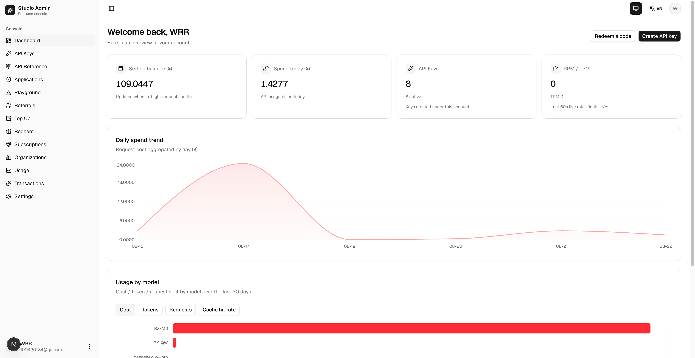
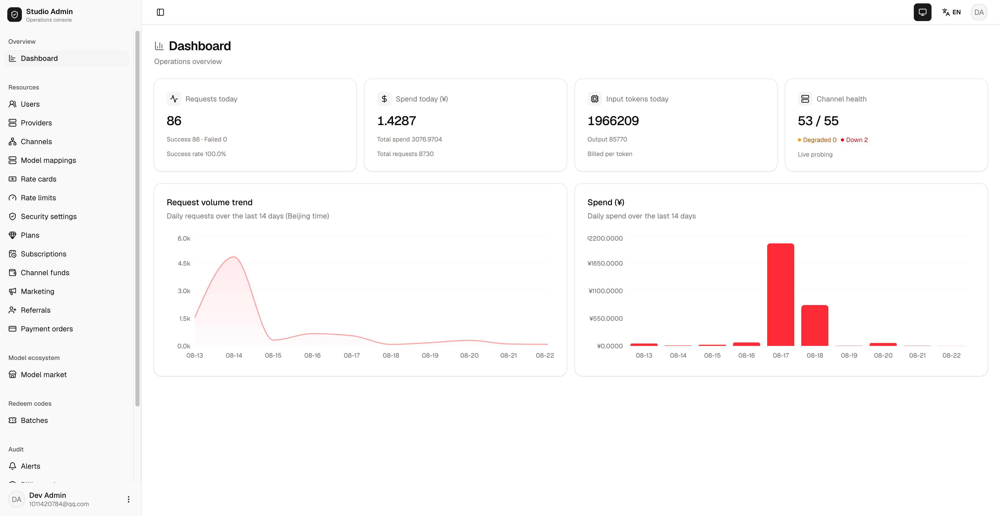

# Tillgate

**[中文文档](README.zh-CN.md)** | [docs](docs/) | [CHANGELOG](CHANGELOG.md)


Tillgate is a self-hosted, production-grade **LLM API gateway**: one OpenAI-compatible endpoint in front of many upstream providers, with wallet-based metered billing, subscriptions, quota enforcement, and full observability. Built entirely on [Bun](https://bun.com) — Hono + Drizzle + PostgreSQL + Redis on the backend, Next.js 16 + React 19 + Tailwind v4 + shadcn/ui for the two consoles.

```
client / agent ──> gateway (/v1, OpenAI-compatible)
                     ├── routing & failover ──> OpenAI / DeepSeek / MiniMax / Qwen / Gemini / Anthropic …
                     ├── hold → settle billing (double-entry ledger, PostgreSQL authoritative)
                     └── traces / TTFT / usage logs ──> admin console
```

## Screenshots

**User console** (left) — balance & spend overview, daily cost trend, usage by model, API keys.
**Admin console** (right) — request/spend/token KPIs, channel health, 14-day trends, full operations surface.

<p align="center">
  
  
</p>

## Repository layout

A Turborepo monorepo of 7 apps + 14 capability packages. Business capabilities are aggregated into
packages with a uniform `domain / application / ports / adapters` layering; apps are thin assembly
units (config + HTTP shell + wiring). See
[docs/project-structure-refactoring.md](docs/project-structure-refactoring.md) for the target
structure and migration discipline, and [AGENTS.md](AGENTS.md) for engineering standards.

```
apps/       gateway · client-api · admin-api · worker · trace-receiver · client · admin   (assembly units)
packages/   ai · inference · billing · accounts · identity · control-plane · notifications ·
            observability · http · db · errors · runtime · api-client · ui                (capabilities)
e2e/        cross-process system tests (mock / real / smoke gates)
docs/       architecture decisions (adr/), ops handbooks, deep-dive guides
```

## Quick Start

### Installation — Option 1: Local development

Run from source with hot reload (for development and contribution).
Prerequisites: [Bun](https://bun.com) ≥ 1.4 and Docker (for PostgreSQL + Redis only).

```bash
git clone https://github.com/renxqoo/Tillgate.git && cd Tillgate
bun install                        # dependencies (bun.lock)
cp .env.example .env               # required keys only; everything else has safe defaults
# generate the required secrets (weak/empty values refuse to boot):
for k in JWT_SECRET ADMIN_JWT_SECRET ENCRYPTION_KEY IDENTITY_CODE_PEPPER CLIENT_CODE_PEPPER CHANNEL_API_KEY_ENCRYPTION; do
  sed -i.bak -E "s|^#?[[:space:]]?${k}=.*|${k}=$(openssl rand -hex 32)|" .env; done; rm -f .env.bak
docker compose -f docker/compose.dev.yml up -d   # postgres + redis
bun packages/db/scripts/provision-fresh.ts   # fresh-db pre-provision (idempotent; required before first migrate)
bun run db:migrate                 # schema (91 migrations, idempotent)
cd apps/admin-api && bun scripts/create-admin.ts --email=admin@ai-gateway.local --password=admin12345 --apply && cd ../..
bun dev                            # turbo dev — all seven apps, hot reload
```

Bootstrap creates a dev admin (`admin@ai-gateway.local` / `admin12345` — dev only; in production
use the same script without `--password` so a strong one-time password is generated). No other
seed data exists: users self-register, channels/model mappings/rate cards are created in the
admin console (no rate card = coefficient 1.0 by design).

Ports: gateway `8080` · client-api `8081` · admin-api `8082` · trace-receiver `8793` ·
worker health `8792` · client console `3001` · admin console `3002`.

### Installation — Option 2: Docker deployment

Full production stack behind nginx with TLS (all services containerized).
Prerequisites: Docker 24+ with the compose plugin; DNS A records for two domains
(e.g. `app.example.com` / `admin.example.com`) pointing at the server; ports 80/443 open.

```bash
# 1) Get the code
git clone https://github.com/renxqoo/Tillgate.git && cd Tillgate

# 2) Production .env — the ONLY config surface
cp .env.example .env && vim .env
#   Must change: JWT_SECRET / ADMIN_JWT_SECRET / ENCRYPTION_KEY / IDENTITY_CODE_PEPPER /
#   CLIENT_CODE_PEPPER / CHANNEL_API_KEY_ENCRYPTION (strong random),
#   POSTGRES_PASSWORD / REDIS_PASSWORD;
#   NODE_ENV=production. DATABASE_URL / REDIS_URL are injected by compose automatically.

# 3) Start infrastructure + run one-time migration
docker compose -f docker/compose.yml up -d postgres redis
docker compose -f docker/compose.yml up --build migrate   # idempotent; exits when done

# 4) First TLS certificate (standalone; nginx not up yet)
docker compose -f docker/compose.yml run --rm --entrypoint certbot -p 80:80 certbot \
  certonly --standalone --cert-name gateway \
  -d app.example.com -d admin.example.com \
  --email you@example.com --agree-tos --no-eff-email

# 5) Bring up the full stack (first build takes ~10 min)
docker compose -f docker/compose.yml up -d --build

# 6) Verify
curl -s http://localhost/livez          # {"ok":true}
docker compose -f docker/compose.yml ps # all Up (migrate Exited(0) is expected)
```

Post-deploy musts: point payment webhooks at
`https://app.example.com/v1/payments/notify/epay|stripe` (missing = top-ups never credited);
renew certs before expiry (certbot renew + nginx reload, cron recommended);
optional observability stack with `--profile obs`.
Full checklist: [docs/deployment-checklist.md](docs/deployment-checklist.md) ·
HA topology: [docs/ha-deployment.md](docs/ha-deployment.md).

### Usage

1. Sign in to the **admin console** (`http://localhost:3002`) with the seeded admin account
   (`admin@ai-gateway.local` by default; in production create admins via the invite flow).
   Add an upstream **channel** (provider API key) and a **model mapping** (public model name →
   real model × channels). Outbound calls pass a built-in SSRF guard (HTTPS only; loopback and
   private-network hosts are rejected, with per-address DNS resolution checks).
2. In the **user console** (`http://localhost:3001`), create an **API key** (optional per-key
   RPM/TPM limits, daily spend cap, model allowlist).
3. Call it like OpenAI:

```bash
curl http://localhost:8080/v1/chat/completions \
  -H "Authorization: Bearer sk-..." -H "Content-Type: application/json" \
  -d '{"model":"gpt-4o-mini","messages":[{"role":"user","content":"hi"}],"stream":true}'
```

Production deployment (TLS, certbot, nginx, observability stack, HA topology) is a single compose
file — see the [deployment checklist](docs/deployment-checklist.md) and
[HA deployment guide](docs/ha-deployment.md). **Never keep the default `.env` secrets in
production** — rotate `POSTGRES_PASSWORD`, `REDIS_PASSWORD`, `JWT_SECRET`, `ADMIN_JWT_SECRET`,
`ENCRYPTION_KEY`.

## Features

- **OpenAI-compatible gateway** — `/v1/chat/completions` (streaming & non-streaming), `/v1/embeddings`, multimodal input, plus native Gemini (`/v1beta`) and Anthropic protocol endpoints. Dual credentials: static API keys and gateway-issued App JWTs (`/oauth/token`) for agents.
- **Multi-provider transport library** (`packages/ai`) — a standalone, zero-internal-dependency upstream library ([ADR-0006](docs/adr/0006-ai-standalone-library.md)): protocol adapters for OpenAI-compatible / Anthropic / Gemini / Azure OpenAI / AWS Bedrock / Vertex AI / MiniMax / dashscope (Qwen), SSE relay with zero buffering, upstream usage normalization, a token estimator for providers that don't report usage, per-vendor parameter-quirk profiles, SSRF hard guard.
- **Channel routing & failover** (`packages/inference`) — model mappings × weighted channels, per-channel budget and probing, circuit breaker, dead-credential admission, retry with channel switch.
- **Wallet billing** (`packages/billing`) — the single source of truth for money: double-entry ledger, idempotent hold → settle flow (command fingerprints + replay), an 8-state settlement state machine, funding waterfall (subscription quota → PAYG balance), crash recovery and reconciliation ([ADR-0003](docs/adr/0003-wallet-ledger-merge-into-billing.md)).
- **Subscriptions & pricing** — plans, rate cards (official price × coefficient), free daily quotas, upgrade/downgrade, redeem codes and referral credits.
- **API keys & quotas** — per-key RPM/TPM, per-key daily spend caps, model allowlists, organization member billing; user-level limits always apply regardless of credential type.
- **Payments** — EPAY and Stripe online top-up with webhook reconciliation.
- **Async generation** — video / music task submission, polling, and callback-based settlement.
- **Observability** (`packages/observability`) — OTLP trace ingestion with per-trace and topology views, **dual TTFT metrics** (upstream vs client-perceived first-token latency, P50 + P95 per channel), usage/request/audit logs, ops dashboards. See [docs/observability.md](docs/observability.md).
- **Notifications & alerts** — transactional-outbox alert delivery (worker), webhook / email notification channels, optional email verification-code second factor for admin sign-in.
- **Resilience** — Redis Sentinel support; graded degradation when Redis is down (rate limiting fail-open, brute-force guard degraded to in-memory, free-quota fail-closed); settlement wakeups over PostgreSQL LISTEN/NOTIFY — no queue middleware.
- **Two consoles** — admin (channels, models, rate cards, users, subscriptions, payments, observability) and client (keys, usage, billing, playground), consuming the APIs through a typed client (`packages/api-client`).
- **Executable architecture** — package boundaries (dependency whitelist, explicit exports, no cycles) are enforced in CI by `scripts/check-package-boundaries.ts`; every capability carries DESIGN / IMPLEMENTATION / MIGRATION docs ([AGENTS.md](AGENTS.md) §13).

## Summary

Tillgate gives teams that resell or aggregate LLM APIs the infrastructure that usually takes
months to build: a compatible front door, provider failover, a billing ledger that survives
crashes, quota enforcement on every dimension, and tracing that shows exactly where latency and
money go. Deep dives: [billing flow](docs/billing-flow-deep-dive.md) ·
[gateway pipeline](docs/gateway-pipeline.md) · [tech stack](docs/tech-stack.md) ·
[API contract](docs/api-contract.md) · [engineering standards](AGENTS.md).

## License

Released under the [MIT License](LICENSE). © 2026 Tillgate contributors.
