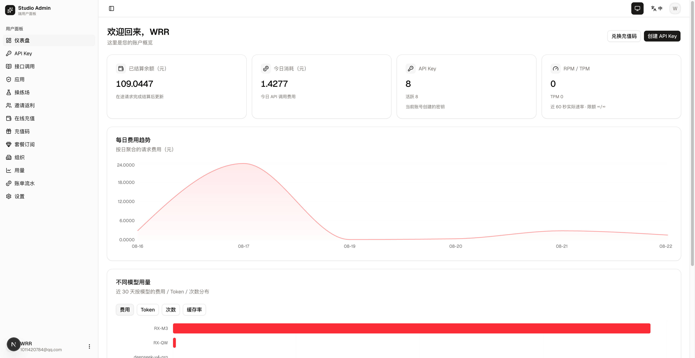
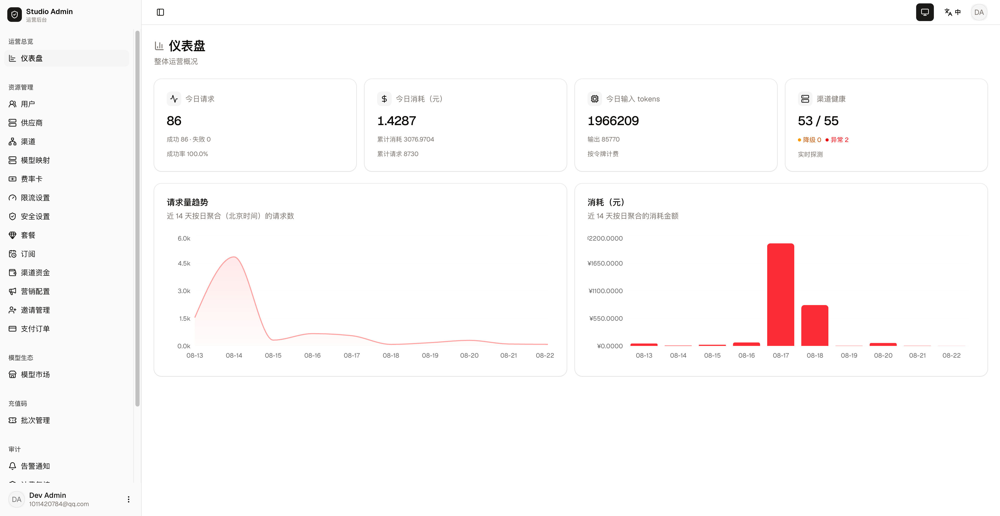

# TokenLens

**[English](README.md)** | [文档](docs/) | [CHANGELOG](CHANGELOG.md)

TokenLens 是一个可自托管的生产级 **LLM API 网关**：用统一的 OpenAI 兼容入口代理多家上游供应商，内置钱包计量计费、订阅体系、限额管控与全链路可观测。全链构建于 [Bun](https://bun.com)——后端 Hono + Drizzle + PostgreSQL + Redis，控制台 Next.js 16 + React 19 + Tailwind v4 + shadcn/ui。

```
客户端 / Agent ──> 网关 (/v1，OpenAI 兼容)
                     ├── 路由与故障转移 ──> OpenAI / DeepSeek / MiniMax / 通义千问 / Gemini / Anthropic …
                     ├── 预扣 → 结算计费（双分录账本，PostgreSQL 权威）
                     └── 链路追踪 / TTFT / 用量日志 ──> 管理后台
```

## 界面预览

**用户面板**（左）—— 余额与消费总览、每日费用趋势、模型用量、API 密钥管理。
**管理后台**（右）—— 今日请求/消费/Token 指标、渠道健康度、14 天趋势与全量运营面。

<p align="center">
  
  
</p>

## 仓库结构

Turborepo monorepo：7 个应用 + 14 个能力包。业务能力按真实边界聚合为包，
包内统一 `domain / application / ports / adapters` 分层；应用是薄装配单元（配置 + HTTP 壳 + 接线）。
目标结构与迁移纪律见 [docs/project-structure-refactoring.md](docs/project-structure-refactoring.md)，
工程规范见 [AGENT.md](AGENT.md)。

```
apps/       gateway · client-api · admin-api · worker · trace-receiver · client · admin   （装配单元）
packages/   ai · inference · billing · accounts · identity · control-plane · notifications ·
            observability · http · db · errors · runtime · api-client · ui                （能力包）
e2e/        跨进程系统测试（mock / real / smoke 四个门）
docs/       架构决策（adr/）、运维手册、深读导读
```

## 快速开始

### 安装 —— 方式一：本地运行

源码直跑 + 热重载（开发/贡献用）。前置条件：[Bun](https://bun.com) ≥ 1.4 与 Docker
（仅用来跑 PostgreSQL + Redis）。

```bash
git clone https://github.com/renxqoo/TokenLens-v2.git && cd TokenLens-v2
bun install                        # 安装依赖（bun.lock）
cp .env.example .env               # 只含必填键；其余配置全部有安全默认值
# 生成必填密钥（弱值/空值启动即拒绝）：
for k in JWT_SECRET ADMIN_JWT_SECRET ENCRYPTION_KEY IDENTITY_CODE_PEPPER CLIENT_CODE_PEPPER CHANNEL_API_KEY_ENCRYPTION; do
  sed -i.bak -E "s|^#?[[:space:]]?${k}=.*|${k}=$(openssl rand -hex 32)|" .env; done; rm -f .env.bak
docker compose -f docker/compose.dev.yml up -d   # 起 postgres + redis
bun run db:migrate                 # 建表（76 个迁移，幂等）
bun run db:seed                    # 开发种子：管理员 + 用户 + 费率卡 + 渠道 + 模型映射
bun dev                            # turbo dev —— 全部七个应用，热重载
```

种子脚本会创建开发管理员（`admin@ai-gateway.local` / `admin12345`，仅开发用）、示例用户、
费率卡；若 `.env` 配了 `DEEPSEEK_API_KEY` 还会建 DeepSeek 渠道与模型映射，
并打印一把虚拟测试 Key（`sk_…`）。

端口：网关 `8080` · client-api `8081` · admin-api `8082` · trace-receiver `8793` ·
worker 健康 `8792` · 用户面板 `3001` · 管理后台 `3002`。

### 安装 —— 方式二：Docker 部署

生产全套：所有服务容器化，nginx 前门 + TLS。前置条件：Docker 24+ 与 compose 插件；
两个域名的 A 记录（如 `app.example.com` / `admin.example.com`）已指向服务器；
防火墙放行 80/443。

```bash
# 1) 获取代码
git clone https://github.com/renxqoo/TokenLens-v2.git && cd TokenLens-v2

# 2) 生产 .env —— 唯一配置面
cp .env.example .env && vim .env
#   必改：JWT_SECRET / ADMIN_JWT_SECRET / ENCRYPTION_KEY / IDENTITY_CODE_PEPPER /
#   CLIENT_CODE_PEPPER / CHANNEL_API_KEY_ENCRYPTION（强随机）、
#   POSTGRES_PASSWORD / REDIS_PASSWORD；
#   NODE_ENV=production。DATABASE_URL / REDIS_URL 由 compose 自动注入，无需手填。

# 3) 起基础设施 + 一次性迁移
docker compose -f docker/compose.yml up -d postgres redis
docker compose -f docker/compose.yml up --build migrate   # 幂等，跑完自动退出

# 4) 首次 TLS 证书（standalone 模式——此刻 nginx 还没起）
docker compose -f docker/compose.yml run --rm --entrypoint certbot -p 80:80 certbot \
  certonly --standalone --cert-name gateway \
  -d app.example.com -d admin.example.com \
  --email you@example.com --agree-tos --no-eff-email

# 5) 全量启动（首次构建约 10 分钟）
docker compose -f docker/compose.yml up -d --build

# 6) 验证
curl -s http://localhost/livez          # {"ok":true}
docker compose -f docker/compose.yml ps # 全部 Up（migrate 为 Exited(0) 属正常）
```

上线后必做：支付回调地址指向 `https://app.example.com/v1/payments/notify/epay|stripe`
（漏配 = 充值不入账）；证书到期前续期（certbot renew + nginx reload，建议 cron）；
可选观测栈 `--profile obs`。完整清单见[部署清单](docs/deployment-checklist.md)，
高可用拓扑见[高可用部署手册](docs/ha-deployment.md)。

### 如何使用

1. 登录**管理后台**（`http://localhost:3002`），本地用种子脚本创建的管理员
   （`admin@ai-gateway.local`；生产走邀请制创建管理员）。添加上游**渠道**（供应商 API Key）
   与**模型映射**（对外模型名 → 真实模型 × 渠道）。出站调用有内置 SSRF 硬防护
   （仅允许 HTTPS；环回/内网地址一律拒绝，DNS 解析后逐地址校验防 rebinding）。
2. 在**用户面板**（`http://localhost:3001`）创建 **API Key**（可选按 Key 的 RPM/TPM 限额、
   日消费上限、模型白名单）。
3. 像 OpenAI 一样调用：

```bash
curl http://localhost:8080/v1/chat/completions \
  -H "Authorization: Bearer sk-..." -H "Content-Type: application/json" \
  -d '{"model":"gpt-4o-mini","messages":[{"role":"user","content":"hi"}],"stream":true}'
```

生产部署（TLS、certbot、nginx、观测栈、HA 拓扑）是一套 compose 文件——见
[部署清单](docs/deployment-checklist.md)与[高可用部署手册](docs/ha-deployment.md)。
**生产环境切勿保留 `.env` 默认密钥**——必须轮换 `POSTGRES_PASSWORD`、`REDIS_PASSWORD`、
`JWT_SECRET`、`ADMIN_JWT_SECRET`、`ENCRYPTION_KEY`。

## 具体功能

- **OpenAI 兼容网关** — `/v1/chat/completions`（流式/非流式）、`/v1/embeddings`、多模态输入，另有 Gemini（`/v1beta`）与 Anthropic 原生协议入口；双凭证：静态 API Key 与网关签发的 App JWT（`/oauth/token`，面向 Agent）。
- **多供应商传输库**（`packages/ai`）— 独立上游库、零内部依赖（[ADR-0006](docs/adr/0006-ai-standalone-library.md)）：OpenAI 兼容 / Anthropic / Gemini / Azure OpenAI / AWS Bedrock / Vertex AI / MiniMax / 通义千问（dashscope）八协议适配，零缓冲 SSE 中继，上游 usage 归一，token 估算器（兜底不回报 usage 的供应商），厂商参数怪癖档案，SSRF 硬门。
- **渠道路由与故障转移**（`packages/inference`）— 模型映射 × 加权渠道、渠道级预算与探活、熔断器、死凭据准入、换渠重试。
- **钱包计费**（`packages/billing`）— 资金与计费唯一事实源：双分录账本、幂等预扣 → 结算（命令指纹 + 冲突重放）、8 态结算状态机、资金来源瀑布（订阅额度 → PAYG 余额）、崩溃恢复与对账（[ADR-0003](docs/adr/0003-wallet-ledger-merge-into-billing.md)）。
- **订阅与定价** — 套餐、费率卡（官方价 × 系数）、免费日限、升降级、充值码与邀请返利。
- **API Key 与限额** — 按 Key 的 RPM/TPM、日消费上限、模型白名单、组织成员计费；无论何种凭证形态，用户级限额恒生效。
- **在线支付** — EPAY 与 Stripe 充值，webhook 对账入账。
- **异步生成** — 视频 / 音乐任务提交、轮询与回调结算。
- **可观测**（`packages/observability`）— OTLP 链路追踪接收（单 trace 视图 + 拓扑图）、**双向 TTFT 指标**（上游 vs 客户端体感首 token 延迟，按渠道 P50 + P95）、usage/request/audit 三类日志与运营看板。见[可观测手册](docs/observability.md)。
- **通知与告警** — 事务性发件箱驱动的告警投递（worker）、Webhook / 邮件通知渠道、管理员可选邮箱验证码二次登录。
- **故障韧性** — Redis Sentinel 支持；Redis 故障分级降级（限流 fail-open、爆破防护降级内存粗限、免费日限 fail-closed）；结算唤醒走 PostgreSQL LISTEN/NOTIFY——无队列中间件依赖。
- **双控制台** — 管理后台（渠道/模型/费率卡/用户/订阅/支付/观测）与用户面板（Key/用量/账单/操练场），经类型化客户端（`packages/api-client`）消费 API。
- **可执行架构** — 包边界（依赖白名单、显式 exports、无环）由 `scripts/check-package-boundaries.ts` 在 CI 强制执行；每个能力包带 DESIGN / IMPLEMENTATION / MIGRATION 文档（[AGENT.md](AGENT.md) §9）。

## 总结

TokenLens 面向需要聚合或转售 LLM API 的团队，把通常要花数月自建的基础设施开箱化：兼容入口、供应商故障转移、能扛住崩溃的计费账本、全维度限额，以及能看清延迟与钱花在哪的链路追踪。深入阅读：[扣款全流程](docs/billing-flow-deep-dive.md) · [网关管线](docs/gateway-pipeline.md) · [技术选型](docs/tech-stack.md) · [API 契约](docs/api-contract.md) · [工程规范](AGENT.md)。

## 开源声明

以 [MIT 许可证](LICENSE) 开源。© 2026 TokenLens 贡献者。
