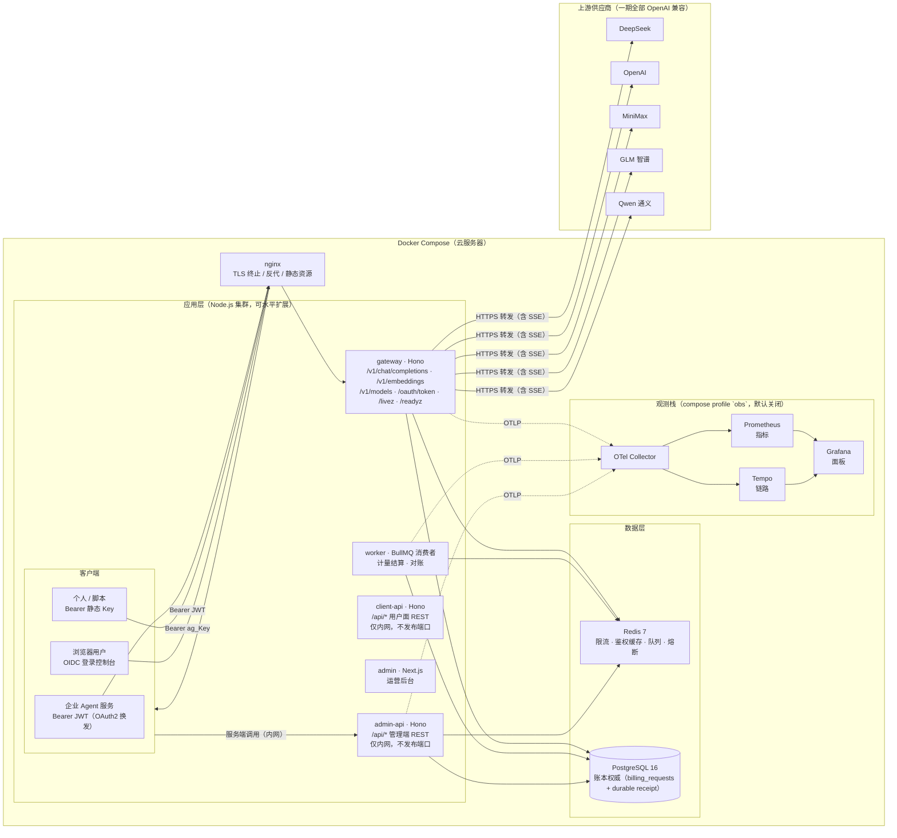
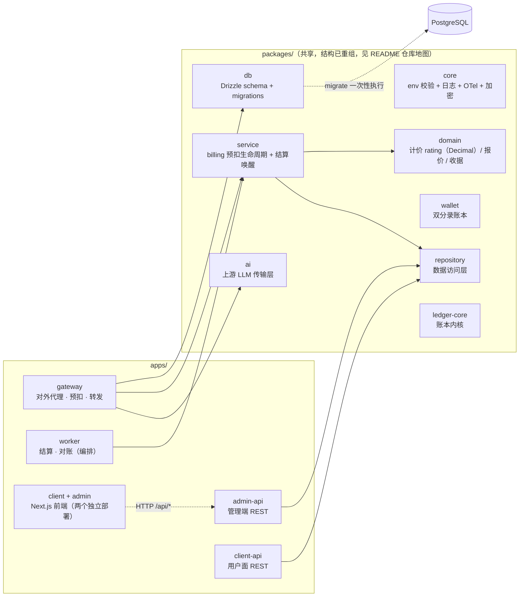
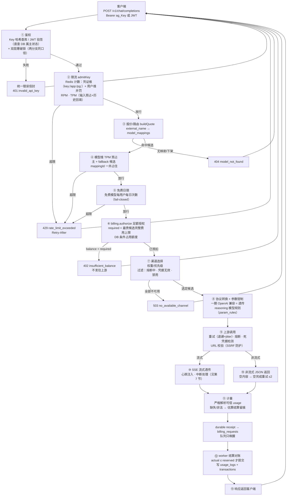
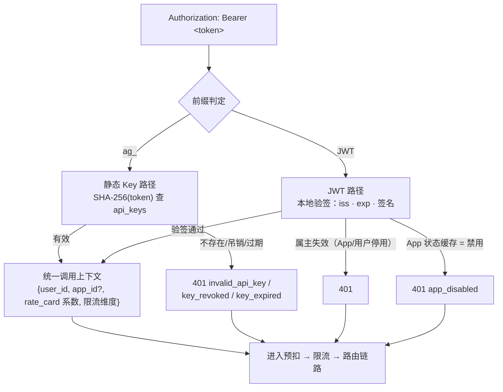
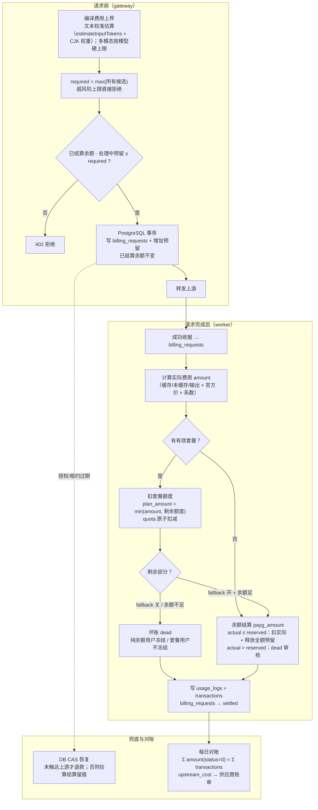
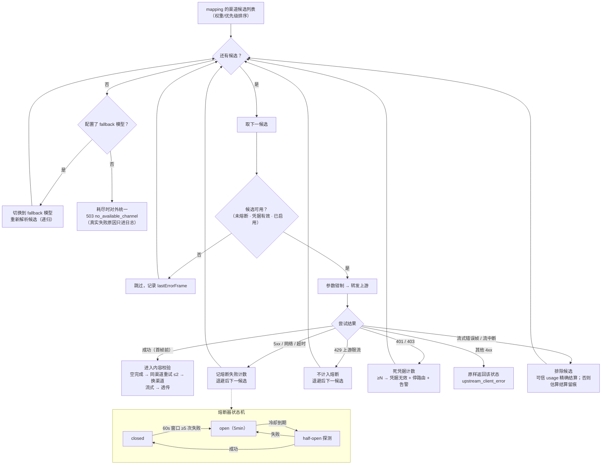
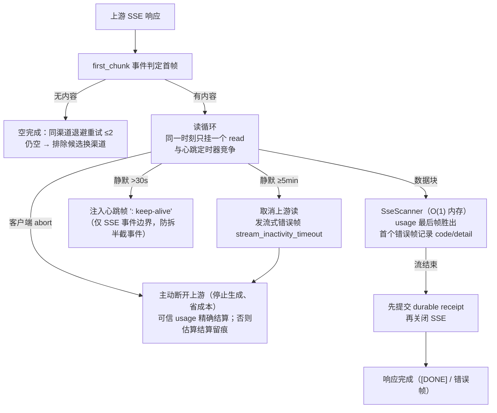
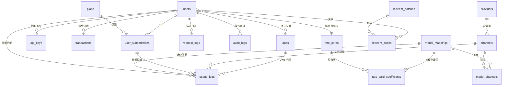

# AI Gateway 架构与流程图（总览）

> 注：本文为 v1 总览设计文档（含 uncertain 状态等 v1 语义）。生产 v2 计费/扣款口径
> （gateway + wallet 双分录）见 [`billing-flow-deep-dive.md`](billing-flow-deep-dive.md)。

> 视觉配套文档，由四份设计文档生成：`requirements.md`（业务）、`data-model.md`（数据）、`api-contract.md`（接口）、`tech-stack.md`（选型）。
> 本文所有图均为 mermaid，支持在 GitHub / 支持 mermaid 的 Markdown 查看器中渲染。

---

## 1. 部署架构图

---

## 2. 模块关系图（monorepo）

---

## 3. 请求全生命周期流程图

---

## 4. 鉴权双凭证流程图

---

## 5. 计费预扣与结算流程图（含套餐判定）

---

## 6. 渠道故障转移与熔断流程图

---

## 7. 流式中继与中断处理流程图

---

## 8. 核心数据关系图（ER 简化）

---

## 9. 各图对应的设计文档

| 图 | 对应章节 |
|---|---|
| 1 部署架构 | tech-stack §4（Docker Compose） |
| 2 模块关系 | tech-stack §2（monorepo） |
| 3 请求生命周期 | requirements §3（链路） |
| 4 鉴权双凭证 | requirements §4.2 |
| 5 预扣与结算 | requirements §4.7 · data-model §5 |
| 6 故障转移与熔断 | requirements §4.3/§4.4 · 规则 5.9/5.10/5.15/5.16 |
| 7 流式中继 | requirements §5.11 · api-contract §2.1 |
| 8 数据关系 | data-model §3 |
