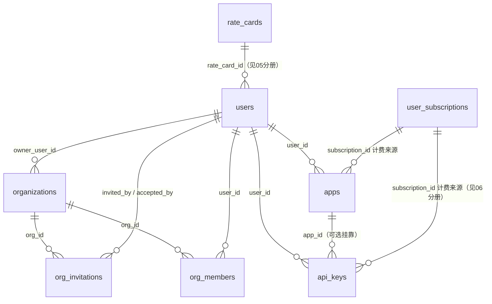

# 02 · 账号与组织（users / admins / organizations / org_members / org_invitations / api_keys / apps）

> 源码：`packages/db/src/schema/users.ts`、`admins.ts`、`organizations.ts`、`org-members.ts`、`org-invitations.ts`、`api-keys.ts`、`apps.ts`、`account-status.ts`。
> 业务实现：`packages/accounts`。

## 0. 这个域的账号模型

平台有**三类主体**，物理分表、绝不混装：

| 主体 | 表 | 登录方式 | 持有什么 |
|---|---|---|---|
| C 端用户 | users | OIDC 三方 或 本地邮箱密码（经 identity 内核） | 余额、费率卡、API Key、订阅、组织 |
| 后台管理员 | admins | 仅本地 email + scrypt 密码，邀请制 | 只有后台操作身份 + RBAC 角色 |
| 应用（Agent 凭证） | apps | client_id + client_secret（JWT 签发方） | 无登录态，纯机器凭证 |

users 与 admins 是「严格互斥」设计：一个人要既用网关（充值、调 API）又管后台，必须两个账号、两次登录。管理员**不持有任何用户业务数据**（余额/费率卡/凭证/调用记录一张不沾），这从根上缩小了后台账号泄露的爆炸半径。

账号状态词表 `ACCOUNT_STATUS = { ACTIVE:0, BANNED:1, DELETED:2 }`（`account-status.ts`），users/admins 共用，`isAccountUsable(status)` 是登录/验码/会话中间件的单一判定。

---

## 1. users — 用户/企业账户

### 为什么需要它

C 端一切的挂靠点：计费、Key、订阅、组织成员、日志都 `user_id` 指过来。这张表只放「账户身份 + 账户级策略」，**刻意不放任何余额列**（资金事实唯一在 wallet，见 04 分册）——同一个人在系统里的钱只有一处真相。

### 字段明细

| 字段 | 类型 | 约束 | 含义 |
|---|---|---|---|
| id | bigserial | PK | 用户 ID |
| issuer | varchar(64) | NOT NULL，UNIQUE(issuer,subject) 之一 | 身份签发方；本地账号固定 `'local'`，OIDC 为 issuer URL |
| subject | varchar(255) | NOT NULL，UNIQUE(issuer,subject) 之一 | 签发方侧用户唯一 ID（OIDC sub） |
| identity_provider | varchar(16) | NOT NULL | 身份提供方标记（local/github/google…） |
| email | varchar(255) | 可空；本地账号部分唯一 | 邮箱 |
| display_name | varchar(64) | 可空 | 昵称 |
| rate_card_id | bigint | FK → rate_cards.id，可空 | 绑定的费率卡（NULL=默认卡），决定用户单价系数 |
| daily_spend_limit | numeric(38,18) | 可空 | 每日花费上限（元，NULL=不限），见下文 |
| status | smallint | NOT NULL 默认 0，CHECK ∈ {0,1,2} | 账号状态 |
| is_enterprise | boolean | NOT NULL 默认 false | 企业用户可购团队套餐（席位制）；个人固定 1 席 |
| freeze_reason | varchar(128) | 可空 | 封禁原因 |
| rpm_limit / tpm_limit | bigint | 可空 | 用户级限流（NULL=继承全局默认） |
| last_login_at | timestamptz | 可空 | 最近登录成功时间 |
| created_at / updated_at | timestamptz | 默认 now() | 行时间 |

### 建表 SQL（等价 DDL，由 drizzle 声明直译）

```sql
CREATE TABLE users (
  id bigserial PRIMARY KEY,
  issuer varchar(64) NOT NULL,
  subject varchar(255) NOT NULL,
  identity_provider varchar(16) NOT NULL,
  email varchar(255),
  display_name varchar(64),
  rate_card_id bigint REFERENCES rate_cards(id),
  daily_spend_limit numeric(38, 18),
  status smallint NOT NULL DEFAULT 0,
  is_enterprise boolean NOT NULL DEFAULT false,
  freeze_reason varchar(128),
  rpm_limit bigint,
  tpm_limit bigint,
  last_login_at timestamptz,
  created_at timestamptz NOT NULL DEFAULT now(),
  updated_at timestamptz NOT NULL DEFAULT now()
);
CREATE UNIQUE INDEX users_issuer_subject_uq ON users (issuer, subject);
-- 本地账号邮箱唯一：部分唯一索引只约束 issuer='local' 的行
CREATE UNIQUE INDEX users_local_email_uq ON users (email)
  WHERE issuer = 'local' AND email IS NOT NULL;
CREATE INDEX users_rate_card_id_idx ON users (rate_card_id);
CHECK users_status_ck: status IN (0, 1, 2)
```

### 设计要点

- **UNIQUE(issuer, subject)**：OIDC 的 sub 只在自己 issuer 内唯一（不同签发方的 sub 互不相干），所以唯一键必须带 issuer；本地账号 issuer='local'、subject 自造，融入同一约束。
- **email 的部分唯一索引**：只有本地账号拿 email 当登录标识才要求唯一；OIDC 用户的 email 只是展示属性（可能缺失、可能与他人重复），不受约束——`WHERE issuer='local' AND email IS NOT NULL` 一行写清。
- **daily_spend_limit 的定位**：RPM/TPM 只挡「频率」，这个挡「总量」——防羊毛党细水长流。判定口径：当日已结算消费 + 在途敞口 + 本次预估 ≤ 限额。与 api_keys.daily_spend_limit、org_members.daily_spend_limit 三层闸门独立生效（都设则双闸）。
- **表内无 balance 列**是刻意的（表注释原话：「资金事实唯一在 wallet」）。看到旧项目在 user 表放 balance 的同学请特别注意这一点。

---

## 2. admins — 管理员账户

### 字段明细

| 字段 | 类型 | 约束 | 含义 |
|---|---|---|---|
| id | bigserial | PK | 管理员 ID |
| email | varchar(255) | NOT NULL，UNIQUE | 登录账号（邀请制分配） |
| display_name | varchar(64) | 可空 | 显示名 |
| status | smallint | NOT NULL 默认 0，CHECK ∈ {0,1,2} | 账号状态 |
| role_id | bigint | NOT NULL，FK → roles.id | RBAC 角色（动态角色体系，见 03 分册） |
| two_factor_enabled | boolean | NOT NULL 默认 false | 邮箱验证码二次登录开关（SMTP 未配置时开启失败） |
| last_login_at | timestamptz | 可空 | 最近登录 |
| created_at / updated_at | timestamptz | 默认 now() | 行时间 |

### 建表 SQL（等价 DDL，由 drizzle 声明直译）

```sql
CREATE TABLE admins (
  id bigserial PRIMARY KEY,
  email varchar(255) NOT NULL,
  display_name varchar(64),
  status smallint NOT NULL DEFAULT 0,
  role_id bigint NOT NULL REFERENCES roles(id),
  two_factor_enabled boolean NOT NULL DEFAULT false,
  last_login_at timestamptz,
  created_at timestamptz NOT NULL DEFAULT now(),
  updated_at timestamptz NOT NULL DEFAULT now()
);
CREATE UNIQUE INDEX admins_email_uq ON admins (email);
CONSTRAINT admins_status_ck: status IN (0, 1, 2)
```

设计要点：

- 管理员密码/TOTP 不在本表——**身份内核复用**：密码哈希在 `identity_passwords`（realm='admin' 命名空间），TOTP 单一真相在 `identity_totp`；
- `role_id` 演进史写在注释里：原先是 varchar `role` 列（固定枚举），迁移 0082 切换成 FK + 回填 NOT NULL，0083 drop 旧列——典型的「两步迁移，每步门禁可绿」范式；
- audit_logs.admin_id 指向本表（管理员操作审计的操作人，见 08 分册）。

---

## 3. organizations — 组织（企业/团队）

### 为什么需要它

个人用户直接挂自己的订阅/余额即可；团队要「一个老板买单、N 个成员共用额度」——组织就是这个共享壳。**owner 也是成员**（org_members 里占 1 席），订阅挂 org_id。

| 字段 | 类型 | 约束 | 含义 |
|---|---|---|---|
| id | bigserial | PK | 组织 ID |
| name | varchar(64) | NOT NULL | 组织名 |
| owner_user_id | bigint | NOT NULL，FK → users.id | 创建者（老板） |
| created_at / updated_at | timestamptz | 默认 now() | 行时间 |

```sql
-- 等价 DDL（由 drizzle 声明直译）
CREATE TABLE organizations (
  id bigserial PRIMARY KEY,
  name varchar(64) NOT NULL,
  owner_user_id bigint NOT NULL REFERENCES users(id),
  created_at timestamptz NOT NULL DEFAULT now(),
  updated_at timestamptz NOT NULL DEFAULT now()
);
```

一张极简的表——组织本身的属性就这么多，成员、邀请、订阅分别在下面三张表。

## 4. org_members — 组织成员关系

### 字段明细

| 字段 | 类型 | 约束 | 含义 |
|---|---|---|---|
| id | bigserial | PK | 行 ID |
| org_id | bigint | NOT NULL，FK → organizations.id | 组织 |
| user_id | bigint | NOT NULL，FK → users.id | 成员 |
| role | varchar(16) | NOT NULL 默认 'member' | owner / member（组织内角色，与管理后台 RBAC 无关） |
| status | smallint | NOT NULL 默认 0 | 0 active / 1 left |
| daily_spend_limit | numeric(38,18) | 可空 | **成员日限**：该成员在 org 套餐内单日封顶 |
| monthly_quota | numeric(38,18) | 可空 | **成员子配额**：该成员在共享额度池分到的上限 |
| created_at / updated_at | timestamptz | 默认 now() | 行时间 |

```sql
-- 等价 DDL（由 drizzle 声明直译）
CREATE TABLE org_members (
  id bigserial PRIMARY KEY,
  org_id bigint NOT NULL REFERENCES organizations(id),
  user_id bigint NOT NULL REFERENCES users(id),
  role varchar(16) NOT NULL DEFAULT 'member',
  status smallint NOT NULL DEFAULT 0,
  daily_spend_limit numeric(38, 18),
  monthly_quota numeric(38, 18),
  created_at timestamptz NOT NULL DEFAULT now(),
  updated_at timestamptz NOT NULL DEFAULT now()
);
-- 一个组织里一人一行
CREATE UNIQUE INDEX org_members_org_user_uq ON org_members (org_id, user_id);
CREATE INDEX org_members_user_idx ON org_members (user_id);
-- 席位统计走这个索引（active 成员数）
CREATE INDEX org_members_org_status_idx ON org_members (org_id, status);
```

### 设计要点：席位怎么算

**席位 = active 成员数 ≤ 订阅 quantity**（订阅可加购席位，见 06 分册）。邀请接受的事务里对组织行 `FOR UPDATE` 串行化校验，防止并发接受邀请超卖席位。

两个成员级限额列（日限 a、子配额 b）是团队管控的两把尺：日限管「每天最多花多少」，子配额管「总共最多用多少」；NULL = 不限（吃组织共享池）。

## 5. org_invitations — 组织邀请

### 为什么需要它

owner 拉人进组织的载体。安全模型：**被邀请人必须已登录 C 端，且登录账号 email 与邀请单上的 email 一致**才能接受——邀请链接发给谁，就只有谁能用。

| 字段 | 类型 | 约束 | 含义 |
|---|---|---|---|
| id | bigserial | PK | 行 ID |
| org_id | bigint | NOT NULL，FK → organizations.id | 目标组织 |
| email | varchar(255) | NOT NULL | 被邀请人邮箱（接受时校验登录账号） |
| token | varchar(64) | NOT NULL，UNIQUE | 邀请令牌（邮件链接携带） |
| invited_by_user_id | bigint | FK → users.id | 发起人（owner/管理员成员） |
| status | smallint | NOT NULL 默认 0 | 0 pending / 1 accepted / 2 revoked / 3 expired |
| expires_at | timestamptz | NOT NULL | 过期时间 |
| accepted_by_user_id | bigint | FK → users.id | 实际接受人（回执） |
| created_at / updated_at | timestamptz | 默认 now() | 行时间 |

```sql
-- 等价 DDL（由 drizzle 声明直译）
CREATE TABLE org_invitations (
  id bigserial PRIMARY KEY,
  org_id bigint NOT NULL REFERENCES organizations(id),
  email varchar(255) NOT NULL,
  token varchar(64) NOT NULL,
  invited_by_user_id bigint REFERENCES users(id),
  status smallint NOT NULL DEFAULT 0,
  expires_at timestamptz NOT NULL,
  accepted_by_user_id bigint REFERENCES users(id),
  created_at timestamptz NOT NULL DEFAULT now(),
  updated_at timestamptz NOT NULL DEFAULT now()
);
CREATE UNIQUE INDEX org_invitations_token_uq ON org_invitations (token);
CREATE INDEX org_invitations_org_idx ON org_invitations (org_id);
CREATE INDEX org_invitations_email_idx ON org_invitations (email);
```

---

## 6. api_keys — 虚拟 Key（C 端调用凭证）

### 为什么需要它

用户调网关 API 的凭证。安全底线：**明文 Key 不落库**——只在创建时展示一次，库里存 SHA-256 哈希；鉴权时把请求带来的 Key 哈希后查表（哈希列上有唯一索引，O(1) 命中）。

### 字段明细

| 字段 | 类型 | 约束 | 含义 |
|---|---|---|---|
| id | bigserial | PK | Key ID |
| key_hash | varchar(64) | NOT NULL，UNIQUE | SHA-256(完整 Key) |
| key_preview | varchar(40) | NOT NULL | 展示用 `sk_****abcd`（末 4 位），列表页不泄露完整 Key |
| user_id | bigint | NOT NULL，FK → users.id | 归属用户 |
| app_id | bigint | FK → apps.id，可空 | 可选挂到某个应用 |
| subscription_id | bigint | FK → user_subscriptions.id，可空 | **计费来源**，见下 |
| name | varchar(64) | NOT NULL | 备注名 |
| remark | varchar(255) | 可空 | 备注 |
| expires_at | timestamptz | 可空 | 过期时间 |
| rpm_limit / tpm_limit | bigint | 可空 | Key 级限流（NULL=继承用户/全局） |
| daily_spend_limit | numeric(38,18) | 可空 | Key 级日限（团队场景：给团员 Key 单设日闸） |
| allow_payg_fallback | boolean | NOT NULL 默认 false | 包月额度耗尽是否自动转 PAYG 扣余额（见下） |
| status | smallint | NOT NULL 默认 0 | 0 有效 / 1 吊销 |
| last_used_at | timestamptz | 可空 | 最近使用（活跃度统计） |
| revoked_at | timestamptz | 可空 | 吊销时间 |
| created_at | timestamptz | 默认 now() | 创建时间 |

### 建表 SQL（等价 DDL，由 drizzle 声明直译）

```sql
CREATE TABLE api_keys (
  id bigserial PRIMARY KEY,
  key_hash varchar(64) NOT NULL,          -- 鉴权查询键：请求 Key 哈希后命中此唯一索引
  key_preview varchar(40) NOT NULL,
  user_id bigint NOT NULL REFERENCES users(id),
  app_id bigint REFERENCES apps(id),
  subscription_id bigint REFERENCES user_subscriptions(id),  -- 计费来源单一真相
  name varchar(64) NOT NULL,
  remark varchar(255),
  expires_at timestamptz,
  rpm_limit bigint,
  tpm_limit bigint,
  daily_spend_limit numeric(38, 18),
  allow_payg_fallback boolean NOT NULL DEFAULT false,
  status smallint NOT NULL DEFAULT 0,
  last_used_at timestamptz,
  revoked_at timestamptz,
  created_at timestamptz NOT NULL DEFAULT now()
);
CREATE UNIQUE INDEX api_keys_key_hash_uq ON api_keys (key_hash);
CREATE INDEX api_keys_user_id_idx ON api_keys (user_id);
CREATE INDEX api_keys_app_id_idx ON api_keys (app_id);
CREATE INDEX api_keys_subscription_id_idx ON api_keys (subscription_id);
```

### 设计要点：subscription_id 是「计费开关」

api_keys 的核心复杂度不在鉴权在计费。`subscription_id` 显式绑定「这把 Key 的请求扣哪个账户的钱」：

- NULL = 扣**成员自己的余额**（payg）；
- 非空 = 扣**该订阅的套餐额度**（个人订阅或所属组织的订阅）。

「换额度来源 = 换一把绑不同订阅的 Key」，gateway 鉴权时直读此列（单一真相，不猜）。`allow_payg_fallback` 是开关式排他策略：false（默认）额度不足**整单拒绝**；true 则订阅出余量 + 余额补差。注意只有 API Key 有此开关，App JWT 恒为 false（应用凭证不允许悄悄吃余额）。

## 7. apps — 应用（企业 Agent 凭证）

### 为什么需要它

面向「Agent/集成商」的另一种凭证形态：不是拿 Key 直接调，而是持 client_id/client_secret 换平台签发的 JWT 再调用（应用自己管理自己的 token 生命周期）。

| 字段 | 类型 | 约束 | 含义 |
|---|---|---|---|
| id | bigserial | PK | 应用 ID |
| app_id | varchar(32) | NOT NULL，UNIQUE | 对外应用标识 |
| user_id | bigint | NOT NULL，FK → users.id | 所属用户 |
| client_id | varchar(64) | NOT NULL，UNIQUE | 客户端 ID |
| client_secret_hash | varchar(64) | NOT NULL | SHA-256(client_secret)；明文仅创建/轮换时展示一次 |
| name | varchar(64) | NOT NULL | 应用名 |
| description | varchar(255) | 可空 | 描述 |
| subscription_id | bigint | FK → user_subscriptions.id，可空 | 计费来源（与 api_keys 同规则：NULL=余额，非空=订阅额度） |
| scope | jsonb | 可空 | 限制项 `{ models: [], rpm: N, tpm: N }` |
| status | smallint | NOT NULL 默认 0 | 0 启用 / 1 禁用 |
| created_at | timestamptz | 默认 now() | 创建时间 |
| rotated_at | timestamptz | 可空 | 密钥最近轮换时间 |

```sql
-- 等价 DDL（由 drizzle 声明直译）
CREATE TABLE apps (
  id bigserial PRIMARY KEY,
  app_id varchar(32) NOT NULL,
  user_id bigint NOT NULL REFERENCES users(id),
  client_id varchar(64) NOT NULL,
  client_secret_hash varchar(64) NOT NULL,   -- 明文仅创建/轮换时展示一次
  name varchar(64) NOT NULL,
  description varchar(255),
  subscription_id bigint REFERENCES user_subscriptions(id),
  scope jsonb,                                -- { models: string[], rpm: number, tpm: number }
  status smallint NOT NULL DEFAULT 0,
  created_at timestamptz NOT NULL DEFAULT now(),
  rotated_at timestamptz
);
CREATE UNIQUE INDEX apps_app_id_uq ON apps (app_id);
CREATE UNIQUE INDEX apps_client_id_uq ON apps (client_id);
CREATE INDEX apps_user_id_idx ON apps (user_id);
CREATE INDEX apps_subscription_id_idx ON apps (subscription_id);
```

## 8. 本域关系图



身份侧关联（无物理 FK）：users/admins 的密码、TOTP、恢复码、会话锚点都在 identity 七表，按 `user_id`（admin 走 realm='admin'）逻辑关联。
