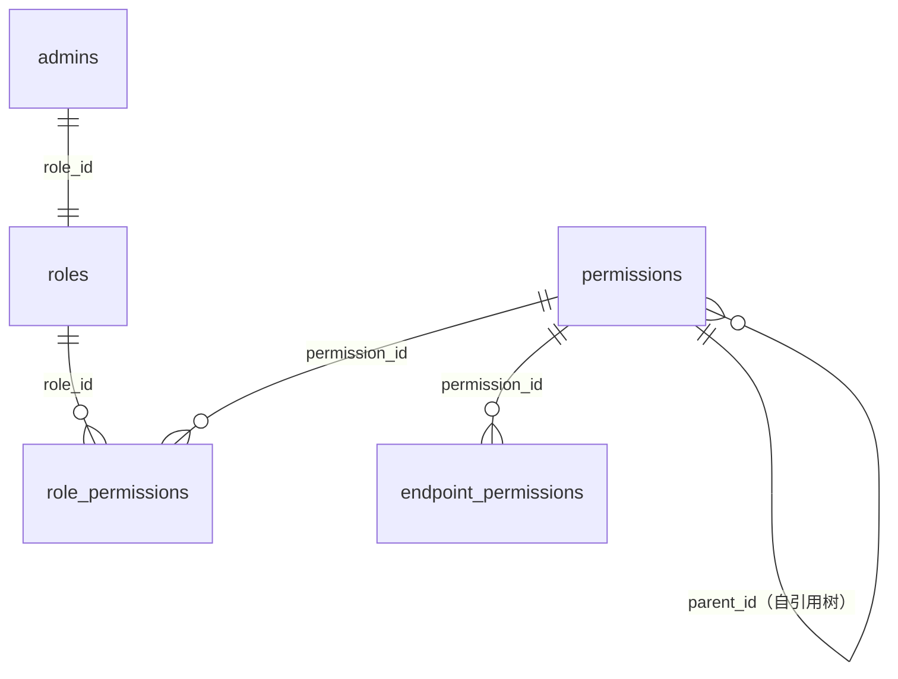

# 03 · 管理后台权限（roles / permissions / role_permissions / endpoint_permissions）

> 源码：`packages/db/src/schema/rbac.ts` · 关键迁移：`0082_rbac_v2.sql`（动态角色 + 单表权限树，varchar role → role_id FK 两步切换）、`0083_drop_admins_role.sql`（drop 旧列）、`0084_endpoint_permissions.sql`（接口权限种子落库）。

## 0. 这个域解决什么问题

管理后台（apps/admin）有成百的页面、按钮、接口，不同的运营角色（超管/财务/客服/只读运维）能看到和操作的范围不同。RBAC（基于角色的访问控制）四件套负责把「谁能干什么」**全部数据化**——加一个角色、改一个权限都是运营操作，不用发版。

先建立三个概念：

- **permissions（权限树）**：后台功能面的目录树。group（目录分组）→ page（页面）→ button（按钮级操作码）。它同时是「左侧导航菜单」和「权限判定原语」的载体；
- **roles（角色）**：一组权限的命名集合，admins.role_id 挂角色；
- **endpoint_permissions（接口绑定）**：HTTP 路由 ←→ 权限码的映射，网关侧 ACL 中间件按此放行/拒绝。

判定链路：管理员登录 → 会话里带上 role → 任意请求查 `role_permissions` join 出**权限码集合** → 前端按码渲染菜单/按钮、后端按码（经 endpoint_permissions）放行接口。

---

## 1. permissions — 单表权限树

### 为什么是「单表树」

树形结构（group → page → button）用单表 + `parent_id` 自引用表达，而不是三张表——三种节点共享 90% 字段，分表会把「挂 button 到 page」这种操作变成跨表插行。

### 字段明细

| 字段 | 类型 | 约束 | 含义 |
|---|---|---|---|
| id | bigserial | PK | 节点 ID |
| parent_id | bigint | 可空 | 父节点（group 为根，NULL；button 挂 page；page 挂 group） |
| type | varchar(16) | CHECK ∈ {group, page, button} | 节点类型 |
| code | varchar(64) | button 必填（部分唯一）；group 必空；page 除 dashboard 外必填 | **判定原语**：权限码，如 `billing:write` |
| name | varchar(128) | NOT NULL | 显示名（custom 文案 / enforced 的 fallback） |
| i18n_key | varchar(128) | 可空 | 内置节点翻译键（`nav.*`）；custom 为 NULL 走 name |
| description | varchar(512) | 可空 | 描述 |
| path | varchar(255) | 可空，page 专属 | 前端路由路径（管理 UI 前端白名单校验用） |
| icon | varchar(64) | 可空，page 专属 | lucide 图标名（前端注册表映射，未知名兜底） |
| sort_order | bigint | NOT NULL 默认 0 | 排序 |
| status | smallint | CHECK ∈ {0,1}，默认 0 | 0 正常 / 1 停用（= 该码 kill-switch，下一请求即失效；enforced 不可停用） |
| source | varchar(16) | CHECK ∈ {enforced, custom}，默认 custom | enforced=种子落库的锁死节点；custom=运营自建 |
| created_at / updated_at | timestamptz | 默认 now() | 行时间 |

### 建表 SQL（等价 DDL，由 drizzle 声明直译；迁移 0082 原文同构）

```sql
CREATE TABLE permissions (
  id bigserial PRIMARY KEY,
  parent_id bigint,                          -- 自引用树（group 为根 NULL）
  type varchar(16) NOT NULL,                 -- group | page | button
  code varchar(64),                          -- 判定原语；group 必空 / button 必填
  name varchar(128) NOT NULL,
  i18n_key varchar(128),
  description varchar(512),
  path varchar(255),                         -- page 专属：前端路由
  icon varchar(64),                          -- page 专属：lucide 图标名
  sort_order bigint NOT NULL DEFAULT 0,
  status smallint NOT NULL DEFAULT 0,
  source varchar(16) NOT NULL DEFAULT 'custom',
  created_at timestamptz NOT NULL DEFAULT now(),
  updated_at timestamptz NOT NULL DEFAULT now(),
  CONSTRAINT permissions_type_ck CHECK (type IN ('group', 'page', 'button')),
  -- 码的形状由节点类型决定：group 必无码 / button 必有码 / page 不限
  CONSTRAINT permissions_code_shape_ck CHECK (
    (type = 'group' AND code IS NULL) OR
    (type = 'button' AND code IS NOT NULL) OR
    type = 'page'
  ),
  CONSTRAINT permissions_status_ck CHECK (status IN (0, 1)),
  CONSTRAINT permissions_source_ck CHECK (source IN ('enforced', 'custom'))
);
-- 按钮码唯一（部分唯一索引：只对 button 行生效）
CREATE UNIQUE INDEX permissions_code_uq ON permissions (code) WHERE type = 'button';
CREATE INDEX permissions_parent_idx ON permissions (parent_id);
```

两条「码」约束的用意：① button 一码一节点（部分唯一索引只锁 button，因为 page 的域读码可被多页共享）；② CHECK 强制 group 必无码（纯结构）、button 必有码——`dashboard` 是唯一无码 page（全员可见）。

### enforced vs custom（锁死与自由并存）

- **enforced**：代码注册表导出的种子节点，启动时落库。语义字段（code/path/type/父子关系）**不可改**——这些字段被后端 ACL 和前端路由依赖，改了就是事故；展示字段（name/icon/sort）允许微调；
- **custom**：运营在界面上自建的节点，自由 CRUD。

### 「页面共享域读码」的规约

同一业务域的多个页面可共享一个 `域:read` 码（可见性判定走码）；写操作则是「按钮一码」——每个按钮一个独立动词码（如 `billing:write`、`user:freeze`）。全量 code 的唯一性由应用层 create/update 守卫（page 的域读码可被多页共享，所以 DB 唯一索引只锁 button）。

---

## 2. roles — 角色

| 字段 | 类型 | 约束 | 含义 |
|---|---|---|---|
| id | bigserial | PK | 角色 ID（admins.role_id 指向这里） |
| code | varchar(64) | NOT NULL，UNIQUE | 角色码 |
| name | varchar(128) | NOT NULL | 显示名 |
| description | varchar(512) | 可空 | 描述 |
| status | smallint | CHECK ∈ {0,1}，默认 0 | 0 正常 / 1 停用（**整角色 kill-switch**：名下管理员下一请求零授权） |
| is_super | boolean | NOT NULL 默认 false | **隐式全量**：不存授权行，`can()` 短路放行一切 |
| is_builtin | boolean | NOT NULL 默认 false | 5 个预置角色：不可删（可改授权/停用） |
| created_at / updated_at | timestamptz | 默认 now() | 行时间 |

```sql
-- 等价 DDL（由 drizzle 声明直译）
CREATE TABLE roles (
  id bigserial PRIMARY KEY,
  code varchar(64) NOT NULL,
  name varchar(128) NOT NULL,
  description varchar(512),
  status smallint NOT NULL DEFAULT 0,        -- 整角色 kill-switch
  is_super boolean NOT NULL DEFAULT false,   -- 隐式全量：不存授权行
  is_builtin boolean NOT NULL DEFAULT false,
  created_at timestamptz NOT NULL DEFAULT now(),
  updated_at timestamptz NOT NULL DEFAULT now(),
  CONSTRAINT roles_status_ck CHECK (status IN (0, 1))
);
CREATE UNIQUE INDEX roles_code_uq ON roles (code);
```

### 设计要点

- **is_super 为什么不存授权行**：超管如果靠授权行表达「全量」，那么每次代码新增一个权限码都得记得给超管补行——漏一次就把超管锁在门外（经典事故）。隐式全量让新码对超管自动免疫，结构上杜绝「改小权限锁死全站」；
- **双锁**：super 角色同时被 `is_super` 和 `is_builtin` 双标志保护——不可编辑、不可删除、不可停用；
- 停用角色是软杀伤：不动 admins 行，名下所有管理员下一请求即失去全部授权（判定时查角色 status）。

---

## 3. role_permissions — 角色-权限绑定

| 字段 | 类型 | 约束 | 含义 |
|---|---|---|---|
| role_id | bigint | 复合 PK 之一 | 角色 |
| permission_id | bigint | 复合 PK 之一 | 权限节点 |
| created_at | timestamptz | 默认 now() | 授权时间 |

```sql
-- 等价 DDL（由 drizzle 声明直译）
CREATE TABLE role_permissions (
  role_id bigint NOT NULL,
  permission_id bigint NOT NULL,             -- 绑 id（FK 级联），改码零漂移
  created_at timestamptz NOT NULL DEFAULT now(),
  PRIMARY KEY (role_id, permission_id)       -- 复合主键天然去重
);
CREATE INDEX role_permissions_permission_idx ON role_permissions (permission_id);
```

- 复合主键天然去重：一个角色对一个权限最多一行；
- 绑定的是 **permission_id**（FK 级联删除），不是 code——权限改码零漂移，判定时 join 出码集合即可；
- `permission_id` 上有独立索引支撑反向查询（「这个权限给了哪些角色」）。

---

## 4. endpoint_permissions — 接口权限绑定（执行面）

### 为什么需要它

权限码若只挂在按钮上，攻击者绕过前端直接打 HTTP 接口就穿了。**执行面**必须有独立的数据化 ACL：每个 admin-api 路由绑定一个权限码，全局 ACL 中间件按 (method, path) 查表——**未绑定的路由默认拒绝**（公开/自身白名单在代码侧声明）。

| 字段 | 类型 | 约束 | 含义 |
|---|---|---|---|
| id | bigserial | PK | 行 ID |
| method | varchar(10) | CHECK ∈ {GET,HEAD,POST,PUT,PATCH,DELETE} | HTTP 方法 |
| path | varchar(255) | NOT NULL | 路由路径（与 method 联合唯一） |
| permission_id | bigint | NOT NULL | 绑定的权限节点（判定时换算成码） |
| source | varchar(16) | CHECK ∈ {enforced, custom}，默认 custom | enforced=0084 种子（原代码内 guard 声明导出落库）；custom=运营自绑 |
| created_at | timestamptz | 默认 now() | 绑定时间 |

```sql
-- 等价 DDL（由 drizzle 声明直译）
CREATE TABLE endpoint_permissions (
  id bigserial PRIMARY KEY,
  method varchar(10) NOT NULL,
  path varchar(255) NOT NULL,
  permission_id bigint NOT NULL,
  source varchar(16) NOT NULL DEFAULT 'custom',
  created_at timestamptz NOT NULL DEFAULT now(),
  CONSTRAINT endpoint_permissions_method_ck
    CHECK (method IN ('GET','HEAD','POST','PUT','PATCH','DELETE')),
  CONSTRAINT endpoint_permissions_source_ck CHECK (source IN ('enforced', 'custom'))
);
-- 一端点一绑定，不允许同一路由绑两个码造成歧义
CREATE UNIQUE INDEX endpoint_permissions_endpoint_uq ON endpoint_permissions (method, path);
CREATE INDEX endpoint_permissions_permission_idx ON endpoint_permissions (permission_id);
```

---

## 5. 关系图与判定链路



一次后台请求的完整判定：

```
JWT（含 adminId+roleId） → 会话回查 roles.status（停用即拒）
  → 超管？ is_super=true → 放行一切
  → 否则查 role_permissions join permissions 拿「码集合」
  → 前端可见性：按码集合渲染菜单/按钮（page 域读码 + button 动词码）
  → 后端接口：ACL 中间件查 endpoint_permissions(method,path) 得码
              → 码 ∈ 集合？放行 : 403（未绑定路由默认拒绝）
```

注意与 02 分册 `org_members.role`（owner/member）区分：那是**组织内**业务角色，和这里的后台 RBAC 完全两套体系，只是撞了字段名。
