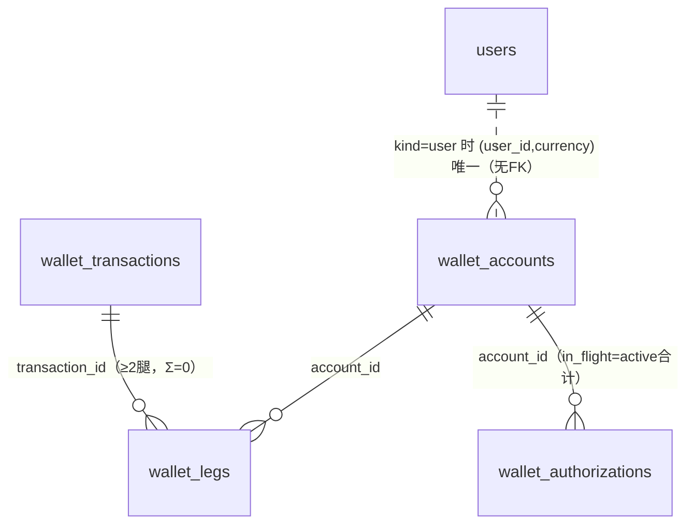

# 04 · 钱包复式账本（wallet 四表 + ledger_operations）

> 源码：`packages/db/src/schema/wallet.ts`、`ledger-operations.ts` · DDL 单一真源：迁移 `0059_wallet_ledger_operations_convergence.sql`（含全部提交期触发器）；相关演进：`0058`（资金单一真相收敛）、`0068/0069`（负余额结算）、`0095/0096`（debit floor）。

## 0. 这个域解决什么问题

钱包是**平台资金事实的唯一来源**。users 表刻意不放 balance 列，所有「谁有多少钱」都从这里回答。

它回答四类问题：

1. **余额多少**——wallet_accounts（账户表）；
2. **钱怎么变动的**——wallet_transactions + wallet_legs（复式账本：每笔交易的来龙去脉）；
3. **冻结中的钱**——wallet_authorizations（预授权：请求开始前冻结、结束后实扣或释放）；
4. **操作会不会重复执行**——ledger_operations（幂等档案）。

### 什么是复式账本（double-entry）

会计的基本法：**每笔交易至少两条腿（leg），借方合计 = 贷方合计（Σ腿 = 0）**。例：用户充值 100 元，写两条腿：`outside +100`（钱从外部世界来）、`user −100`… 方向约定见下。好处是任何时刻「所有账户余额之和」恒等于内部科目初始化值——账不平会立刻暴露，而且每笔钱都能回答「从哪来、到哪去」。

### 两套账本的关系（新手最容易混淆的点）

| | transactions（06 分册） | wallet_transactions / wallet_legs（本分册） |
|---|---|---|
| 视角 | 用户视角流水（「我的账单」） | 平台复式账本（会计总账） |
| 金额位置 | 流水行自带 amount | 批头不带金额，金额在腿上 |
| 消费方 | C 端账单页、对账作业 | 资金内核、审计 |

两套账并存：transactions 是用户可见的简化账，wallet 是资金真账。**幂等地基是 ledger_operations**（见 §5）。

---

## 1. wallet_accounts — 账户

### 账户分两类（一张表两种身份，CHECK 强制互斥）

- **user 账户**：`(user_id, currency)` 唯一——每用户每币种一个账户；
- **internal 科目账户**：`(code, currency, shard)` 唯一——平台内部科目，如 `platform_revenue`（平台收入）、`outside`（外部世界，充值的对手方）、业务自定义科目。shard 是内部科目的物理分片（0~255，分散热点），user 账户恒 0。

### 字段明细

| 字段 | 类型 | 约束 | 含义 |
|---|---|---|---|
| id | uuid | PK，默认 gen_random_uuid() | 账户 ID |
| kind | varchar(8) | CHECK：user 必有 user_id 无 code；internal 反之 | 账户类别 |
| user_id | bigint | 可空（user 必填；**无 FK**） | 归属用户 |
| code | varchar(64) | 可空（internal 必填），snake_case | 科目代码 |
| shard | integer | NOT NULL 默认 0，CHECK：user 恒 0；internal 0..255 | 内部分片 |
| currency | varchar(3) | NOT NULL 默认 'CNY' | 币种 |
| balance | numeric(38,18) | NOT NULL 默认 0 | 余额（可负，见下） |
| in_flight | numeric(38,18) | NOT NULL 默认 0，CHECK ≥ 0 | 在途敞口：所有 active 冻结单之和 |
| credit_limit | numeric(38,18) | NOT NULL 默认 0，CHECK ≥ 0 | 新请求准入授信额度 |
| debit_floor | numeric(38,18) | NOT NULL 默认 0，CHECK ≥ 0 | 结算透支地板（缺省 0 = 不透支） |
| debit_floor_source | varchar(16) | NOT NULL 默认 'default' | 地板来源：default=随全局默认；manual=管理员手工（批量永不覆盖）；group=分组预留 |
| status | varchar(8) | CHECK ∈ {active, frozen} | 冻结 = 拒绝一切资金变动 |
| updated_at | timestamptz | 默认 now() | 最近变动 |

### 三个金额列的语义（核心）

```
可用口径 = balance + credit_limit − in_flight
```

- **balance**：已结算余额。结算补扣（上游实际用量超预估）可形成**负数**——这是刻意的：已发生的消费不能因为余额不够就少记账；
- **in_flight**：冻结中还没落定的钱（= active 冻结单合计，触发器强制与 wallet_authorizations 对齐）；
- **credit_limit**：只管「新请求准入」，不限制已发生消费的结算补扣；
- **debit_floor**：结算透支的地板深度。最终可用敞口不得低于 `−(credit_limit + debit_floor)`（DB 触发器强制）——给「允许用户小额度透支结算」这类运营策略一个结构化的口子，缺省 0（完全不透支）。

`debit_floor_source` 解决的是批量运维与手工干预打架的问题：批量刷默认值只动 source='default' 的行，管理员手工设置的 manual 行永不覆盖。

### 建表 SQL（等价 DDL，由 drizzle 声明直译的**当前态**；初建在迁移 0059，debit_floor 组列由 0095/0096 增补）

```sql
CREATE TABLE wallet_accounts (
  id uuid PRIMARY KEY DEFAULT gen_random_uuid(),
  kind varchar(8) NOT NULL,                          -- user | internal
  user_id bigint,
  code varchar(64),
  shard integer NOT NULL DEFAULT 0,
  currency varchar(3) NOT NULL DEFAULT 'CNY',
  balance numeric(38, 18) NOT NULL DEFAULT 0,
  in_flight numeric(38, 18) NOT NULL DEFAULT 0,
  credit_limit numeric(38, 18) NOT NULL DEFAULT 0,
  debit_floor numeric(38, 18) NOT NULL DEFAULT 0,
  debit_floor_source varchar(16) NOT NULL DEFAULT 'default',
  status varchar(8) NOT NULL DEFAULT 'active',
  updated_at timestamptz NOT NULL DEFAULT now(),
  -- 身份互斥：user 必有 user_id 无 code；internal 反之
  CONSTRAINT wallet_accounts_identity_ck CHECK (
    (kind = 'user' AND user_id IS NOT NULL AND code IS NULL) OR
    (kind = 'internal' AND code IS NOT NULL AND user_id IS NULL)
  ),
  CONSTRAINT wallet_accounts_floor_ck CHECK (credit_limit >= 0 AND in_flight >= 0 AND debit_floor >= 0),
  CONSTRAINT wallet_accounts_status_ck CHECK (status IN ('active', 'frozen')),
  CONSTRAINT wallet_accounts_shard_ck CHECK (
    (kind = 'user' AND shard = 0) OR
    (kind = 'internal' AND shard BETWEEN 0 AND 255)
  )
);
-- 每用户每币种一个账户（部分唯一：只约束 user 行）
CREATE UNIQUE INDEX wallet_accounts_user_uq ON wallet_accounts (user_id, currency) WHERE kind = 'user';
-- 每科目每币种每分片一个账户
CREATE UNIQUE INDEX wallet_accounts_internal_uq ON wallet_accounts (code, currency, shard) WHERE kind = 'internal';
```

---

## 2. wallet_transactions — 交易批头

### 字段明细

| 字段 | 类型 | 约束 | 含义 |
|---|---|---|---|
| id | bigserial | PK | 交易 ID |
| kind | varchar(16) | CHECK ∈ {credit, settle, refund, transfer, credit_line, freeze} | 交易类型 |
| ref_type | varchar(32) | NOT NULL，UNIQUE(ref_type, ref_id, kind) | 来源类型（usage_logs / payment_orders / …） |
| ref_id | varchar(128) | NOT NULL | 来源 ID |
| memo | varchar(255) | 可空 | 摘要 |
| credit_limit_after | numeric(38,18) | 仅 credit_line 行非空 | 该行生效后的新授信额——幂等重放的读回依据 |
| frozen_after | boolean | 仅 freeze 行非空 | 冻结目标状态——稳定幂等回执（不能读账户当前状态，那会漂） |
| command_fingerprint | varchar(64) | 可空 | 规范化命令的 SHA-256；NULL 仅兼容引入指纹前的历史交易 |
| created_at | timestamptz | 默认 now() | 时间 |

### 关键设计

- **金额不在批头**：批头只管「这笔交易是什么、为什么发生」（幂等键 + 类型），钱在腿上。同一业务事件（ref）的不同 kind（如结算 settle 与退款 refund）各自合法，所以幂等键是 (ref_type, ref_id, **kind**) 三元组；
- **单腿规则**：`credit_line`（调授信）和 `freeze`（冻结/解冻账户）是不动钱的「零额审计交易」——各写**一条 amount=0 的腿**（Σ=0 平凡成立），让「授信改过、账户冻结过」也进账本可审计；
- **command_fingerprint**：同键不同参 = 冲突。重放时对比指纹，参数不一致直接拒绝（防止把「同一幂等键」误用到两笔不同的业务上）。

```sql
-- 等价 DDL（当前态；初建迁移 0059）
CREATE TABLE wallet_transactions (
  id bigserial PRIMARY KEY,
  kind varchar(16) NOT NULL,
  ref_type varchar(32) NOT NULL,
  ref_id varchar(128) NOT NULL,
  memo varchar(255),
  credit_limit_after numeric(38, 18),    -- 仅 credit_line 行非空
  frozen_after boolean,                  -- 仅 freeze 行非空
  command_fingerprint varchar(64),
  created_at timestamptz NOT NULL DEFAULT now(),
  CONSTRAINT wallet_transactions_ref_kind_uq UNIQUE (ref_type, ref_id, kind),  -- 幂等键三元组
  CONSTRAINT wallet_transactions_kind_ck CHECK (
    kind IN ('credit', 'settle', 'refund', 'transfer', 'credit_line', 'freeze')
  ),
  -- 回执列形状：freeze 带 frozen_after / credit_line 带 credit_limit_after / 其余双空
  CONSTRAINT wallet_transactions_receipt_ck CHECK (
    (kind = 'freeze' AND frozen_after IS NOT NULL AND credit_limit_after IS NULL) OR
    (kind = 'credit_line' AND frozen_after IS NULL AND credit_limit_after IS NOT NULL) OR
    (kind NOT IN ('freeze', 'credit_line') AND frozen_after IS NULL AND credit_limit_after IS NULL)
  )
);
CREATE INDEX wallet_transactions_ref_idx ON wallet_transactions (ref_type, created_at);
```

## 3. wallet_legs — 腿

| 字段 | 类型 | 约束 | 含义 |
|---|---|---|---|
| id | bigserial | PK | 腿 ID（同账户内按 id 即为记账顺序） |
| transaction_id | bigint | NOT NULL，FK → wallet_transactions.id | 所属交易 |
| account_id | uuid | NOT NULL，FK → wallet_accounts.id | 受影响账户 |
| currency | varchar(3) | NOT NULL | 币种（触发器校验与账户一致） |
| amount | numeric(38,18) | NOT NULL | **有符号**：正 = 入（贷），负 = 出（借）；同交易 Σ = 0 |
| balance_before | numeric(38,18) | NOT NULL | 记腿前余额 |
| balance_after | numeric(38,18) | NOT NULL | 记腿后余额 |

```sql
-- 等价 DDL（当前态；初建迁移 0059）
CREATE TABLE wallet_legs (
  id bigserial PRIMARY KEY,
  transaction_id bigint NOT NULL REFERENCES wallet_transactions(id),
  account_id uuid NOT NULL REFERENCES wallet_accounts(id),
  currency varchar(3) NOT NULL,
  amount numeric(38, 18) NOT NULL,             -- 有符号：正=入（贷），负=出（借）
  balance_before numeric(38, 18) NOT NULL,
  balance_after numeric(38, 18) NOT NULL,
  -- 链式恒等（不变量下沉；连续性另由触发器保证，见 §6）
  CONSTRAINT wallet_legs_chain_ck CHECK (balance_after = balance_before + amount)
);
CREATE INDEX wallet_legs_account_idx ON wallet_legs (account_id, id);
CREATE INDEX wallet_legs_transaction_idx ON wallet_legs (transaction_id);
CREATE INDEX wallet_legs_account_transaction_idx ON wallet_legs (account_id, transaction_id);
```

为什么 `balance_before/after` 要落库？它是**链式证明**：任何时刻审计某账户，把腿按 id 排开，每一行都验证 `after = before + amount` 且下一行 `before = 上一行 after`，余额历史无断点、无篡改。

## 4. wallet_authorizations — 冻结单（预授权）

### 为什么需要它

预付费风控模型：请求开始前冻结一笔预估（authorize），结束后实扣（settle）或释放（release）。冻结不动 balance，动 in_flight——「可用」变少但钱还在。

| 字段 | 类型 | 约束 | 含义 |
|---|---|---|---|
| id | uuid | PK，默认 gen_random_uuid() | 冻结单 ID |
| account_id | uuid | NOT NULL，FK → wallet_accounts.id | 账户 |
| ref_type | varchar(32) | NOT NULL，UNIQUE(ref_type, ref_id) | 来源类型（如 billing_requests） |
| ref_id | varchar(128) | NOT NULL | 来源 ID（如 requestId） |
| amount | numeric(38,18) | NOT NULL，CHECK > 0 | 冻结金额 |
| status | varchar(16) | CHECK ∈ {active, settled, released, expired} | 状态机（单向） |
| settled_amount | numeric(38,18) | settled 行必填且 0 < x ≤ amount | 实扣金额（可小于冻结额） |
| release_reason | varchar(64) | released/expired 行必填 | 释放原因 |
| memo | varchar(255) | 可空 | 摘要 |
| authorize_fingerprint | varchar(64) | 可空 | authorize 原命令指纹（NULL 兼容历史） |
| release_fingerprint | varchar(64) | 可空 | 主动 release 命令指纹（expired 保持 NULL） |
| expires_at | timestamptz | 可空 | 超时时间（worker 扫描过期） |
| created_at / updated_at | timestamptz | 默认 now() | 行时间 |

状态机（CHECK 强制每个状态的字段形状）：

```sql
-- 等价 DDL（当前态；初建迁移 0059）
CREATE TABLE wallet_authorizations (
  id uuid PRIMARY KEY DEFAULT gen_random_uuid(),
  account_id uuid NOT NULL REFERENCES wallet_accounts(id),
  ref_type varchar(32) NOT NULL,
  ref_id varchar(128) NOT NULL,
  amount numeric(38, 18) NOT NULL,
  status varchar(16) NOT NULL DEFAULT 'active',
  settled_amount numeric(38, 18),
  release_reason varchar(64),
  memo varchar(255),
  authorize_fingerprint varchar(64),
  release_fingerprint varchar(64),
  expires_at timestamptz,
  created_at timestamptz NOT NULL DEFAULT now(),
  updated_at timestamptz NOT NULL DEFAULT now(),
  -- 预授权幂等：同一业务事件至多一张冻结单
  CONSTRAINT wallet_authorizations_ref_uq UNIQUE (ref_type, ref_id),
  CONSTRAINT wallet_authorizations_amount_ck CHECK (amount > 0),
  CONSTRAINT wallet_authorizations_status_ck
    CHECK (status IN ('active', 'settled', 'released', 'expired')),
  -- 状态机字段形状：active 三空 / settled 带实扣额 / released+expired 带原因
  CONSTRAINT wallet_authorizations_state_ck CHECK (
    (status = 'active' AND settled_amount IS NULL AND release_reason IS NULL) OR
    (status = 'settled' AND settled_amount > 0 AND settled_amount <= amount AND release_reason IS NULL) OR
    (status IN ('released', 'expired') AND settled_amount IS NULL AND release_reason IS NOT NULL)
  )
);
-- 「可用额」判定只扫 active 行（每请求必走，部分索引保持极小）
CREATE INDEX wallet_authorizations_account_active_idx
  ON wallet_authorizations (account_id) WHERE status = 'active';
CREATE INDEX wallet_authorizations_expiry_idx
  ON wallet_authorizations (expires_at) WHERE status = 'active' AND expires_at IS NOT NULL;
```

```
active ──settle──► settled   （settled_amount 落定，≤ 冻结额）
   │──release──► released    （release_reason 必填）
   └──超时扫描──► expired     （release_reason 必填）
```

- `UNIQUE(ref_type, ref_id)`：同一业务事件至多一张冻结单——这就是预授权幂等；
- 部分索引 `WHERE status='active'`：钱包判定「可用额」只扫 active 行，这是每请求必走的查询，部分索引让它保持极小。

## 5. ledger_operations — 幂等操作档案

### 为什么需要它

资金操作的调用方（HTTP 回调、队列重试、worker 重启）都可能**重复发起同一命令**。档案表把「这个操作执行过吗、参数一致吗、结果是什么」做成可查的事实：

| 字段 | 类型 | 约束 | 含义 |
|---|---|---|---|
| id | bigserial | PK | 行 ID |
| operation_id | varchar(128) | NOT NULL，UNIQUE | **幂等键**（调用方设计的全局唯一键，如 `payment-credit:epay:20260906...`） |
| kind | varchar(32) | NOT NULL | 操作类型（读侧分页过滤） |
| fingerprint | varchar(64) | NOT NULL | canonical 参数指纹——同键不同参 = 冲突拒绝 |
| receipt | jsonb | 可空 | 回执——重放时**原样归还**的结果 |
| created_at / updated_at | timestamptz | 默认 now() | 行时间 |

执行协议（注释原话精义）：操作行与业务写在**同一事务**——要么同生（执行完成且回执落档）要么同死（抛错整体回滚）。并发同键的第二个 INSERT 阻塞在唯一索引上，等首事务终结：提交则走重放读回执，回滚则接棒执行。单语句定序，无死锁面。

```sql
-- 迁移 0059 原文（重排版）
CREATE TABLE IF NOT EXISTS ledger_operations (
  id bigserial PRIMARY KEY,
  operation_id varchar(128) NOT NULL,     -- 幂等键：并发同键阻塞在唯一索引上
  kind varchar(32) NOT NULL,
  fingerprint varchar(64) NOT NULL,       -- 同键不同参 = 冲突拒绝
  receipt jsonb,                          -- 重放时原样归还的回执
  created_at timestamptz NOT NULL DEFAULT now(),
  updated_at timestamptz NOT NULL DEFAULT now(),
  CONSTRAINT ledger_operations_operation_id_uq UNIQUE (operation_id)
);
-- 读侧分页：kind 过滤 + id 倒序
CREATE INDEX ledger_operations_kind_id_idx ON ledger_operations (kind, id);
```

06 分册会看到它的典型键：`gift+signup:{userId}`、`referral-commission:{inviterId}:{yyyyMMdd}`、`payment-credit:{provider}:{providerOrderId}`……

## 6. 提交期触发器（迁移 0059，账本不可破坏的最后防线）

四个延迟约束触发器（`DEFERRABLE INITIALLY DEFERRED`，事务提交时统一校验）+ 两个行级触发器：

| 触发器 | 时机 | 强制的不变量 |
|---|---|---|
| wallet_legs_insert_guard | BEFORE INSERT 腿 | 账户存在、币种一致、`balance_before` = 账户当前余额（腿链连续，FOR UPDATE 串行化） |
| wallet_legs_immutable / wallet_transactions_immutable | BEFORE UPDATE/DELETE | 账本行**物理不可改不可删**（审计红线） |
| wallet_transactions_balance_ck + wallet_legs_balance_ck | 提交期 | 每笔交易 Σ腿 = 0；普通交易 ≥2 腿；credit_line/freeze 恰 1 条零额腿 |
| wallet_accounts_coherence_ck（+legs/authorizations 侧） | 提交期 | 账户 balance = 最后一条腿的 balance_after；in_flight = active 冻结单合计；user 账户可用敞口 ≥ −(credit_limit+debit_floor) |

**为什么用延迟约束触发器**：写一笔交易要依次 INSERT 批头和多条腿，中间态必然「暂时不平」。INITIALLY DEFERRED 让检查推迟到 COMMIT——事务内随便摆中间态，提交那一刻必须全部成立。

## 7. 关系图



ledger_operations 与所有资金操作（钱包交易、入账、赠送、返佣）是 **operation_id 逻辑关联**（无 FK）：它不指向具体表，而是给每类操作做幂等档案。
