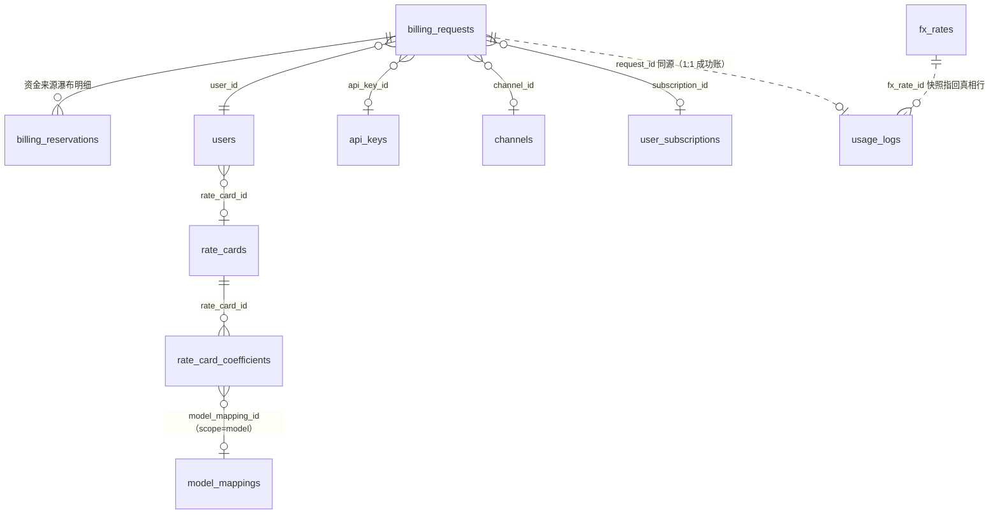

# 05 · 计费管线（billing_requests / billing_reservations / rate_cards / rate_card_coefficients / usage_logs / fx_rates / system_configs）

> 源码：`packages/db/src/schema/billing-requests.ts`、`billing-reservations.ts`、`billing.ts`、`usage.ts`、`fx.ts`。业务实现：`packages/billing`（评级/结算/恢复）、`packages/inference`（编排）。

## 0. 这个域解决什么问题

计费要同时做到三件互相拉扯的事：

1. **不能少收**：流式响应可能几分钟才结束、上游用量事后才知道——钱必须按真实用量收；
2. **不能超卖**：用户可能余额只剩 1 分钱却发起昂贵请求——必须**事前**拦住（预扣）；
3. **不能重复收**：结算 worker 会重试、会多副本——同一请求只扣一次。

解法是**两阶段提交**（预扣 → 实结），核心状态机就是 `billing_requests`。配套的 pricing 基础设施（费率卡、汇率）和计费明细账（usage_logs）也在本分册。

```
 authorized ──► in_flight ──► settlement_pending ──► processing ──► settled
     │            │                 │                    │
     │            │                 └──► retry_wait ─────┘（退避重试）
     │            └──► released（失败/取消，释放预扣）
     └──► dead（多次结算失败，死信告警）
```

---

## 1. billing_requests — 请求级计费状态机

### 为什么需要它

网关收到请求时资金动作必须**同步**发生（预扣），但结算必须**异步**（等上游 usage 证据）。这张表就是每个请求的资金生命线：一行从 authorized 走到 settled/released/dead。它同时是结算收据的 **durable outbox**（收据 receipt 落在这里，worker 重启不丢）。PostgreSQL 是资金唯一事实源；低延迟唤醒只靠 PG NOTIFY（`settle-wake`），通知丢了也不影响正确性——worker 还有轮询兜底。

### 字段明细（按功能分组读）

**身份与关联：**

| 字段 | 类型 | 约束 | 含义 |
|---|---|---|---|
| request_id | uuid | PK | 网关请求 ID（全局唯一，usage_logs.request_id 同源） |
| user_id | bigint | NOT NULL，FK → users | 用户 |
| api_key_id | bigint | FK → api_keys，可空 | 发起凭证的 Key（JWT/无 Key 为 NULL）；Key 级日限统计用 |
| channel_id | bigint | FK → channels，可空 | 当前尝试的渠道（路由选渠时写入） |
| subscription_id | bigint | FK → user_subscriptions，可空 | 结算/释放时关联的订阅（套餐分流来源） |

**金额组（预估/预扣/超收）：**

| 字段 | 类型 | 约束 | 含义 |
|---|---|---|---|
| estimated_exposure_amount | numeric(38,18) | ≥0 | 保守风险预估（日限额/在途敞口判定用；fixed 模式下可大于实际冻结额） |
| reserved_amount | numeric(38,18) | NOT NULL ≥0 | 实际冻结金额（full=按风险预估；fixed=显式门槛） |
| plan_reserved_amount | numeric(38,18) | 可空 | 套餐额度承担的在途部分（≤ reserved_amount；NULL=无套餐/纯余额） |
| channel_reserved_amount | numeric(38,18) | 可空 | 该请求在当前渠道的在途上游成本敞口；结算/释放/换渠道时清或改写 |
| waived_amount | numeric(38,18) | NOT NULL 默认 0 | 超收放弃额，见下 |

**waived_amount 值得单独讲**：结算时若实际费用 > 预留且用户可用额不足，超出可收的部分被**放弃**（`charged = actual − waived`）。常态为 0；>0 是「上游 usage 虚高/用户余额耗尽」的运营信号（对账与告警口径）——宁可少收一笔钱，也不让结算死信卡住整个请求。

**状态与并发控制：**

| 字段 | 类型 | 约束 | 含义 |
|---|---|---|---|
| status | varchar(32) | CHECK 词表 | authorized / in_flight / settlement_pending / processing / retry_wait / settled / released / dead |
| revision | bigint | NOT NULL 默认 0 | 每次状态迁移递增；**同时是 worker fencing token**（旧 worker 拿旧 revision 的 CAS 必败，防脑裂） |
| stream | boolean | NOT NULL 默认 false | 是否流式 |
| quote | jsonb | NOT NULL | 计价快照（请求时的模型单价/系数等证据） |
| authorization_fingerprint | varchar(64) | NOT NULL | 预扣命令指纹（幂等冲突检测） |
| trace_parent | varchar(55) | 可空 | 根 span 的 traceparent；worker 结算时以此为父建 `billing.settle` span，让扣费出现在请求同一条链路里 |

**结算执行组（worker 侧）：**

| 字段 | 类型 | 含义 |
|---|---|---|
| receipt / receipt_fingerprint | jsonb / varchar(64) | 结算收据与指纹（进入结算态后 receipt 必填，CHECK 强制） |
| lease_owner / lease_expires_at | varchar(128) / timestamptz | 结算租约（多 worker 分单 + 过期接管） |
| upstream_started_at | timestamptz | 上游开始时间 |
| failure_code / failure_class / last_error | varchar / text | 失败分类与详情 |
| settlement_attempts / next_settlement_at | bigint / timestamptz | 重试次数与下次重试时间（退避） |
| claim_owner / claim_token / claim_until | varchar(128) / uuid / timestamptz | 认领三列（CHECK：processing 态三列必同时非空，其他态必同时为空）——多副本消费 fencing |
| dead_at / settled_at / released_at | timestamptz | 终态时间戳 |

索引按查询面铺：`(user_id,status)` 用户在途查询、`(status,created_at)` 队列扫描、`(status,next_settlement_at)` 重试扫描、`(status,lease_expires_at)` 租约过期接管、`(channel_id,created_at)` 渠道对账。

### 建表 SQL（等价 DDL，由 drizzle 声明直译；为可读性省略字段注释见上表）

```sql
CREATE TABLE billing_requests (
  request_id uuid PRIMARY KEY,
  user_id bigint NOT NULL REFERENCES users(id),
  api_key_id bigint REFERENCES api_keys(id),
  channel_id bigint REFERENCES channels(id),
  channel_reserved_amount numeric(38, 18),
  plan_reserved_amount numeric(38, 18),
  subscription_id bigint REFERENCES user_subscriptions(id),
  estimated_exposure_amount numeric(38, 18),
  reserved_amount numeric(38, 18) NOT NULL,
  waived_amount numeric(38, 18) NOT NULL DEFAULT 0,
  status varchar(32) NOT NULL DEFAULT 'authorized',
  revision bigint NOT NULL DEFAULT 0,        -- 状态迁移计数 + worker fencing token
  stream boolean NOT NULL DEFAULT false,
  quote jsonb NOT NULL,
  authorization_fingerprint varchar(64) NOT NULL,
  trace_parent varchar(55),
  receipt jsonb,
  receipt_fingerprint varchar(64),
  lease_owner varchar(128),
  lease_expires_at timestamptz,
  upstream_started_at timestamptz,
  failure_code varchar(64),
  settlement_attempts bigint NOT NULL DEFAULT 0,
  next_settlement_at timestamptz,
  claim_owner varchar(128),
  claim_token uuid,
  claim_until timestamptz,
  failure_class varchar(64),
  last_error text,
  dead_at timestamptz,
  settled_at timestamptz,
  released_at timestamptz,
  created_at timestamptz NOT NULL DEFAULT now(),
  updated_at timestamptz NOT NULL DEFAULT now(),
  CONSTRAINT billing_requests_status_ck CHECK (status IN (
    'authorized','in_flight','settlement_pending','processing',
    'retry_wait','settled','released','dead')),
  -- 进入结算族状态必须有收据
  CONSTRAINT billing_requests_receipt_state_ck CHECK (
    (status NOT IN ('settlement_pending','processing','retry_wait','settled','dead'))
    OR receipt IS NOT NULL),
  -- 认领三列同生同灭（多副本 fencing）
  CONSTRAINT billing_requests_claim_state_ck CHECK (
    (status = 'processing') = (claim_token IS NOT NULL AND claim_owner IS NOT NULL AND claim_until IS NOT NULL)),
  CONSTRAINT billing_requests_amounts_nonnegative_ck
    CHECK (estimated_exposure_amount >= 0 AND reserved_amount >= 0)
);
-- 查询面索引：用户在途 / Key 统计 / 队列扫描 / 重试扫描 / 租约接管 / 渠道对账
CREATE INDEX billing_requests_user_status_idx ON billing_requests (user_id, status);
CREATE INDEX billing_requests_api_key_status_idx ON billing_requests (api_key_id, status);
CREATE INDEX billing_requests_status_created_idx ON billing_requests (status, created_at);
CREATE INDEX billing_requests_channel_created_idx ON billing_requests (channel_id, created_at);
CREATE INDEX billing_requests_pending_idx ON billing_requests (status, next_settlement_at);
CREATE INDEX billing_requests_lease_idx ON billing_requests (status, lease_expires_at);
CREATE INDEX billing_requests_claim_idx ON billing_requests (status, claim_until);
CREATE UNIQUE INDEX billing_requests_claim_token_uq ON billing_requests (claim_token);
```

## 2. billing_reservations — 预扣明细（资金来源瀑布的真相表）

### 为什么需要它

一个请求的钱可能来自多个来源：先扣套餐额度、不够再扣余额（瀑布）。批头上的三个投影列（reserved/plan_reserved/subscription_id）说不清「每个来源各占多少」，本表一行 = 一个来源为该请求预占的金额。

| 字段 | 类型 | 约束 | 含义 |
|---|---|---|---|
| id | bigserial | PK | 行 ID |
| billing_request_id | uuid | NOT NULL，FK → billing_requests | 所属请求 |
| source_type | varchar(32) | NOT NULL | payg / subscription /（将来）promo / enterprise |
| source_ref_id | bigint | 可空 | 来源行引用（subscription 的订阅 id；payg 为 NULL） |
| amount | numeric(38,18) | NOT NULL，CHECK > 0 | 预占金额 |
| status | varchar(16) | CHECK ∈ {active, released, settled}（单向） | 明细状态 |
| released_at / settled_at | timestamptz | CHECK 与 status 配对 | 终态时间 |
| created_at | timestamptz | 默认 now() | 时间 |

```sql
-- 等价 DDL（由 drizzle 声明直译）
CREATE TABLE billing_reservations (
  id bigserial PRIMARY KEY,
  billing_request_id uuid NOT NULL REFERENCES billing_requests(request_id),
  source_type varchar(32) NOT NULL,          -- payg / subscription /（将来）promo / enterprise
  source_ref_id bigint,
  amount numeric(38, 18) NOT NULL,
  status varchar(16) NOT NULL DEFAULT 'active',
  released_at timestamptz,
  settled_at timestamptz,
  created_at timestamptz NOT NULL DEFAULT now(),
  CONSTRAINT billing_reservations_amount_positive CHECK (amount > 0),
  CONSTRAINT billing_reservations_status_valid CHECK (status IN ('active','released','settled')),
  -- 状态与时间戳配对（active 双空 / settled 带 settled_at / released 带 released_at）
  CONSTRAINT billing_reservations_status_ts CHECK (
    (status = 'active' AND released_at IS NULL AND settled_at IS NULL) OR
    (status = 'released' AND released_at IS NOT NULL AND settled_at IS NULL) OR
    (status = 'settled' AND settled_at IS NOT NULL AND released_at IS NULL)
  )
);
-- 同请求同来源至多一行 active：重放双预留的结构性防线
CREATE UNIQUE INDEX billing_reservations_request_source_uq
  ON billing_reservations (billing_request_id, source_type) WHERE status = 'active';
CREATE INDEX billing_reservations_request_idx
  ON billing_reservations (billing_request_id) WHERE status = 'active';
CREATE INDEX billing_reservations_source_idx
  ON billing_reservations (source_type, source_ref_id) WHERE status = 'active';
-- 全量索引：清理脚本/对账要扫 released/settled 行，partial 索引盖不到
CREATE INDEX billing_reservations_request_all_idx ON billing_reservations (billing_request_id);
```

关键约束：部分唯一索引 `(billing_request_id, source_type) WHERE status='active'`——同请求同来源至多一行 active，这是「重放双预留」的结构性防线（请求重试不会重复冻结）。释放/结算按明细逐笔走对应来源。

## 3. rate_cards / rate_card_coefficients — 费率卡（定价系数）

### 定价模型一句话

**用户价 = 官方价（model_mappings，07 分册）× 费率卡系数**。账户绑一张卡（users.rate_card_id），不同客户群体给不同折扣。

**rate_cards（卡）**：id、name（唯一）、description、status（0 启用/1 停用——停用后新请求拒绝，已签发 JWT 按快照继续）+ 时间列。

```sql
-- 等价 DDL（由 drizzle 声明直译）
CREATE TABLE rate_cards (
  id bigserial PRIMARY KEY,
  name varchar(32) NOT NULL,
  description varchar(255),
  status smallint NOT NULL DEFAULT 0,
  created_at timestamptz NOT NULL DEFAULT now(),
  updated_at timestamptz NOT NULL DEFAULT now()
);
CREATE UNIQUE INDEX rate_cards_name_uq ON rate_cards (name);
```

**rate_card_coefficients（系数行）**——三级解析，优先级 **model > group > global**：

| 字段 | 类型 | 约束 | 含义 |
|---|---|---|---|
| id | bigserial | PK | 行 ID |
| rate_card_id | bigint | NOT NULL，FK → rate_cards | 所属卡 |
| scope | varchar(8) | CHECK ∈ {global, model, group} | 生效范围 |
| model_mapping_id | bigint | FK → model_mappings，可空 | scope=model 行指向具体模型 |
| group_key | varchar(32) | 可空 | scope=group 行的分组键（与 model_mappings.pricing_group 匹配，如 'anthropic'） |
| coefficient | numeric(6,3) | NOT NULL | 系数（1.0 = 原价；如 0.8 = 八折） |
| created_at | timestamptz | 默认 now() | 时间 |

```sql
-- 等价 DDL（由 drizzle 声明直译）
CREATE TABLE rate_card_coefficients (
  id bigserial PRIMARY KEY,
  rate_card_id bigint NOT NULL REFERENCES rate_cards(id),
  scope varchar(8) NOT NULL,
  model_mapping_id bigint REFERENCES model_mappings(id),
  group_key varchar(32),
  coefficient numeric(6, 3) NOT NULL,
  created_at timestamptz NOT NULL DEFAULT now(),
  CONSTRAINT rate_card_coefficients_scope_ck CHECK (scope IN ('global','model','group'))
);
-- 三个唯一索引精确表达「每卡每层至多一行」：
CREATE UNIQUE INDEX rate_card_coefficients_uq
  ON rate_card_coefficients (rate_card_id, scope, model_mapping_id);            -- model 行去重
-- 全局行去重（注释：原 uq 因 NULLS DISTINCT 拦不住重复全局行而补此索引）
CREATE UNIQUE INDEX rate_card_coefficients_global_uq
  ON rate_card_coefficients (rate_card_id, scope) WHERE model_mapping_id IS NULL;
CREATE UNIQUE INDEX rate_card_coefficients_group_uq
  ON rate_card_coefficients (rate_card_id, group_key)
  WHERE scope = 'group' AND group_key IS NOT NULL;                              -- group 行去重
CREATE INDEX rate_card_coefficients_mapping_idx ON rate_card_coefficients (model_mapping_id);
```

约束「每卡必有且仅有一行 global」由应用层写入保证；系数解析器单一真源在 `packages/ledger` 的 `billing/coefficient.ts`。

## 4. fx_rates + system_configs — 汇率（真相与缓存分离）

### 为什么需要汇率

模型官方价常以美元定价，用户以人民币结算——需要 USD→CNY 汇率，而且**每一笔账都要能回答「当时用的什么汇率、谁定的」**（客诉/审计刚需）。

**fx_rates — 追加式汇率真相表（只增不改）**：

| 字段 | 类型 | 约束 | 含义 |
|---|---|---|---|
| id | bigserial | PK | 行 ID |
| base_currency / quote_currency | varchar(8) | 默认 USD / CNY | 货币对 |
| rate | numeric(38,18) | NOT NULL（迁移 CHECK > 0） | 1 USD = rate CNY |
| source | varchar(16) | NOT NULL | ecb（frankfurter 自动拉取）/ manual（运营覆盖） |
| mode | varchar(8) | 默认 auto | auto / override |
| operator_admin_id | bigint | 可空 | 手动覆盖时的操作管理员 |
| fetched_at | timestamptz | 默认 now() | 拉取/覆盖时间 |

```sql
-- 等价 DDL（由 drizzle 声明直译）
CREATE TABLE fx_rates (
  id bigserial PRIMARY KEY,
  base_currency varchar(8) NOT NULL DEFAULT 'USD',
  quote_currency varchar(8) NOT NULL DEFAULT 'CNY',
  rate numeric(38, 18) NOT NULL,          -- >0 由迁移 CHECK 保证
  source varchar(16) NOT NULL,            -- ecb / manual
  mode varchar(8) NOT NULL DEFAULT 'auto',
  operator_admin_id bigint,
  fetched_at timestamptz NOT NULL DEFAULT now()
);
CREATE INDEX fx_rates_fetched_at_idx ON fx_rates (fetched_at);
```

**system_configs — 运行态 KV 缓存**：当前承载目录汇率运行态 `{ mode, bufferPct, overrideRate, currentRate, currentFxRateId, source, fetchedAt }`。语义分工（注释原话）：**真相恒在 fx_rates 与审计；本表只回答「现在生效什么」**。usage_logs 的 `fx_rate`/`fx_rate_id` 快照列指回真相行（见 §5）。

```sql
-- 等价 DDL（由 drizzle 声明直译）
CREATE TABLE system_configs (
  key varchar(64) PRIMARY KEY,
  value jsonb NOT NULL,
  updated_at timestamptz NOT NULL DEFAULT now(),
  updated_by_admin_id bigint
);
```

## 5. usage_logs — 用量明细（计费账本）

### 为什么需要它

每笔成功计费的**明细证据**：用了多少 token、当时什么价、系数多少、钱怎么拆的。只追加、长期保留（与 request_logs「30 天排障日志」分工：**本表是账，那张是日志**）。

### 字段明细（按组）

**关联与模型：**

| 字段 | 类型 | 约束 | 含义 |
|---|---|---|---|
| id | bigserial | PK | 行 ID |
| request_id | uuid | NOT NULL，**UNIQUE** | 网关请求 ID——天然幂等（同请求只计一次） |
| user_id | bigint | NOT NULL，FK → users | 用户 |
| app_id / api_key_id | bigint | FK，ON DELETE SET NULL | 凭证（删凭证不删账） |
| credential_type | varchar(8) | NOT NULL | key / jwt |
| external_model / real_model | varchar | NOT NULL | 对外名 / 真实名（双写快照，模型改名不漂移） |
| channel_id | bigint | FK，ON DELETE SET NULL | 渠道 |

**用量与价格快照：**

| 字段 | 类型 | 含义 |
|---|---|---|
| input_tokens / cached_input_tokens / cache_write_tokens / output_tokens | bigint | 四类 token 用量（缓存命中/缓存写分别计量） |
| units | bigint | 单位计费计量：按次=次数/按张=张数/按秒=秒数/按字符=字符数；token 计费模型恒 0 |
| input_price / output_price / cache_input_price / cache_write_price / unit_price | numeric(38,18) | **官方价快照**（元/百万 token 或元/单位）——改价不影响历史账 |
| pricing_window | varchar(64) | 命中分时段计价的窗口标签快照（「这笔为什么是这个价」的审计口径） |
| coefficient | numeric(6,3) | 费率卡系数快照 |
| fx_rate / fx_rate_id | numeric / bigint | 请求时点汇率快照 + 指向 fx_rates 真相行（NULL=fx 机制上线前的历史行） |

**金额组（钱怎么算、怎么拆）：**

| 字段 | 类型 | 含义 |
|---|---|---|
| amount | numeric(38,18) | **实扣费用**（预付费模式不超过预留额） |
| calculated_amount | numeric(38,18) | 按实际 usage 算的理论费用（可能高于实扣） |
| upstream_cost | numeric(38,18) | 上游成本估算（供应商对账基础） |
| plan_amount / payg_amount | numeric(38,18) | 套餐承担 / 余额承担（成功单 CHECK：amount = plan + payg） |
| billed_by | varchar(8) | CHECK ∈ {plan, payg}（Key 分流后「both」结构性不可达） |
| subscription_id | bigint，FK | 套餐账挂靠的订阅 |

**观测与口径组：**

| 字段 | 类型 | 含义 |
|---|---|---|
| duration_ms | bigint | 请求时长 |
| upstream_ttft_ms / client_ttft_ms | bigint | 上游首字 / 客户端首字延迟（流式观测，非流式 NULL；不参与计费） |
| status | smallint | 0 成功已计费 / 1 失败不计费 |
| stream / stream_aborted | boolean | 流式 / 流式中断（中断后只有供应商仍返回可信 usage 才精确结算） |
| estimated | boolean | **估算结算标记**：用户取消 ∪ 完成缺 usage 时按估算结算的行（区分真实获取与估算） |
| estimate_reason | varchar(64) | 估算归属（「这笔是估算扣的、为什么」） |
| usage_clamps | jsonb | 结算验收门钳制事实：上游发票（usage）超出准入界被钳定的「original → clamped + 依据」轨迹；NULL = 诚实发票 |
| created_at | timestamptz | 时间 |

### 建表 SQL（等价 DDL，由 drizzle 声明直译）

```sql
CREATE TABLE usage_logs (
  id bigserial PRIMARY KEY,
  request_id uuid NOT NULL,                    -- 天然幂等：同请求只计一次
  user_id bigint NOT NULL REFERENCES users(id),
  app_id bigint REFERENCES apps(id) ON DELETE SET NULL,
  api_key_id bigint REFERENCES api_keys(id) ON DELETE SET NULL,
  credential_type varchar(8) NOT NULL,
  external_model varchar(64) NOT NULL,
  real_model varchar(128) NOT NULL,
  channel_id bigint REFERENCES channels(id) ON DELETE SET NULL,
  input_tokens bigint NOT NULL DEFAULT 0,
  cached_input_tokens bigint NOT NULL DEFAULT 0,
  cache_write_tokens bigint NOT NULL DEFAULT 0,
  cache_write_price numeric(38, 18) NOT NULL DEFAULT 0,
  output_tokens bigint NOT NULL DEFAULT 0,
  units bigint NOT NULL DEFAULT 0,
  input_price numeric(38, 18) NOT NULL DEFAULT 0,
  output_price numeric(38, 18) NOT NULL DEFAULT 0,
  cache_input_price numeric(38, 18) NOT NULL DEFAULT 0,
  unit_price numeric(38, 18) NOT NULL DEFAULT 0,
  pricing_window varchar(64),
  coefficient numeric(6, 3) NOT NULL,
  amount numeric(38, 18) NOT NULL DEFAULT 0,
  calculated_amount numeric(38, 18) NOT NULL DEFAULT 0,
  upstream_cost numeric(38, 18) NOT NULL DEFAULT 0,
  fx_rate numeric(38, 18),
  fx_rate_id bigint,
  plan_amount numeric(38, 18) NOT NULL DEFAULT 0,
  payg_amount numeric(38, 18) NOT NULL DEFAULT 0,
  billed_by varchar(8) NOT NULL,
  subscription_id bigint REFERENCES user_subscriptions(id),
  duration_ms bigint NOT NULL DEFAULT 0,
  upstream_ttft_ms bigint,
  client_ttft_ms bigint,
  status smallint NOT NULL DEFAULT 1,
  stream boolean NOT NULL DEFAULT false,
  stream_aborted boolean NOT NULL DEFAULT false,
  estimated boolean NOT NULL DEFAULT false,
  estimate_reason varchar(64),
  usage_clamps jsonb,
  created_at timestamptz NOT NULL DEFAULT now(),
  -- Key 分流后「both」结构性不可达：只允许 plan/payg
  CONSTRAINT usage_logs_billed_by_ck CHECK (billed_by IN ('plan','payg')),
  -- 四方金额非负
  CONSTRAINT usage_logs_amounts_nonnegative_ck CHECK (
    amount >= 0 AND plan_amount >= 0 AND payg_amount >= 0 AND upstream_cost >= 0),
  -- 成功单金额拆分守恒：实扣 = 套餐承担 + 余额承担
  CONSTRAINT usage_logs_amount_split_ck CHECK (
    (status <> 0) OR (amount = plan_amount + payg_amount))
);
CREATE UNIQUE INDEX usage_logs_request_id_uq ON usage_logs (request_id);
CREATE INDEX usage_logs_user_created_idx ON usage_logs (user_id, created_at DESC);
CREATE INDEX usage_logs_model_created_idx ON usage_logs (external_model, created_at);
CREATE INDEX usage_logs_channel_created_idx ON usage_logs (channel_id, created_at);
CREATE INDEX usage_logs_subscription_idx ON usage_logs (subscription_id, created_at);
```

### 计价公式（表头注释原文）

```
amount = (未缓存输入×输入价 + 缓存输入×缓存价 + 输出×输出价)/1e6 × 系数
```

单位计费模型（request/image/second/char）走 `units × unit_price × 系数`，token 三元组不参与——计量维度词表在 model_mappings.pricing_unit（07 分册），公式单一真源在 `packages/billing` 的 money/amount 模块。

## 6. 本域关系图


