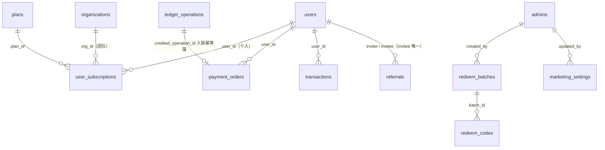

# 06 · 套餐·支付·资金入口（plans / user_subscriptions / payment_orders / redeem_* / transactions / referrals / marketing_settings / reconcile_discrepancies）

> 源码：`packages/db/src/schema/plans.ts`、`payments.ts`、`redeem.ts`、`transactions.ts`、`referrals.ts`、`marketing.ts`、`reconcile.ts`。业务实现：`packages/billing`。

## 0. 这个域解决什么问题

钱的**入口**（充值、买套餐、兑换码、赠送、返佣）与用户视角的**流水账**（transactions），外加财务护栏（对账差异记录）。本域所有入账动作的幂等地基都是 04 分册的 `ledger_operations`。

先分清两个资金容器：

- **余额（PAYG）**：充进去的钱，按量扣，永不过期——真账在 wallet；
- **套餐额度（quota）**：包月/加油包预付的金额额度，按「官方价×系数」同口径折算扣减，包月有到期日——记账在 user_subscriptions。

---

## 1. plans — 套餐定义

### 字段明细

| 字段 | 类型 | 约束 | 含义 |
|---|---|---|---|
| id | bigserial | PK | 套餐 ID |
| name | varchar(32) | NOT NULL（有索引，无唯一约束） | 名称 |
| kind | varchar(16) | NOT NULL 默认 'subscription' | subscription 包月 / **pack 加油包**（一次性买积分，无到期无层级） |
| sort_order | bigint | 可空 | 层级序号（lite=1 / pro=2 / max=3）；加油包为 NULL。**升级/扩容只允许升不许降** |
| price | numeric(38,18) | NOT NULL | 售价（元） |
| period_days | bigint | NOT NULL | 周期天数（30/365）；加油包为 0（一次性，无周期） |
| quota_amount | numeric(38,18) | NOT NULL | 金额额度（元）；加油包 = 到账额度 |
| allow_seats | boolean | NOT NULL 默认 false | 是否支持席位（团队套餐）：true=可 quantity>1 加份；false=固定 1 席（个人套餐） |
| status | smallint | NOT NULL 默认 0 | 0 启用 / 1 停用 |

```sql
-- 等价 DDL（由 drizzle 声明直译）
CREATE TABLE plans (
  id bigserial PRIMARY KEY,
  name varchar(32) NOT NULL,
  kind varchar(16) NOT NULL DEFAULT 'subscription',   -- subscription | pack
  sort_order bigint,                                  -- 层级序号；加油包 NULL
  price numeric(38, 18) NOT NULL,
  period_days bigint NOT NULL,                        -- 加油包为 0
  quota_amount numeric(38, 18) NOT NULL,
  allow_seats boolean NOT NULL DEFAULT false,
  status smallint NOT NULL DEFAULT 0
);
CREATE INDEX plans_name_idx ON plans (name);
```

设计要点：套餐用「金额额度」而不是「token 数」——扣减与按量同口径（官方价×系数），一套计价引擎通吃，不用担心 token 单价调整后套餐贬值/溢价。

## 2. user_subscriptions — 用户订阅

### 为什么需要它

一份生效的套餐：谁买的、哪个档、额度池现状（总额/已用/在途）、席位、挂个人还是挂组织。

### 字段明细

| 字段 | 类型 | 约束 | 含义 |
|---|---|---|---|
| id | bigserial | PK | 订阅 ID（api_keys/apps 的 subscription_id 指向这里） |
| user_id | bigint | NOT NULL，FK → users | 购买者（组织订阅时 = owner） |
| plan_id | bigint | NOT NULL，FK → plans | 套餐档 |
| start_at / end_at | timestamptz | NOT NULL | 生效/到期时间 |
| quota_amount | numeric(38,18) | NOT NULL | **额度快照** = 档额度 × 席位（购买/变更时落库——之后改套餐定义不影响已购订阅） |
| used_amount | numeric(38,18) | NOT NULL 默认 0，CHECK ≥ 0 | 已用额度（结算时原子扣减） |
| reserved_amount | numeric(38,18) | NOT NULL 默认 0，CHECK ≥ 0 | 在途敞口（所有未终结请求对额度的预占之和；结算/释放时清） |
| quantity | bigint | NOT NULL 默认 1，CHECK ≥ 1 | 席位/数量（共享额度池：总额度 = 档额度 × 席位） |
| org_id | bigint | FK → organizations，可空 | **非空 = 组织订阅（团队）；NULL = 个人订阅** |
| price | numeric(38,18) | NOT NULL 默认 0，CHECK ≥ 0 | 订阅总价快照 = 档价 × 席位；升级算「剩余价值」用 |
| status | smallint | NOT NULL 默认 0 | 0 有效 / 1 到期 / 2 取消 |
| created_at | timestamptz | 默认 now() | 购买时间 |

### 建表 SQL（等价 DDL，由 drizzle 声明直译；含三个硬不变量）

```sql
CREATE TABLE user_subscriptions (
  id bigserial PRIMARY KEY,
  user_id bigint NOT NULL REFERENCES users(id),
  plan_id bigint NOT NULL REFERENCES plans(id),
  start_at timestamptz NOT NULL,
  end_at timestamptz NOT NULL,
  quota_amount numeric(38, 18) NOT NULL,       -- 快照 = 档额度 × 席位
  used_amount numeric(38, 18) NOT NULL DEFAULT 0,
  reserved_amount numeric(38, 18) NOT NULL DEFAULT 0,
  quantity bigint NOT NULL DEFAULT 1,
  org_id bigint REFERENCES organizations(id),  -- 非空=团队订阅
  price numeric(38, 18) NOT NULL DEFAULT 0,    -- 快照 = 档价 × 席位
  status smallint NOT NULL DEFAULT 0,          -- 0 有效 / 1 到期 / 2 取消
  created_at timestamptz NOT NULL DEFAULT now(),
  CONSTRAINT user_subscriptions_used_nonnegative_ck CHECK (used_amount >= 0),
  CONSTRAINT user_subscriptions_reserved_nonnegative_ck CHECK (reserved_amount >= 0),
  -- 额度永不为负：已用 + 在途 ≤ 总额
  CONSTRAINT user_subscriptions_within_quota_ck
    CHECK (used_amount + reserved_amount <= quota_amount),
  CONSTRAINT user_subscriptions_quantity_positive_ck CHECK (quantity >= 1),
  CONSTRAINT user_subscriptions_price_nonnegative_ck CHECK (price >= 0)
);
-- ① 每用户至多一条 active（连「并发建多 org 绕过」也覆盖）
CREATE UNIQUE INDEX user_subscriptions_one_active_uq
  ON user_subscriptions (user_id) WHERE status = 0;
-- ② 每组织至多一条 active
CREATE UNIQUE INDEX user_subscriptions_one_org_uq
  ON user_subscriptions (org_id) WHERE status = 0 AND org_id IS NOT NULL;
CREATE INDEX user_subscriptions_user_idx ON user_subscriptions (user_id);
CREATE INDEX user_subscriptions_plan_idx ON user_subscriptions (plan_id);
CREATE INDEX user_subscriptions_org_idx ON user_subscriptions (org_id);
```

①②是「单有效订阅」业务规则的结构化表达：想插第二条 active？索引直接拒绝，应用层并发漏洞都绕不过。③（CHECK）保证额度池永远不会被扣穿。

## 3. payment_orders — 在线支付订单

### 状态机

```
0 created ──► 1 paid（支付回调确认）──► 2 credited（入账完成）──► 3 refunded
    └──────────────────────────────► 4 expired（超时未支付/手动关闭）
```

迁移合法性由入账事务的**条件 UPDATE** 保证（UPDATE ... WHERE status=1 才置 2，失败即 0 行受影响）。

### 字段明细

| 字段 | 类型 | 约束 | 含义 |
|---|---|---|---|
| id | uuid | PK，默认 gen_random_uuid() | 订单 ID |
| provider | varchar(16) | CHECK ∈ {epay, stripe} | 支付渠道（PaymentProvider 注册表键） |
| provider_order_id | varchar(128) | NOT NULL，UNIQUE(provider, provider_order_id) | 渠道侧订单号（易支付 trade_no / Stripe Checkout Session id） |
| user_id | bigint | NOT NULL，FK → users | 付款用户 |
| amount | numeric(38,18) | NOT NULL，CHECK > 0 | 实付金额（法币，元） |
| currency | varchar(8) | NOT NULL 默认 CNY | 币种 |
| credit_amount | numeric(38,18) | NOT NULL，CHECK > 0 | **入账余额金额**：创建时由 amount × 充值汇率**定死**，回调只认订单不重算 |
| status | smallint | CHECK ∈ {0..4} | 状态机 |
| credited_operation_id | varchar(128) | FK → ledger_operations.operation_id | **入账幂等锚点** |
| failure_reason | varchar(255) | 可空 | 失败原因 |
| raw | jsonb | 可空 | 创建参数与回调原始载荷（审计；不参与结算） |
| created_at / updated_at / paid_at / credited_at | timestamptz | 时间组 | 各阶段时间 |

### 建表 SQL（等价 DDL，由 drizzle 声明直译）

```sql
CREATE TABLE payment_orders (
  id uuid PRIMARY KEY DEFAULT gen_random_uuid(),
  provider varchar(16) NOT NULL,                       -- epay | stripe
  provider_order_id varchar(128) NOT NULL,
  user_id bigint NOT NULL REFERENCES users(id),
  amount numeric(38, 18) NOT NULL,                     -- 实付（法币）
  currency varchar(8) NOT NULL DEFAULT 'CNY',
  credit_amount numeric(38, 18) NOT NULL,              -- 入账额，创建时定死
  status smallint NOT NULL DEFAULT 0,                  -- 0 created → 1 paid → 2 credited / 3 refunded / 4 expired
  credited_operation_id varchar(128) REFERENCES ledger_operations(operation_id),
  failure_reason varchar(255),
  raw jsonb,
  created_at timestamptz NOT NULL DEFAULT now(),
  updated_at timestamptz NOT NULL DEFAULT now(),
  paid_at timestamptz,
  credited_at timestamptz,
  CONSTRAINT payment_orders_provider_ck CHECK (provider IN ('epay','stripe')),
  CONSTRAINT payment_orders_status_ck CHECK (status IN (0, 1, 2, 3, 4)),
  CONSTRAINT payment_orders_amounts_positive_ck CHECK (amount > 0 AND credit_amount > 0)
);
CREATE UNIQUE INDEX payment_orders_provider_order_uq ON payment_orders (provider, provider_order_id);
CREATE INDEX payment_orders_user_created_idx ON payment_orders (user_id, created_at DESC);
CREATE INDEX payment_orders_status_created_idx ON payment_orders (status, created_at);
```

### 入账为什么不会重复（双保险）

支付回调可能重放（渠道重试）、可能并发（双副本同时收到）。防线：

1. `ledger_operations` 以 `operation_id = payment-credit:{provider}:{provider_order_id}` 抢占（04 分册协议）；
2. `transactions` 上 `ref_type='payment_orders'` 的部分唯一索引（§5）兜底。

**credit_amount 创建时定死**是关键决策：回调载荷里的金额不可信（可篡改/可币种混淆），入账只认订单行里早定好的数。

## 4. redeem_batches / redeem_codes — 充值码

### 模型

运营批量生成定额充值码（卡密）：批次（面额/数量）→ N 张码。码只存 SHA-256（同 api_keys 哲学：明文只在生成时下发一次）。

**redeem_batches（批次）**：

| 字段 | 类型 | 约束 | 含义 |
|---|---|---|---|
| id | bigserial | PK | 批次 ID |
| name | varchar(64) | NOT NULL | 批次名 |
| remark | varchar(255) | 可空 | 备注 |
| amount | numeric(38,18) | NOT NULL | 统一面额（元；**创建后不可修改**） |
| total | bigint | NOT NULL | 生成数量 |
| used_count | bigint | NOT NULL 默认 0 | 已核销计数 |
| created_by | bigint | NOT NULL，FK → admins.id | 创建管理员 |
| created_at | timestamptz | 默认 now() | 时间 |

```sql
-- 等价 DDL（由 drizzle 声明直译）
CREATE TABLE redeem_batches (
  id bigserial PRIMARY KEY,
  name varchar(64) NOT NULL,
  remark varchar(255),
  amount numeric(38, 18) NOT NULL,     -- 统一面额，创建后不可修改
  total bigint NOT NULL,
  used_count bigint NOT NULL DEFAULT 0,
  created_by bigint NOT NULL REFERENCES admins(id),
  created_at timestamptz NOT NULL DEFAULT now()
);
CREATE INDEX redeem_batches_created_by_idx ON redeem_batches (created_by);
```

**redeem_codes（码）**：

| 字段 | 类型 | 约束 | 含义 |
|---|---|---|---|
| id | bigserial | PK | 码 ID |
| batch_id | bigint | NOT NULL，FK → redeem_batches | 所属批次 |
| code_hash | varchar(64) | NOT NULL，UNIQUE | SHA-256(码) |
| status | smallint | NOT NULL 默认 0 | 0 未用 / 1 已用 / 2 作废 |
| used_by | bigint | FK → users，可空 | 核销用户 |
| used_at | timestamptz | 可空 | 核销时间 |
| expires_at | timestamptz | 可空 | 过期时间 |

```sql
-- 等价 DDL（由 drizzle 声明直译）
CREATE TABLE redeem_codes (
  id bigserial PRIMARY KEY,
  batch_id bigint NOT NULL REFERENCES redeem_batches(id),
  code_hash varchar(64) NOT NULL,      -- 只存 SHA-256，明文生成时下发一次
  status smallint NOT NULL DEFAULT 0,  -- 0 未用 / 1 已用 / 2 作废
  used_by bigint REFERENCES users(id),
  used_at timestamptz,
  expires_at timestamptz
);
CREATE UNIQUE INDEX redeem_codes_code_hash_uq ON redeem_codes (code_hash);
CREATE INDEX redeem_codes_batch_idx ON redeem_codes (batch_id);
CREATE INDEX redeem_codes_used_by_idx ON redeem_codes (used_by);
```

核销幂等：兑换事务里 `UPDATE ... SET status=1, used_by=... WHERE id=? AND status=0`（CAS），加 transactions 的 `ref_type='redeem_codes'` 部分唯一索引（§5）双保险——防双击/重试重复入账（注释标注为 R-2 修复）。

## 5. transactions — 用户资金流水（余额变化的唯一依据）

### 为什么需要它

用户视角的账单：每一笔余额变动一行，带变化前后余额（链式可审计）。type 词表：**consume 扣费 / redeem 充值码 / gift 系统赠送 / manual 管理员调账 / refund 退款 / subscribe 购买套餐**。

### 字段明细

| 字段 | 类型 | 约束 | 含义 |
|---|---|---|---|
| id | bigserial | PK | 流水 ID |
| user_id | bigint | NOT NULL，FK → users | 用户 |
| type | varchar(16) | NOT NULL | 类型词表（上述六种） |
| amount | numeric(38,18) | NOT NULL | **有符号**：负=支出，正=收入 |
| balance_before / balance_after | numeric(38,18) | NOT NULL | 变化前后余额（链式） |
| ref_type | varchar(32) | 可空 | 来源类型（usage_logs / redeem_codes / payment_orders / payment_refunds / signup_gift / subscription / referral_commission / 管理员） |
| ref_id | varchar(64) | 可空 | 来源 ID |
| remark | varchar(255) | 可空 | 备注 |
| created_by | bigint | 可空 | 管理员操作时记录；系统任务为 NULL |
| created_at | timestamptz | 默认 now() | 时间 |

### 建表 SQL（等价 DDL，由 drizzle 声明直译；本表精华 = 七条幂等域）

```sql
CREATE TABLE transactions (
  id bigserial PRIMARY KEY,
  user_id bigint NOT NULL REFERENCES users(id),
  type varchar(16) NOT NULL,           -- consume/redeem/gift/manual/refund/subscribe
  amount numeric(38, 18) NOT NULL,     -- 有符号：负=支出，正=收入
  balance_before numeric(38, 18) NOT NULL,
  balance_after numeric(38, 18) NOT NULL,
  ref_type varchar(32),
  ref_id varchar(64),
  remark varchar(255),
  created_by bigint,                   -- 管理员操作时记录
  created_at timestamptz NOT NULL DEFAULT now(),
  -- 余额链恒等（不变量下沉）
  CONSTRAINT transactions_balance_chain_ck CHECK (balance_after = balance_before + amount)
);
CREATE INDEX transactions_user_created_idx ON transactions (user_id, created_at);
CREATE INDEX transactions_type_created_idx ON transactions (type, created_at);
CREATE INDEX transactions_ref_idx ON transactions (ref_type, ref_id);
-- 七个部分唯一索引 = 七条幂等域（worker 结算 ON CONFLICT DO NOTHING）：
CREATE UNIQUE INDEX transactions_consume_ref_uq  ON transactions (ref_type, ref_id) WHERE ref_type = 'usage_logs';
CREATE UNIQUE INDEX transactions_redeem_ref_uq   ON transactions (ref_type, ref_id) WHERE ref_type = 'redeem_codes';
CREATE UNIQUE INDEX transactions_gift_ref_uq     ON transactions (ref_type, ref_id) WHERE ref_type = 'signup_gift';
CREATE UNIQUE INDEX transactions_subscription_ref_uq ON transactions (ref_type, ref_id) WHERE ref_type = 'subscription';
CREATE UNIQUE INDEX transactions_payment_ref_uq  ON transactions (ref_type, ref_id) WHERE ref_type = 'payment_orders';
CREATE UNIQUE INDEX transactions_payment_refund_ref_uq ON transactions (ref_type, ref_id) WHERE ref_type = 'payment_refunds';
CREATE UNIQUE INDEX transactions_referral_commission_ref_uq ON transactions (ref_type, ref_id) WHERE ref_type = 'referral_commission';
```

## 6. referrals — 邀请关系

| 字段 | 类型 | 约束 | 含义 |
|---|---|---|---|
| id | bigserial | PK | 行 ID |
| inviter_user_id | bigint | NOT NULL，FK → users | 邀请人 |
| invitee_user_id | bigint | NOT NULL，FK → users，**UNIQUE** | 被邀请人（一人只能被邀请一次） |
| status | smallint | CHECK ∈ {0,1} | 0 有效 / 1 封禁（作弊判定后停止返佣） |
| created_at | timestamptz | 默认 now() | 建立时间 |

```sql
-- 等价 DDL（由 drizzle 声明直译）
CREATE TABLE referrals (
  id bigserial PRIMARY KEY,
  inviter_user_id bigint NOT NULL REFERENCES users(id),
  invitee_user_id bigint NOT NULL REFERENCES users(id),
  status smallint NOT NULL DEFAULT 0,
  created_at timestamptz NOT NULL DEFAULT now(),
  CONSTRAINT referrals_self_invite_ck CHECK (inviter_user_id <> invitee_user_id),
  CONSTRAINT referrals_status_ck CHECK (status IN (0, 1))
);
CREATE UNIQUE INDEX referrals_invitee_uq ON referrals (invitee_user_id);  -- 一人只能被邀请一次
CREATE INDEX referrals_inviter_created_idx ON referrals (inviter_user_id, created_at);
```

奖励发放全部走 ledger_operations 自然键幂等（注册双方奖 `referral-signup:{inviteeId}:{side}`；日结佣金 `referral-commission:{inviterId}:{yyyyMMdd}`），参数金额在 marketing_settings（§7）。

## 7. marketing_settings — 营销参数（单行表）

### 为什么是一张表而不是环境变量

资金参数（送多少钱、返佣比例）放 env 的问题：改值要重启、改了没审计、不知道当时生效的是多少。2026-08-21 起从 env 迁入 DB——**改值即时生效且全程审计**。

| 字段 | 类型 | 约束 | 含义 |
|---|---|---|---|
| id | integer | PK，默认 1，**CHECK (id = 1)** | 单行表：CHECK 钉死只允许 id=1 这一行存在 |
| signup_gift_amount | numeric(38,18) | NOT NULL 默认 0，CHECK ≥ 0 | 无条件注册赠送（元/人；0=关闭）；幂等锚 `gift+signup:{userId}` |
| referral_signup_bonus | numeric(38,18) | NOT NULL 默认 0，CHECK ≥ 0 | 邀请注册双方奖励（元/人；0=关闭） |
| referral_commission_rate | numeric(38,18) | NOT NULL 默认 0，CHECK 0..1 | 邀请人佣金比例（被邀请人日消费 × 比例） |
| updated_by | bigint | FK → admins，可空 | 最后修改管理员 |
| updated_at | timestamptz | 默认 now() | 修改时间 |

```sql
-- 等价 DDL（由 drizzle 声明直译）
CREATE TABLE marketing_settings (
  id integer PRIMARY KEY DEFAULT 1,
  signup_gift_amount numeric(38, 18) NOT NULL DEFAULT 0,
  referral_signup_bonus numeric(38, 18) NOT NULL DEFAULT 0,
  referral_commission_rate numeric(38, 18) NOT NULL DEFAULT 0,
  updated_by bigint REFERENCES admins(id),
  updated_at timestamptz NOT NULL DEFAULT now(),
  CONSTRAINT marketing_settings_single_row_ck CHECK (id = 1),   -- 单行表：钉死只允许 id=1
  CONSTRAINT marketing_settings_gift_ck CHECK (signup_gift_amount >= 0),
  CONSTRAINT marketing_settings_bonus_ck CHECK (referral_signup_bonus >= 0),
  CONSTRAINT marketing_settings_rate_ck CHECK (referral_commission_rate >= 0 AND referral_commission_rate <= 1)
);
```

**生效语义**（注释原文）：下一动作生效、历史不重算——已入账的赠送/佣金按当时参数不动；append-only 账本不冲正，幂等键不破坏。

## 8. reconcile_discrepancies — 对账差异记录

### 为什么需要它

对账是独立于主链路的**护栏**（金融系统标配）：worker 定期核对账本是否平衡，不平就落差异行——**只告警+留痕，不阻塞计费**。

检查口径（注释）：用户级 `sum(usage_logs.amount)+充值` 与余额变动一致性；平台级 `sum(upstream_cost)` 累计统计异常；hold（冻结单）维度。

| 字段 | 类型 | 约束 | 含义 |
|---|---|---|---|
| id | bigserial | PK | 行 ID |
| scope | varchar(16) | NOT NULL | 维度：user / platform / hold |
| user_id | bigint | FK → users，可空 | scope=user 时填，否则 NULL |
| expected | numeric(38,18) | NOT NULL | 期望值（元） |
| actual | numeric(38,18) | NOT NULL | 实际值（元） |
| diff | numeric(38,18) | NOT NULL | 差额（actual − expected） |
| detail | varchar(512) | 可空 | 详情（检查项、时间窗口等） |
| created_at | timestamptz | 默认 now() | 发现时间 |

```sql
-- 等价 DDL（由 drizzle 声明直译）
CREATE TABLE reconcile_discrepancies (
  id bigserial PRIMARY KEY,
  scope varchar(16) NOT NULL,                    -- user | platform | hold
  user_id bigint REFERENCES users(id),           -- scope=user 时填
  expected numeric(38, 18) NOT NULL,
  actual numeric(38, 18) NOT NULL,
  diff numeric(38, 18) NOT NULL,                 -- actual - expected
  detail varchar(512),
  created_at timestamptz NOT NULL DEFAULT now()
);
CREATE INDEX reconcile_user_created_idx ON reconcile_discrepancies (user_id, created_at);
CREATE INDEX reconcile_scope_created_idx ON reconcile_discrepancies (scope, created_at);
```

差异行会同时触发 notify_outbox 告警事件（09 分册）。

## 9. 本域关系图



transactions 与来源行（usage_logs / redeem_codes / payment_orders / payment_refunds / signup_gift / subscription / referral_commission）经 `ref_type + ref_id` 逻辑关联——每种来源一个独立幂等域（部分唯一索引）。
