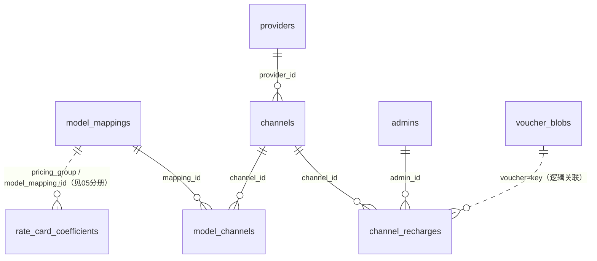

# 07 · 模型与渠道控制面（providers / channels / model_mappings / model_channels / routing_policies / channel_recharges / voucher_blobs / integration_settings）

> 源码：`packages/db/src/schema/providers.ts`、`channels.ts`、`model-mappings.ts`、`routing.ts`、`channel-recharges.ts`、`integration-settings.ts`。业务实现：`packages/control-plane`（模型/渠道配置）、`packages/inference`（路由编排）、`packages/ai`（上游协议）。

## 0. 这个域解决什么问题

网关的核心灵魂问题：**用户请求「gpt-4o」，发到哪个上游、用什么 Key、按什么价、失败了怎么办？** 控制面四层回答：

```
model_mappings   「gpt-4o」是什么：真实模型、官方定价、计费单位、参数规则
      │
model_channels   这个模型哪些渠道能跑 + 该渠道的出站模型名 + 渠道侧成本价
      │
channels         渠道 = 供应商 × 一把上游 Key：健康/熔断/限流/上游资金
      │
providers        供应商：协议 + base_url + 厂商档案
```

路由时 `inference` 包把这些表按「映射渠道列表 ∩ 渠道白名单 ∩ 渠道健康」算出候选集（`findRouteCandidates` SQL 单点收口），再按 routing_policies 策略打分选渠。

---

## 1. providers — 供应商

### 字段明细

| 字段 | 类型 | 约束 | 含义 |
|---|---|---|---|
| id | bigserial | PK | 供应商 ID |
| name | varchar(32) | NOT NULL，部分唯一（仅在册行） | 名称 |
| protocol | varchar(32) | NOT NULL 默认 'openai-compatible' | 协议标识 = ai 包适配器注册表键（SUPPORTED_PROTOCOLS 单一真相；当前仅 openai-compatible） |
| vendor | varchar(32) | 可空 | 厂商档案键（VENDOR_PROFILES 词表）：协议族的参数怪癖预设（如 openai 的 max_tokens→max_completion_tokens）；NULL = 无档案纯透传；合法值由 admin-api 校验 |
| base_url | varchar(255) | NOT NULL | 上游基础 URL |
| status | smallint | NOT NULL 默认 0 | 0 启用 / 1 禁用 |
| deleted_at | timestamptz | 可空 | 软删除（回收站），见下 |
| created_at | timestamptz | 默认 now() | 时间 |

```sql
-- 等价 DDL（由 drizzle 声明直译）
CREATE TABLE providers (
  id bigserial PRIMARY KEY,
  name varchar(32) NOT NULL,
  protocol varchar(32) NOT NULL DEFAULT 'openai-compatible',
  vendor varchar(32),
  base_url varchar(255) NOT NULL,
  status smallint NOT NULL DEFAULT 0,
  deleted_at timestamptz,
  created_at timestamptz NOT NULL DEFAULT now()
);
-- 部分唯一：仅约束在册记录——逻辑删除后名称释放，可重建同名
CREATE UNIQUE INDEX providers_name_uq ON providers (name) WHERE deleted_at IS NULL;
```

**软删除规约**（providers/channels/model_mappings 三表同款）：`deleted_at IS NULL` = 在册；非空 = 已删除但记录保留（历史渠道 FK 引用不受影响）；删除时强制 status=1，恢复记录回到禁用态。名称唯一约束是**部分唯一索引**（`WHERE deleted_at IS NULL`）——删掉的记录不占用名称，可重建同名供应商。

## 2. channels — 渠道（供应商 × 上游 Key）

### 为什么需要它

同一个供应商可以开多个账号/多把 Key（配额分散、故障隔离）——渠道就是「一把可用的人间钥匙」。路由、熔断、上游资金控制都挂在这层。

### 字段明细

**基础组：**

| 字段 | 类型 | 约束 | 含义 |
|---|---|---|---|
| id | bigserial | PK | 渠道 ID |
| provider_id | bigint | NOT NULL，FK → providers | 供应商 |
| name | varchar(64) | NOT NULL，部分唯一（在册行） | 渠道名 |
| api_key_enc | text | NOT NULL | **AES-GCM 加密的上游 Key**（解密密钥在环境变量；库被拖也拿不到上游 Key） |
| base_url_override | varchar(255) | 可空 | 覆盖供应商 base_url（同供应商多区域端点） |
| models | jsonb (string[]) | 可空 | 上游模型名**白名单**：NULL/空=不限；非空时路由取「映射渠道列表 ∩ 白名单」（交集按绑定行 upstream_model 匹配） |

**路由与保护组：**

| 字段 | 类型 | 约束 | 含义 |
|---|---|---|---|
| weight | bigint | NOT NULL 默认 1 | 同优先级内的加权随机权重 |
| priority | bigint | NOT NULL 默认 0 | 优先级（先高后低）；注：路由排序的 weight/priority 单轨住在 channels 层（model_channels 旧列已由迁移 0107 清退） |
| status | smallint | NOT NULL 默认 0 | **0 启用 / 1 禁用 / 2 维护 / 3 熔断(自动) / 4 凭据无效**（连续 401/403，换 Key 后恢复） |
| fail_count | bigint | NOT NULL 默认 0 | 连续失败次数（仅计 circuitTrip 类错误，熔断判定） |
| cooldown_until | timestamptz | 可空 | 熔断冷却截止 |
| rpm_limit / tpm_limit | bigint | 可空 | 渠道级限流（保护上游配额） |

**上游资金组（渠道「进货额度」模型）：**

| 字段 | 类型 | 约束 | 含义 |
|---|---|---|---|
| upstream_budget | numeric(38,18) | NOT NULL 默认 0 | 当前余额（元）= 渠道「有没有钱」的唯一依据。入货 +、调账 ±、结算按实际成本原子扣减；**可为负**（历史/在途超支）。余额 ≤ 0 → 路由硬闸拦截新请求 |
| upstream_threshold | numeric(38,18) | 可空 | 熔断阈值：剩余 ≤ 此值自动熔断（status=3）+ 清路由缓存；NULL=0（耗尽才熔断）；仅 budget>0 时生效 |
| upstream_reserved | numeric(38,18) | NOT NULL 默认 0，CHECK ≥ 0 | 在途上游成本敞口：选渠时原子累加本次预估、结算/释放时原子扣减；与 billing_requests.channel_reserved_amount 对应 |
| usage_evidence_defects | bigint | NOT NULL 默认 0 | 用量证据缺陷计数：结算验收门对上游「发票」（usage 谎报/虚报）的钳制次数；≥ 装配阈值 → 熔断；运营复位后可重启 |
| deleted_at / created_at / updated_at | timestamptz | 软删除 + 时间 | 同 providers 规约 |

```sql
-- 等价 DDL（由 drizzle 声明直译；字段注释见上表）
CREATE TABLE channels (
  id bigserial PRIMARY KEY,
  provider_id bigint NOT NULL REFERENCES providers(id),
  name varchar(64) NOT NULL,
  api_key_enc text NOT NULL,                 -- AES-GCM 密文，解密密钥在环境变量
  base_url_override varchar(255),
  models jsonb,                              -- 上游模型名白名单 string[]
  weight bigint NOT NULL DEFAULT 1,
  priority bigint NOT NULL DEFAULT 0,
  status smallint NOT NULL DEFAULT 0,        -- 0..4（启用/禁用/维护/熔断/凭据无效）
  fail_count bigint NOT NULL DEFAULT 0,
  cooldown_until timestamptz,
  rpm_limit bigint,
  tpm_limit bigint,
  upstream_budget numeric(38, 18) NOT NULL DEFAULT 0,
  upstream_threshold numeric(38, 18),
  usage_evidence_defects bigint NOT NULL DEFAULT 0,
  upstream_reserved numeric(38, 18) NOT NULL DEFAULT 0,
  deleted_at timestamptz,
  created_at timestamptz NOT NULL DEFAULT now(),
  updated_at timestamptz NOT NULL DEFAULT now(),
  -- 在途敞口非负（释放路径带 >= 守卫的原子扣减，DB 兜底禁穿透）。
  -- 刻意不加 upstream_reserved <= upstream_budget 的 CHECK：
  -- 管理端允许调低 budget，该场景由 reserveChannel 守卫 UPDATE 拦新预留，不构成结构不变量
  CONSTRAINT channels_upstream_reserved_nonnegative_ck CHECK (upstream_reserved >= 0)
);
CREATE INDEX channels_provider_id_idx ON channels (provider_id);
CREATE UNIQUE INDEX channels_name_uq ON channels (name) WHERE deleted_at IS NULL;
```

**这套模型的价值**：把「上游供应商也是要花钱的」纳入结构化管控——渠道余额耗尽自动停用、在途成本可见、上游谎报用量会积累缺陷计数直到熔断。

## 3. model_mappings — 模型映射（对外名 → 真实模型）

### 为什么需要它

对外暴露统一的模型目录（名字可运营化），内部映射到各上游的真实模型名；**同时是官方定价的载体**。

### 字段明细

**身份组：**

| 字段 | 类型 | 约束 | 含义 |
|---|---|---|---|
| id | bigserial | PK | 映射 ID |
| external_name | varchar(64) | NOT NULL，部分唯一（在册行） | 对外模型名（用户请求里的 model 参数） |
| real_model | varchar(128) | NOT NULL | 真实模型名（**能力规范名**：身份/计费/统计口径） |
| context_length | bigint | 可空 | 上下文窗口（token 数；null=未知；目录导入带入可编辑） |
| status | smallint | NOT NULL 默认 0 | 0 上架 / 1 下架 |
| deleted_at | timestamptz | 可空 | 软删除（同规约；恢复回到下架态不直接复活上架） |

**定价组（官方价，元/百万 token）：**

| 字段 | 类型 | 约束 | 含义 |
|---|---|---|---|
| input_price / output_price | numeric(38,18) | NOT NULL 默认 0，CHECK ≥ 0 | 输入/输出单价 |
| cache_input_price | numeric(38,18) | 同上 | 缓存命中单价（不启用缓存计费则与输入价同值） |
| cache_write_price | numeric(38,18) | 同上 | 缓存写单价（Anthropic 5m 档 1.25×/1h 档 2× 输入价；0=不收缓存写费） |
| pricing_unit | varchar(16) | CHECK ∈ {token, request, image, second, char} | **计量维度**：token 三元组计价 / 按次 / 按张 / 按秒 / 按字符（非 token 单位用 unit_price，token 三元组不参与结算） |
| unit_price | numeric(38,18) | CHECK ≥ 0 | 单位单价（元/单位；token 模型恒 0） |
| pricing_group | varchar(32) | 可空，有索引 | 定价分组键：费率卡 scope='group' 系数行按此匹配（如 'anthropic'、'image-gen'） |
| billing_config | jsonb | NOT NULL 默认 {} | 可扩展计费配置：`flat`（缺省，unit_price 列生效）/ `variant`（变体价格表，如图像分辨率差价）/ `schedule`（分时段窗口价格表）…… 与 pricing_unit **正交**：unit=计量维度，本列=单价怎么选 |

**行为组：**

| 字段 | 类型 | 含义 |
|---|---|---|
| fallback_models | jsonb (string[]) | fallback 模型链（对外名数组；默认空=不降级） |
| param_rules | jsonb | 参数抹平规则（透传基底）：`{ignore:[], clamp:{}, map:{}, unknown:'passthrough'|'drop'}` |
| billing_policy | jsonb | 版本化多模态足额授权策略；最终结算仍只认供应商可信 usage |
| rpm_limit / tpm_limit | bigint | 模型级限流 |

CHECK 价格非负的注释值得记住：**入口 zod 已拦，DB 兜底——负价经 calcAmount 钳 0 会静默免费**（钳制逻辑会把负数金额截成 0，等于白送，所以必须在源头拒绝）。

### 建表 SQL（等价 DDL，由 drizzle 声明直译）

```sql
CREATE TABLE model_mappings (
  id bigserial PRIMARY KEY,
  external_name varchar(64) NOT NULL,        -- 对外模型名
  context_length bigint,
  real_model varchar(128) NOT NULL,          -- 能力规范名
  status smallint NOT NULL DEFAULT 0,        -- 0 上架 / 1 下架
  input_price numeric(38, 18) NOT NULL DEFAULT 0,
  output_price numeric(38, 18) NOT NULL DEFAULT 0,
  cache_input_price numeric(38, 18) NOT NULL DEFAULT 0,
  cache_write_price numeric(38, 18) NOT NULL DEFAULT 0,
  pricing_unit varchar(16) NOT NULL DEFAULT 'token',
  unit_price numeric(38, 18) NOT NULL DEFAULT 0,
  pricing_group varchar(32),
  billing_config jsonb NOT NULL DEFAULT '{}',      -- flat | variant | schedule …
  fallback_models jsonb,
  param_rules jsonb,
  billing_policy jsonb,
  rpm_limit bigint,
  tpm_limit bigint,
  deleted_at timestamptz,
  created_at timestamptz NOT NULL DEFAULT now(),
  updated_at timestamptz NOT NULL DEFAULT now(),
  -- 负价经 calcAmount 钳 0 会静默免费，DB 兜底拒绝
  CONSTRAINT model_mappings_prices_nonnegative_ck CHECK (
    input_price >= 0 AND output_price >= 0 AND cache_input_price >= 0
    AND cache_write_price >= 0 AND unit_price >= 0),
  -- 计费单位词表（新增单位须同步 PRICING_UNITS 常量与计价公式）
  CONSTRAINT model_mappings_pricing_unit_ck
    CHECK (pricing_unit IN ('token','request','image','second','char'))
);
CREATE UNIQUE INDEX model_mappings_external_name_uq
  ON model_mappings (external_name) WHERE deleted_at IS NULL;
CREATE INDEX model_mappings_pricing_group_idx ON model_mappings (pricing_group);
```

## 4. model_channels — 映射 × 渠道关联（多对多桥）

### 为什么需要它

一个模型跑在多个渠道（冗余/比价），一个渠道跑多个模型——桥表承载绑定，**外加每个渠道的出站模型名与成本价**。

| 字段 | 类型 | 约束 | 含义 |
|---|---|---|---|
| mapping_id | bigint | 复合 PK 之一，FK → model_mappings | 映射 |
| channel_id | bigint | 复合 PK 之一，FK → channels | 渠道 |
| upstream_model | varchar(128) | NOT NULL | **该渠道的出站模型名**（厂商各异名的单一真相）：mapping.real_model 是能力规范名，真正发往上游的模型名在本列 |
| cost_input_price / cost_output_price / cost_cache_input_price / cost_cache_write_price / cost_unit_price | numeric(38,18) | 可空，CHECK：任一非空则全部 ≥ 0 | **渠道成本价**（双轨定价）：NULL = 继承映射官方价（读取处 SQL COALESCE 单轨收口） |
| cost_config | jsonb | NOT NULL 默认 {} | 成本侧计费配置（与 billingConfig 同构，如 schedule 峰谷成本窗口）；窗口命中后字段级覆盖成本平价列 |

复合主键天然防重复绑定。**双轨定价**的含义：官方价（映射层）是对用户的**售价基准**；成本价（绑定层）是该渠道的**进货价**——两者之差就是毛利，渠道比价/毛利分析靠这组列。

```sql
-- 等价 DDL（由 drizzle 声明直译）
CREATE TABLE model_channels (
  mapping_id bigint NOT NULL REFERENCES model_mappings(id),
  channel_id bigint NOT NULL REFERENCES channels(id),
  upstream_model varchar(128) NOT NULL,      -- 该渠道的出站模型名（缺省物化为映射 realModel）
  cost_input_price numeric(38, 18),          -- NULL = 继承映射官方价（COALESCE 收口）
  cost_output_price numeric(38, 18),
  cost_cache_input_price numeric(38, 18),
  cost_cache_write_price numeric(38, 18),
  cost_unit_price numeric(38, 18),
  cost_config jsonb NOT NULL DEFAULT '{}',   -- 成本侧计费配置（与 billingConfig 同构）
  CONSTRAINT model_channels_pk PRIMARY KEY (mapping_id, channel_id),  -- 复合主键天然防重复绑定
  -- 成本价非负（可空列——NULL 继承不触发）
  CONSTRAINT model_channels_cost_nonnegative_ck CHECK (
    cost_input_price IS NULL OR (
      cost_input_price >= 0 AND cost_output_price >= 0 AND cost_cache_input_price >= 0
      AND cost_cache_write_price >= 0 AND cost_unit_price >= 0))
);
CREATE INDEX model_channels_channel_id_idx ON model_channels (channel_id);
```

## 5. routing_policies — 智能路由策略（热配置）

| 字段 | 类型 | 约束 | 含义 |
|---|---|---|---|
| id | bigserial | PK | 行 ID |
| scope | varchar(64) | NOT NULL，UNIQUE | 'global' 单行；预留 'mapping:{id}' 级覆写（字段级 merge 覆盖全局） |
| version | varchar(32) | NOT NULL | 版本号（应用层保存时自增——展示与回滚锚点） |
| policy | jsonb | NOT NULL | 策略体：scorers/retry/penalty/modelDead/wait，形状单一真源在 `packages/inference` 的 routingPolicySchema（写侧 zod 校验坏值拒落库；读侧解析失败沿用上一份好值） |
| note | varchar(255) | 可空 | 编辑留痕 |
| updated_by | varchar(64) | 可空 | 操作人 |
| created_at / updated_at | timestamptz | 时间 | |

```sql
-- 等价 DDL（由 drizzle 声明直译）
CREATE TABLE routing_policies (
  id bigserial PRIMARY KEY,
  scope varchar(64) NOT NULL,          -- 'global' 单行；预留 'mapping:{id}' 覆写
  version varchar(32) NOT NULL,
  policy jsonb NOT NULL,               -- 形状单一真源：inference 包 routingPolicySchema
  note varchar(255),
  updated_by varchar(64),
  created_at timestamptz NOT NULL DEFAULT now(),
  updated_at timestamptz NOT NULL DEFAULT now()
);
CREATE UNIQUE INDEX routing_policies_scope_uq ON routing_policies (scope);
```

gateway 用 **TTL reader** 读这张表（≤15s 生效，不重启）——调路由策略是纯运营操作。

## 6. channel_recharges — 渠道资金流水（入货/调账）

### 为什么需要它

`channels.upstream_budget` 只回答「现在多少钱」，本表回答「怎么变成这样的」——append-only 审计账（只追加，不修改不删除）。

| 字段 | 类型 | 约束 | 含义 |
|---|---|---|---|
| id | bigserial | PK | 行 ID |
| channel_id | bigint | NOT NULL，FK → channels | 渠道 |
| type | varchar(16) | NOT NULL 默认 'recharge' | recharge 入货（amount 恒正）/ adjust 调账（可正负，修正错误） |
| amount | numeric(38,18) | NOT NULL | 有符号金额（元） |
| balance_after | numeric(38,18) | NOT NULL 默认 0 | 变动后 channels.upstream_budget 快照（对账追溯） |
| order_no | varchar(128) | 可空 | 支付订单号（入货时可选） |
| voucher | varchar(128) | 可空 | 支付凭证截图 key（指向 voucher_blobs 的 key，见 §7） |
| remark | varchar(255) | 可空 | 备注 |
| admin_id | bigint | FK → admins，可空 | 操作管理员（seed/导入可为 null） |
| created_at | timestamptz | 默认 now() | 时间 |

```sql
-- 等价 DDL（由 drizzle 声明直译；append-only，只追加不修改不删除）
CREATE TABLE channel_recharges (
  id bigserial PRIMARY KEY,
  channel_id bigint NOT NULL REFERENCES channels(id),
  type varchar(16) NOT NULL DEFAULT 'recharge',   -- recharge | adjust
  amount numeric(38, 18) NOT NULL,                -- 入货恒正，调账可正负
  balance_after numeric(38, 18) NOT NULL DEFAULT 0,
  order_no varchar(128),
  voucher varchar(128),                           -- 凭证 key（指向 voucher_blobs）
  remark varchar(255),
  admin_id bigint REFERENCES admins(id),
  created_at timestamptz NOT NULL DEFAULT now()
);
CREATE INDEX channel_recharges_channel_created_idx ON channel_recharges (channel_id, created_at);
```

## 7. voucher_blobs — 凭证字节存储（唯一不进 drizzle 的表）

> DDL 单一真源：迁移 `0066_voucher_blobs.sql`；消费方：`packages/control-plane/src/adapters/postgres/voucher-storage.ts`（raw SQL 直用）。

### 为什么存在、为什么是 raw-SQL 表

渠道入货凭证（支付截图）原本存本地磁盘 `./data/vouchers`——多副本部署时互不可见、容器重建即丢。凭证是小图（≤2MB，PNG/JPEG/WebP/GIF 白名单），bytea 直存 DB；运营低频回看，不值引入对象存储的运维面。

| 字段 | 类型 | 约束 | 含义 |
|---|---|---|---|
| key | varchar(48) | PK | 凭证键 = uuid.ext（与 channel_recharges.voucher 列兼容） |
| mime | varchar(32) | NOT NULL | MIME 类型 |
| data | bytea | NOT NULL | 凭证字节 |
| created_at | timestamptz | NOT NULL 默认 now() | 上传时间 |

```sql
-- 迁移 0066 原文
create table if not exists "voucher_blobs" (
  "key" varchar(48) primary key,
  "mime" varchar(32) not null,
  "data" bytea not null,
  "created_at" timestamptz not null default now()
);
create index if not exists "voucher_blobs_created_at_idx"
  on "voucher_blobs" ("created_at" desc);
```

drizzle schema 刻意不建模（适配器注释明示「DDL 在 db 迁移 0066」）——所以全库统计时它是 52 张 drizzle 表之外的第 53 张。port 设计留了 OSS 适配的口子（`ports/voucher-storage.ts`），将来可整体切换。

## 8. integration_settings — 第三方集成动态配置

### 为什么需要它

OAuth/SMTP/Turnstile/易支付/Stripe 的凭据原本在 env——改 SMTP 密码要发版、轮换支付密钥有停机窗口。迁入 DB 后：热生效 + 审计 + 轮换双读窗。

| 字段 | 类型 | 约束 | 含义 |
|---|---|---|---|
| key | varchar(64) | PK，CHECK 封闭词表 ∈ {oauth.github, oauth.google, smtp, captcha.turnstile, payment.epay, payment.stripe} | 集成键（词表单一真源在 control-plane domain，本表 CHECK 与之逐项相等，契约测试锁定） |
| enabled | boolean | NOT NULL 默认 false | 功能面开关（true ⇒ config 必填齐全——写入侧用例保证）。停用保留凭据，重启用无需重录 |
| config | jsonb | NOT NULL 默认 {} | 字段值；**secret 字段以 enc:v1 密文内嵌**（根密钥与渠道 Key 同一部署契约）；非 secret 明文 |
| previous_secrets | jsonb | 可空 | 轮换双读窗 `{field: enc:v1 密文}`——仅 payment 验签字段进入；96h 自愈 |
| rotated_at | timestamptz | 可空 | 最近一次 rotatable secret 轮换时刻 |
| updated_by_admin_id | bigint | 可空 | 最后修改管理员 |
| updated_at | timestamptz | 默认 now() | 修改时间 |

```sql
-- 等价 DDL（由 drizzle 声明直译）
CREATE TABLE integration_settings (
  key varchar(64) PRIMARY KEY,
  enabled boolean NOT NULL DEFAULT false,
  config jsonb NOT NULL DEFAULT '{}',          -- secret 字段为 enc:v1 密文
  previous_secrets jsonb,                     -- 轮换双读窗 {field: enc:v1}，仅 payment 验签字段
  rotated_at timestamptz,
  updated_by_admin_id bigint,
  updated_at timestamptz NOT NULL DEFAULT now(),
  -- key 词表封闭：与 control-plane domain 词表逐项相等（契约测试锁定）
  CONSTRAINT integration_settings_key_ck CHECK (key IN (
    'oauth.github','oauth.google','smtp',
    'captcha.turnstile','payment.epay','payment.stripe'))
);
```

**双读窗**解决的经典难题：支付渠道改验签密钥后，回调可能还带旧密钥签名——新旧密钥同时可验一个窗口期（96h），过期自动收敛到只认新密钥。**无行 = 未配置**（语义等价 enabled=false, config={}）。

## 9. 本域关系图



选渠判定（inference 包 `findRouteCandidates` 单点收口）：候选 = model_channels（映射绑定）∩ channels.models 白名单（按 upstream_model 匹配）∩ 渠道可用（status=0、未熔断、budget−reserved 足够、限流未超），再按 routing_policies 打分。
