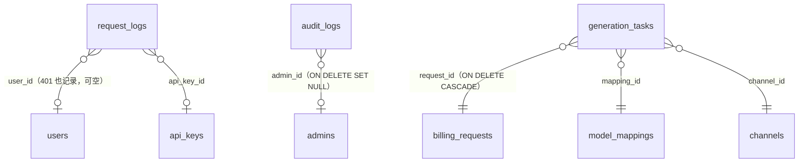

# 08 · 日志与观测（request_logs / trace_spans / audit_logs / generation_tasks）

> 源码：`packages/db/src/schema/logs.ts`、`tracing.ts`、`generation-tasks.ts`。业务实现：`apps/trace-receiver`（OTLP 接收）、`apps/worker`（分区维护/任务轮询）、gateway/admin-api（日志写入）。

## 0. 这个域的分工

| 表 | 定位 | 保留策略 |
|---|---|---|
| request_logs | **排障日志**：每个 HTTP 请求一条（含 401） | 按月分区，30 天滚动删除 |
| usage_logs（05 分册） | **计费账本**：只记成功计费 | 长期保留 |
| trace_spans | **链路追踪**：分布式调用树 | 按日分区，诊断级 best-effort |
| audit_logs | **管理操作审计**：后台动过什么 | 长期保留 |
| generation_tasks | **异步生成任务**（视频/音乐）：任务生命周期与产物 | 长期保留 |

request_logs 与 usage_logs 的分工是刻意设计：排障日志（含失败请求、含请求摘要）体积大价值衰减快，30 天足够；计费账本是钱，永久保留。混在一张表里要么浪费存储要么丢证据。

---

## 1. request_logs — 请求日志（分区表！）

### ⚠️ 先记最重要的工程约定

实际 DB 中本表自迁移 0040 起是 `PARTITION BY RANGE (created_at)` 的**分区母表**：

- 主键是 `(id, created_at)`（分区表主键必须含分区键），**没有外键**（高频写入表去掉每行两次 FK 检查也是收益，引用完整性由写入方保证）；
- drizzle 声明只描述列结构供查询类型使用——**不要对 request_logs 跑 db:generate**，涉该表变更必须手写迁移并核对分区母表/索引。

分区由 worker 每小时维护：预建 [前月, 当月, 次月] 分区 + DEFAULT 兜底分区，每日滚动删 30 天前分区——删除 = `DROP TABLE 分区`，瞬时完成，不产生 DELETE 巨事务。

### 迁移 0040 的换表手法（值得学习的迁移范本）

```sql
-- 建新分区表（LIKE 旧表含默认值 + 新主键）
CREATE TABLE request_logs_partitioned (
  LIKE request_logs INCLUDING DEFAULTS,
  PRIMARY KEY (id, created_at)
) PARTITION BY RANGE (created_at);
-- DO 块循环建 [-1..1] 月分区 + DEFAULT 分区；母表建索引自动下推分区
-- 拷贝存量 + 原子换名（事务内，锁窗口极短）
INSERT INTO request_logs_partitioned SELECT * FROM request_logs;
ALTER TABLE request_logs RENAME TO request_logs_unpartitioned;
ALTER TABLE request_logs_partitioned RENAME TO request_logs;
-- bigserial 序列所有权仍在旧表：先解绑→删旧表→所有权交给新表→setval 对齐 max(id)
ALTER SEQUENCE request_logs_id_seq OWNED BY NONE;
DROP TABLE request_logs_unpartitioned;
ALTER SEQUENCE request_logs_id_seq OWNED BY request_logs.id;
SELECT setval('request_logs_id_seq', (SELECT COALESCE(max(id),1) FROM request_logs));
```

### 字段明细

| 字段 | 类型 | 约束 | 含义 |
|---|---|---|---|
| id | bigserial | PK（实际 (id, created_at)） | 行 ID |
| request_id | uuid | NOT NULL | 网关请求 ID（与 billing/usage 同源，串起排障链） |
| user_id | bigint | FK → users，可空 | 用户（**鉴权前也记**，401 也有——user 可空） |
| api_key_id | bigint | FK → api_keys，可空 | 凭证 Key |
| method | varchar(8) | NOT NULL | HTTP 方法 |
| path | varchar(128) | NOT NULL | 路径 |
| status_code | bigint | NOT NULL | 响应状态码 |
| error_code | varchar(32) | 可空 | 错误码 |
| duration_ms | bigint | NOT NULL | 耗时 |
| request_summary | jsonb | 可空 | **截断后的**请求摘要（不含敏感内容；截断长度可配置，默认 2000 字符） |
| attempts | bigint | NOT NULL 默认 1 | 尝试渠道次数（观测用） |
| channels | jsonb (string[]) | 可空 | 尝试渠道轨迹：渠道名按评估序，**含被门拒绝的渠道**——失败请求的换渠排障事实 |
| source_ip | varchar(64) | 可空 | 来源 IP（X-Forwarded-For 首段 / X-Real-IP / socket；鉴权前记录，401 也有） |
| created_at | timestamptz | NOT NULL 默认 now()，分区键 | 时间 |

### 当前态建表 SQL（分区母表形态）

```sql
-- 实际 DB 中的形态（迁移 0040 起）：分区母表，主键含分区键，无 FK
CREATE TABLE request_logs (
  id bigserial PRIMARY KEY,
  request_id uuid NOT NULL,
  user_id bigint,                       -- 无 FK：分区表去 FK 检查也是高频写入收益
  api_key_id bigint,
  method varchar(8) NOT NULL,
  path varchar(128) NOT NULL,
  status_code bigint NOT NULL,
  error_code varchar(32),
  duration_ms bigint NOT NULL,
  request_summary jsonb,
  attempts bigint NOT NULL DEFAULT 1,
  channels jsonb,                       -- 尝试渠道轨迹 string[]
  source_ip varchar(64),
  created_at timestamptz NOT NULL DEFAULT now(),
  PRIMARY KEY (id, created_at)          -- 分区键必须在主键内
) PARTITION BY RANGE (created_at);
-- 索引声明在母表，自动下推各分区
CREATE INDEX request_logs_created_idx ON request_logs (created_at);
CREATE INDEX request_logs_user_created_idx ON request_logs (user_id, created_at);
```

> 注意：drizzle 声明里 `user_id`/`api_key_id` 写了 `.references()`，但真实分区表（0040 换表后）不保留 FK——以迁移为准。

## 2. trace_spans — 链路 span（OTLP 接收 + 日分区）

### 为什么需要它

OpenTelemetry 链路追踪的落库端：gateway/inference/worker 各服务上报 span，admin 后台按 traceId/requestId 查询。**数据等级定位是「诊断数据（best-effort）」**——接收端过载即丢，绝不反压业务主链路。

| 字段 | 类型 | 约束 | 含义 |
|---|---|---|---|
| trace_id | varchar(32) | NOT NULL，有索引 | 链路 ID（一次请求的全链路） |
| span_id | varchar(16) | NOT NULL | span ID |
| parent_span_id | varchar(16) | 可空 | 父 span（树形） |
| name | varchar(256) | NOT NULL | span 名（如 gateway.handle / billing.settle） |
| service | varchar(64) | NOT NULL | 上报服务名 |
| start_time / end_time | timestamptz | NOT NULL，start_time 有索引 | 起止（分区键 = start_time，按日 RANGE 分区，DDL 在迁移 0028） |
| duration_ms | bigint | NOT NULL | 时长 |
| status_code | smallint | NOT NULL 默认 0 | OTel StatusCode：0=UNSET 1=OK 2=ERROR |
| status_message | varchar(512) | 可空 | 状态消息（异常信息） |
| request_id | varchar(64) | 可空，有索引 | **提升列**：网关请求 ID——计费关联的点查入口 |
| user_id | bigint | 可空 | **提升列**：用户 ID |
| channel | varchar(64) | 可空 | **提升列**：渠道标识 |
| model | varchar(128) | 可空 | **提升列**：模型名 |
| attributes | jsonb | NOT NULL 默认 {} | 完整 span 属性（含未提升的所有键） |
| events | jsonb | NOT NULL 默认 [] | span events（异常等）`[{name, timeMs, attributes}]` |
| created_at | timestamptz | 默认 now() | 落库时间 |

```sql
-- 当前态建表 SQL（等价 DDL；按 start_time 日分区，DDL 见迁移 0028）
CREATE TABLE trace_spans (
  trace_id varchar(32) NOT NULL,
  span_id varchar(16) NOT NULL,
  parent_span_id varchar(16),
  name varchar(256) NOT NULL,
  service varchar(64) NOT NULL,
  start_time timestamptz NOT NULL,        -- 分区键
  end_time timestamptz NOT NULL,
  duration_ms bigint NOT NULL,
  status_code smallint NOT NULL DEFAULT 0,  -- 0=UNSET 1=OK 2=ERROR
  status_message varchar(512),
  request_id varchar(64),                 -- 提升列（高频点查键）
  user_id bigint,                         -- 提升列
  channel varchar(64),                    -- 提升列
  model varchar(128),                     -- 提升列
  attributes jsonb NOT NULL DEFAULT '{}', -- 全量原始属性
  events jsonb NOT NULL DEFAULT '[]',
  created_at timestamptz NOT NULL DEFAULT now()
);
CREATE INDEX trace_spans_trace_id_idx ON trace_spans (trace_id);
CREATE INDEX trace_spans_request_id_idx ON trace_spans (request_id);
CREATE INDEX trace_spans_start_time_idx ON trace_spans (start_time);
```

**「提升列」模式**是 JSONB 日志表的高频最佳实践：OTel 原始数据都在 attributes JSONB 里，但按 request_id/user_id/channel/model 点查是刚需——JSONB 索引又贵又慢，所以接收时把高频键提取成真实列并建普通索引，attributes 原样保留。

## 3. audit_logs — 管理操作审计

### 为什么需要它

后台每次敏感操作（改渠道、调余额、封号…）必须可追责。actor 二分：`admin`（人，admin_id 必填）/ `system`（系统任务：对账、赠送、自动冻结，admin_id 为 NULL）。

| 字段 | 类型 | 约束 | 含义 |
|---|---|---|---|
| id | bigserial | PK | 行 ID |
| admin_id | bigint | FK → admins，**ON DELETE SET NULL** | 操作管理员；系统任务为 NULL（管理员被删也不丢审计行，只是失联） |
| actor | varchar(8) | NOT NULL 默认 'admin' | admin / system |
| action | varchar(64) | NOT NULL | 动作码（如 channel.update / user.adjust） |
| target_type | varchar(32) | NOT NULL | 目标类型（channel/user/billing…） |
| target_id | varchar(64) | 可空 | 目标 ID |
| detail | jsonb | 可空 | **变更前后摘要**（diff） |
| created_at | timestamptz | 默认 now()，有索引 | 时间 |

```sql
-- 等价 DDL（由 drizzle 声明直译）
CREATE TABLE audit_logs (
  id bigserial PRIMARY KEY,
  admin_id bigint REFERENCES admins(id) ON DELETE SET NULL,  -- 系统任务为 NULL
  actor varchar(8) NOT NULL DEFAULT 'admin',                 -- admin | system
  action varchar(64) NOT NULL,                               -- 如 channel.update / user.adjust
  target_type varchar(32) NOT NULL,
  target_id varchar(64),
  detail jsonb,                                              -- 变更前后摘要
  created_at timestamptz NOT NULL DEFAULT now()
);
CREATE INDEX audit_logs_created_idx ON audit_logs (created_at);
```

## 4. generation_tasks — 异步生成任务（视频/音乐）

### 为什么需要它

聊天补全是同步请求-响应；视频/音乐生成是**分钟级异步任务**：提交→排队→上游慢跑→轮询取结果。资金模型与 billing_requests 同构（两阶段：提交=authorize 预留 → 完成=实扣 / 失败超时=released 释放），本表只承载任务生命周期与产物，**资金单一真相在 billing_requests**。

### 状态机

```
queued（已提交；music=待 worker 执行）→ running →
  succeeded（result 必填）| failed / expired（fail_reason 必填）
```

终态一致性由 CHECK 强制：成功必有产物、失败/超时必有原因，二者与状态迁移同 UPDATE 写入。

### 与结算的顺序协议（表头注释精义，防漏收/漏放的关键）

- **succeeded：先 signal 后 CAS 终态**——实扣信号是权威动作，扣费成功才置终态；CAS 失败（已被并发置终态）无妨，任务行保留重试；
- **failed/expired：先 CAS 终态后 signal**——释放路径相反，信号失败由 recover 兜底。

一句话：**宁可任务状态滞后，不可账本动作丢失**。

### 字段明细

| 字段 | 类型 | 约束 | 含义 |
|---|---|---|---|
| id | uuid | PK，默认 gen_random_uuid() | 对外任务 ID（`GET /v1/videos/{id}` 查询键） |
| request_id | uuid | NOT NULL，FK → billing_requests，**ON DELETE CASCADE** | 关联账单（预留与结算的事实源） |
| user_id | bigint | NOT NULL，FK → users | 用户 |
| api_key_id | bigint | FK → api_keys，可空 | 凭证 |
| mapping_id | bigint | NOT NULL，FK → model_mappings | 模型映射 |
| channel_id | bigint | NOT NULL，FK → channels | 渠道 |
| upstream_task_id | varchar(128) | 可空，UNIQUE(channel_id, upstream_task_id) | 上游任务号（MiniMax video task_id；music 同步调用为 NULL——PG 唯一索引允许多 NULL） |
| upstream_model | varchar(128) | NOT NULL | 出站模型名快照（提交时从绑定行物化；在途任务不随绑定改名漂移） |
| kind | varchar(16) | CHECK ∈ {video, music} | 任务类型 |
| status | varchar(16) | CHECK 状态词表 | 生命周期 |
| params | jsonb | NOT NULL | 提交参数快照（prompt/duration/ratio/帧图引用等，按 kind 各自 schema 校验后落） |
| receipt_template | jsonb | NOT NULL | 收据模板（网关提交时构建；worker 终态填 usage.units 即成收据） |
| units_snapshot | numeric(38,18) | 可空 | 计费时长快照（pricingUnit=second 时=duration；按次为 1） |
| result | jsonb | 可空 | 终态产物：video `{videoUrl,width,height}` / music `{audioUrl}` |
| fail_reason | varchar(512) | 可空 | 失败原因（终态必填其一） |
| created_at / updated_at | timestamptz | 时间 | |
| expires_at | timestamptz | NOT NULL | 超时上界（提交时间+TTL）：worker 超时扫描的**权威时间源** |
| finished_at | timestamptz | 可空 | 终态时间 |

索引：`(status, created_at)` 轮询扫描队列（worker 只取未终态行）、`(user_id, created_at desc)` 用户任务列表。

### 建表 SQL（等价 DDL，由 drizzle 声明直译）

```sql
CREATE TABLE generation_tasks (
  id uuid PRIMARY KEY DEFAULT gen_random_uuid(),           -- 对外任务 ID
  request_id uuid NOT NULL REFERENCES billing_requests(request_id) ON DELETE CASCADE,
  user_id bigint NOT NULL REFERENCES users(id),
  api_key_id bigint REFERENCES api_keys(id),
  mapping_id bigint NOT NULL REFERENCES model_mappings(id),
  channel_id bigint NOT NULL REFERENCES channels(id),
  upstream_task_id varchar(128),                           -- music 为 NULL（PG 唯一索引允许多 NULL）
  upstream_model varchar(128) NOT NULL,                    -- 提交时快照
  kind varchar(16) NOT NULL,                               -- video | music
  status varchar(16) NOT NULL DEFAULT 'queued',
  params jsonb NOT NULL,                                   -- 提交参数快照
  receipt_template jsonb NOT NULL,
  units_snapshot numeric(38, 18),
  result jsonb,                                            -- 终态产物
  fail_reason varchar(512),
  created_at timestamptz NOT NULL DEFAULT now(),
  updated_at timestamptz NOT NULL DEFAULT now(),
  expires_at timestamptz NOT NULL,                         -- worker 超时扫描权威时间源
  finished_at timestamptz,
  CONSTRAINT generation_tasks_kind_ck CHECK (kind IN ('video', 'music')),
  CONSTRAINT generation_tasks_status_ck CHECK (
    status IN ('queued', 'running', 'succeeded', 'failed', 'expired')),
  -- 终态一致性：成功必有产物，失败/超时必有原因（与状态迁移同 UPDATE 写入）
  CONSTRAINT generation_tasks_terminal_state_ck CHECK (
    (status = 'succeeded' AND result IS NOT NULL) OR
    (status IN ('failed', 'expired') AND fail_reason IS NOT NULL) OR
    status IN ('queued', 'running'))
);
CREATE INDEX generation_tasks_status_created_idx ON generation_tasks (status, created_at);
CREATE INDEX generation_tasks_user_created_idx ON generation_tasks (user_id, created_at DESC);
-- 同渠道上游任务号唯一（防同 task_id 双落）
CREATE UNIQUE INDEX generation_tasks_channel_upstream_uq ON generation_tasks (channel_id, upstream_task_id);
```

注意 music 与 video 的执行形态差异：music 是 worker 代执行的**同步阻塞型**上游调用（无 upstream_task_id）；video 是提交后轮询上游任务号。

## 5. 本域关系图



trace_spans 通过提升列 `request_id`/`user_id`/`channel`/`model` 与任意业务行做逻辑关联（点查入口），无外键。
