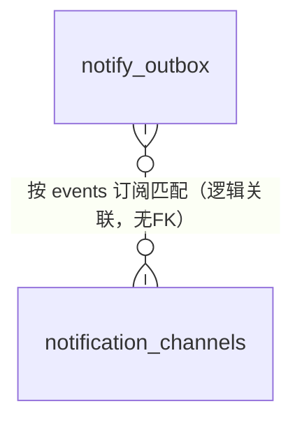

# 09 · 告警通知（notification_channels / notify_outbox）

> 源码：`packages/db/src/schema/notifications.ts`。业务实现：`packages/notifications`（outbox 能力）、`apps/worker`（投递轮询）。

## 0. 这个域解决什么问题

运营需要及时知道坏事发生：渠道熔断/凭据失效、对账出现差异、计费死单、用户余额不足……但「业务代码里直接发 webhook/邮件」有两个致命缺陷：

1. **丢事件**：HTTP 调用失败业务事务已经提交了，事件没了；
2. **拖主链路**：外部服务慢一秒，业务就慢一秒。

解法是**事务性发件箱（transactional outbox）模式**：业务状态变更的**同一事务**里往 `notify_outbox` 插一行事件（要么同生要么同死），worker 独立轮询投递。事件即事实，不搞事后扫描。

```
业务事务： UPDATE 渠道状态 + INSERT notify_outbox（同事务提交）
                                    │
worker（独立进程）： 轮询 outbox → 按渠道订阅的 events 过滤 → 投递 → 记 sent_at
```

---

## 1. notification_channels — 告警通知渠道（目的地注册表）

| 字段 | 类型 | 约束 | 含义 |
|---|---|---|---|
| id | bigserial | PK | 渠道 ID |
| name | varchar(64) | NOT NULL，UNIQUE | 名称（运营起名，如「值班群 webhook」） |
| type | varchar(8) | CHECK ∈ {webhook, email} | 投递方式 |
| config | jsonb | NOT NULL | webhook：`{url, secret}`（POST + **HMAC-SHA256 签名头**，接收方可验签防伪造）；email：`{recipients: string[]}` |
| events | jsonb (string[]) | NOT NULL | 订阅的事件类型列表（NOTIFY_EVENTS 词表的子集；投递前按此过滤——每张渠道只收自己关心的事件） |
| status | smallint | CHECK ∈ {0,1}，默认 0 | 0 启用 / 1 停用 |
| created_at / updated_at | timestamptz | 默认 now() | 时间 |

```sql
-- 等价 DDL（由 drizzle 声明直译）
CREATE TABLE notification_channels (
  id bigserial PRIMARY KEY,
  name varchar(64) NOT NULL,
  type varchar(8) NOT NULL,                  -- webhook | email
  config jsonb NOT NULL,                     -- webhook:{url,secret} / email:{recipients[]}
  events jsonb NOT NULL,                     -- NOTIFY_EVENTS 子集，投递前过滤
  status smallint NOT NULL DEFAULT 0,
  created_at timestamptz NOT NULL DEFAULT now(),
  updated_at timestamptz NOT NULL DEFAULT now(),
  CONSTRAINT notification_channels_type_ck CHECK (type IN ('webhook','email')),
  CONSTRAINT notification_channels_status_ck CHECK (status IN (0, 1))
);
CREATE UNIQUE INDEX notification_channels_name_uq ON notification_channels (name);
```

设计要点：事件类型词表（NOTIFY_EVENTS）在 notifications 包代码里定义，本表 `events` 存其子集——**订阅过滤在投递时做**，同一事件可被多渠道订阅、一个渠道也可只订阅部分事件。

## 2. notify_outbox — 事务性发件箱

### 字段明细

**事件组：**

| 字段 | 类型 | 约束 | 含义 |
|---|---|---|---|
| id | bigserial | PK | 事件 ID |
| event | varchar(32) | NOT NULL | 事件类型（NOTIFY_EVENTS 词表） |
| payload | jsonb | NOT NULL | 事件载荷 |
| dedupe_key | varchar(128) | NOT NULL，**UNIQUE** | 入箱幂等键：业务自然键（如 `balance-low:{userId}:{yyyyMMdd}`——同一用户每天至多一条余额预警） |

**投递组：**

| 字段 | 类型 | 约束 | 含义 |
|---|---|---|---|
| attempts | smallint | NOT NULL 默认 0 | 已尝试次数 |
| last_error | varchar(255) | 可空 | 最近失败原因 |
| delivered_channel_ids | jsonb (number[]) | NOT NULL 默认 '[]'::jsonb，CHECK 是数组 | **已成功投递的渠道 id**：部分失败重试时跳过已成功渠道，避免重复轰炸 |
| next_attempt_at | timestamptz | NOT NULL 默认 now() | 失败退避截止（避免同一轮循环立即重试三次并饿死后续事件） |
| sent_at | timestamptz | 可空 | NULL=待投递；非 NULL=终态时间（已投递或达上限放弃） |

**并发认领组（多副本消费 fencing）：**

| 字段 | 类型 | 约束 | 含义 |
|---|---|---|---|
| claim_owner | varchar(128) | 三列同生同灭（CHECK） | 认领者标识（worker 实例） |
| claim_token | uuid | 同上 | 认领令牌 |
| claim_until | timestamptz | 同上 | 租约到期——过期后其他副本可安全重领 |
| created_at | timestamptz | 默认 now() | 入箱时间 |

### 建表 SQL（等价 DDL，由 drizzle 声明直译）

```sql
CREATE TABLE notify_outbox (
  id bigserial PRIMARY KEY,
  event varchar(32) NOT NULL,                        -- NOTIFY_EVENTS 词表
  payload jsonb NOT NULL,
  dedupe_key varchar(128) NOT NULL,                  -- 业务自然键幂等
  attempts smallint NOT NULL DEFAULT 0,
  last_error varchar(255),
  delivered_channel_ids jsonb NOT NULL DEFAULT '[]'::jsonb,  -- 已成功渠道，重试跳过
  next_attempt_at timestamptz NOT NULL DEFAULT now(),        -- 失败退避截止
  claim_owner varchar(128),
  claim_token uuid,
  claim_until timestamptz,
  sent_at timestamptz,                               -- NULL=待投递；非 NULL=终态时间
  created_at timestamptz NOT NULL DEFAULT now(),
  CONSTRAINT notify_outbox_delivered_channels_ck CHECK (jsonb_typeof(delivered_channel_ids) = 'array'),
  -- 认领三列一致性：要么全空（未被认领），要么全非空且未终态
  CONSTRAINT notify_outbox_claim_ck CHECK (
    (claim_owner IS NULL AND claim_token IS NULL AND claim_until IS NULL) OR
    (sent_at IS NULL AND claim_owner IS NOT NULL
        AND claim_token IS NOT NULL AND claim_until IS NOT NULL))
);
-- 幂等入箱：同一业务事件永远只有一行
CREATE UNIQUE INDEX notify_outbox_dedupe_uq ON notify_outbox (dedupe_key);
-- 待投递扫描队列：worker 轮询 WHERE sent_at IS NULL ORDER BY id
-- 部分索引保持极小（只含未完成行）
CREATE INDEX notify_outbox_pending_idx
  ON notify_outbox (next_attempt_at, claim_until, id) WHERE sent_at IS NULL;
```

### 投递生命周期

```
入箱（业务事务） → worker 认领（claim 三列 CAS）→ 按订阅渠道逐个投递
  ├─ 渠道成功：delivered_channel_ids 追加该渠道 id
  ├─ 渠道失败：attempts+1，next_attempt_at 退避后移，last_error 记录
  └─ 全渠道成功 或 attempts 达上限：sent_at 置终态时间（放弃也置——带 last_error 留痕）
租约过期（claim_until 越界）：其他副本重领，靠 delivered_channel_ids 防重发
```

这套「三列认领 + 部分投递记录 + 部分索引扫描」的组合与 billing_requests 的 claim 组、05 分册的结算租约是同一套并发原语——读懂一处，三处通用。

## 3. 关系图



事件来源（入箱方）：渠道禁用/熔断、对账差异（reconcile_discrepancies）、计费死单（billing_requests.dead）、余额预警等，全部在各业务事务内写 outbox。
