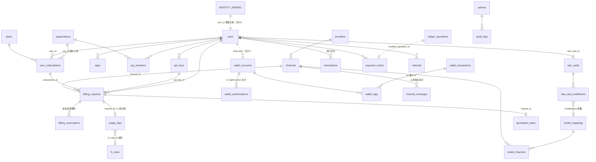

# 10 · ER 总图与核心流程串联

> 本篇把前九个分册的表串成三张图和四条业务流程，适合通读完分册后做整体回顾。

## 1. 全域关系总图（按域收缩）

53 张表全画会不可读，下图按「域 → 核心表」收缩，只画跨域的关键关联：



实线 = 物理外键；虚线（`..`）= 逻辑关联（应用层维护）。三个无 FK 域再看一眼：identity 七表、wallet 四表（资金域不依赖身份域物理外键）、trace_spans/outbox 的提升列关联。

## 2. 流程一：一次计费请求的完整资金链路（最重要）

以「用户用 API Key 非流式调用 chat completion，扣组织套餐额度，额度不够余额补差」为例：

```
① 鉴权（gateway）
   请求 Key → SHA-256 → api_keys.key_hash 唯一索引命中
   → 读出 user_id、subscription_id（计费来源单一真相列）、allow_payg_fallback=true

② 计价（billing，读定价三件套）
   model_mappings（官方价/计量维度）× rate_cards 系数（经 users.rate_card_id，
   解析 model > group > global）× fx_rates（美元价折算）
   → quote 快照

③ 准入与预扣（同事务）
   检查：用户 status 可用、日限（users/api_keys/org_members 三层）、
         订阅可用额度（quota − used − reserved）、钱包可用额
   落 billing_requests（authorized）+ billing_reservations 两行：
     source=subscription amount=X（套餐承担）
     source=payg         amount=Y（余额补差部分）
   同事务：user_subscriptions.reserved_amount += X
          wallet_authorizations 落冻结单 amount=Y（wallet in_flight += Y）
          channels.upstream_reserved += 上游成本预估（该渠道有进货额度时）

④ 路由与上游调用（inference + ai）
   findRouteCandidates：model_channels 绑定 ∩ channels.models 白名单 ∩ 渠道健康
   （status=0、未熔断、budget−reserved 足够、限流未超）→ 策略打分选渠
   请求日志 request_logs 落一行（含渠道轨迹）；换渠道时改写 channel_id 与敞口
   billing_requests → in_flight

⑤ 结算（worker，异步）
   拿到上游 usage 证据（或估算政策）→ 验收门钳制（usage_clamps 记轨迹）
   → billing_requests → settlement_pending → processing（claim 三列认领）
   → usage_logs 落账（四类 token/单位计量 × 价格快照 × 系数快照 × fx 快照；
      plan_amount + payg_amount = amount，CHECK 守恒）
   → wallet：settle 交易（腿：用户账户扣 payg 实扣 + platform_revenue 入账）
     transactions 落用户流水（ref_type='usage_logs'，部分唯一索引幂等）
     订阅 used_amount += plan 实扣；reserved_amount 回落
     wallet_authorizations → settled（settled_amount=Y′，可小于冻结额）
     channels.upstream_budget 原子扣实际成本、upstream_reserved 回落
   → settled（revision CAS，防旧 worker 脑裂）

⑥ 失败路径
   上游失败/取消：billing_requests → released；按 billing_reservations 明细
   逐来源释放（订阅 reserved 回落、冻结单 → released、渠道敞口回落）
   重试失败多次 → dead + notify_outbox 告警（09 分册）
```

涉及表速查：api_keys / model_mappings / rate_card_coefficients / fx_rates / billing_requests / billing_reservations / user_subscriptions / wallet_authorizations / wallet_accounts / channels / request_logs / usage_logs / wallet_transactions / wallet_legs / transactions。

## 3. 流程二：在线充值（钱怎么进来）

```
① 用户发起充值 → payment_orders 落单（status=0 created）
   credit_amount = amount × 当时充值汇率【创建时定死，回调不重算】
② 跳转渠道支付 → 渠道异步回调（status → 1 paid）
③ 入账（回调处理事务）：
   ledger_operations 抢占 operation_id = payment-credit:{provider}:{provider_order_id}
   → wallet credit 交易（腿：outside → user 账户）
   → transactions 落流水（ref_type='payment_orders'，部分唯一索引幂等）
   → payment_orders status → 2 credited（条件 UPDATE，credited_operation_id 锚定）
④ 回调重放/并发双副本：ledger_operations 唯一键 + transactions 部分唯一索引双保险，
   第二次要么阻塞后重放读回执，要么 ON CONFLICT DO NOTHING
```

充值码（redeem）同构：CAS 核销 redeem_codes（status 0→1）+ ledger 幂等 + transactions（ref_type='redeem_codes'）。

## 4. 流程三：购买团队套餐（组织 + 席位）

```
① owner（is_enterprise 用户）创建 organizations → 自动入 org_members（role=owner）
② 购买 allow_seats=true 的 plan × N 席：
   user_subscriptions 落行（org_id 非空；quota/price 快照 = 档值 × 席位；
   CHECK: user/org 各至多一条 active、used+reserved ≤ quota）
   → transactions 落 subscribe 流水（ref_type='subscription' 幂等）
③ 邀请成员：org_invitations（token 邮件送达）
   → 接受：校验「已登录且 email 一致」→ 事务内 FOR UPDATE 组织行校验
     active 成员数 < 订阅 quantity → 入 org_members（可带成员日限/子配额）
④ 成员使用：建 api_keys（subscription_id 绑组织订阅）
   → 计费走流程一，额度吃组织的共享池（成员限额双闸门）
⑤ 升级：只允许升不许降（plans.sort_order 单向）；剩余价值按 price 快照折算
```

## 5. 流程四：渠道运营（上游侧的钱）

```
① 运营录 providers（协议/base_url）+ channels（AES-GCM 加密上游 Key）
② 入货：channel_recharges 落 recharge 行（amount>0，balance_after 快照）
   → channels.upstream_budget 原子累加；凭证截图存 voucher_blobs
③ 运行：路由选渠时 upstream_reserved 原子累加（CHECK ≥0）；
   剩余 ≤ upstream_threshold 自动熔断（status=3）+ 清路由缓存
④ 结算：按 model_channels 成本价（NULL 继承映射官方价，COALESCE 收口）
   算 upstream_cost，从 budget 原子扣减；usage_logs.upstream_cost 落证据
⑤ 上游谎报 usage → usage_evidence_defects 累计 → 达阈值熔断 → notify_outbox 告警
⑥ 财务对账：reconcile_discrepancies 记差异（用户级/平台级），
   毛利分析 = 售价（官方价×系数）− 渠道成本价
```

## 6. 跨域共性模式回顾（读源码前的 checklist）

| 模式 | 出现在哪 | 一句话 |
|---|---|---|
| 部分唯一索引幂等 | transactions 七域、billing_reservations、user_subscriptions、challenge 活挑战、软删除三表 | 业务自然键 + WHERE 条件 = 结构性防重 |
| 幂等档案 + 回执 | ledger_operations | 同键重放原样归还，同键异参拒绝 |
| 三列认领 fencing | billing_requests.claim_*、notify_outbox.claim_* | owner+token+until 同生同灭，租约过期安全重领 |
| revision/单调水位 CAS | billing_requests.revision、identity_session_anchors.GREATEST、identity_totp.last_used_step | 只进不退，旧实例写必败 |
| 不变量下沉 CHECK | 余额链恒等、额度不穿、金额拆分守恒、终态字段配对 | 应用有 bug 时 DB 是最后一道闸 |
| 提交期延迟触发器 | wallet 四表 | 事务内允许中间态，COMMIT 必须平衡 |
| 快照防漂移 | usage_logs 价格/系数/fx 快照、订阅 quota/price 快照、任务 upstream_model/params | 改配置不追溯历史账 |
| 真相与缓存分离 | fx_rates vs system_configs；users 表无余额列 | 一处事实，别处只是投影 |
| 软删除回收站 | providers/channels/model_mappings | deleted_at + 部分唯一索引释放名称 |
| 提升列 + JSONB 全量 | trace_spans | 高频查询键变真列，原始数据保全量 |

## 7. 分册索引

| 分册 | 主题 |
|---|---|
| [README](./README.md) | 总览 · 全局约定 · 词汇表 |
| [01](./01-identity.md) | 身份内核七表 |
| [02](./02-accounts.md) | 账号与组织 |
| [03](./03-rbac.md) | 后台 RBAC |
| [04](./04-wallet.md) | 钱包复式账本 |
| [05](./05-billing.md) | 计费管线 |
| [06](./06-commerce.md) | 套餐·支付·资金入口 |
| [07](./07-control-plane.md) | 模型与渠道控制面 |
| [08](./08-observability.md) | 日志与观测 |
| [09](./09-notifications.md) | 告警通知 |
