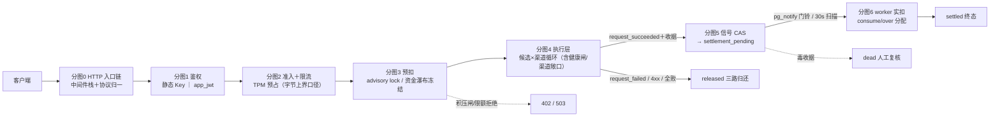
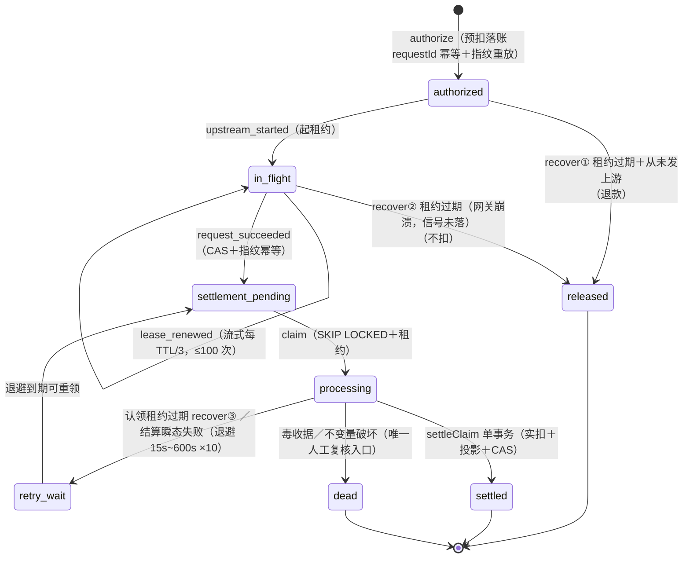

# Gateway 全链路流程图（含全部判定细节）

> 本文档自 v1（ai-getway）同名文档适配至 v2 结构；行为细节以代码为准。
>
> 口径：v2 源码（packages/inference 拆分形态 + packages/billing 深模块合并形态）。
> 钱的公式与 [billing-flow-deep-dive.md](billing-flow-deep-dive.md) 对齐；图的约定：
> `□`＝判定、`──►`＝走向、`（→分图N）`＝子流程跳转。除标注外均为**单入口串行**语义。
>
> 相对 v1 版的主要修订（均已对 v2 代码核实）：
> ① 凭证两形态（playground JWT 随操练场 BYOK 改造退役）；app_id = apps.app_id 字符串（R-E2）；
> ② 输入估算拆双口径：特征校准估算（实扣兜底）与 JSON 字节保守上界（仅预扣敞口）；
> ③ 流式缺 usage 的估算归属细分（供应商质量 / 故障率 / 停机补偿各取所需）；
> ④ 实扣公式含 cacheWrite 三段互斥段；
> ⑤ PAYG 超额 `#over` 走 `collectOverage` **允许负余额全额补收**（无「不足降级」路径）；
> 套餐核销为守卫式红灯回滚（无「降级核销」路径）；
> ⑥ 唤醒通道 BullMQ → PG LISTEN/NOTIFY（worker 零 Redis）；
> ⑦ 模型维/渠道维 TPM 预占与免费日限不在 v2（R-E3 在案）；
> ⑧ 死凭据处置从 DB markDead（status=4）改为 inference health 状态机（AiEvent 记账）。
>
> 分图：-1 总览 / 0 入口链 / 1 鉴权 / 2 准入与限流 / 3 预扣计算 / 4 执行层 /
> 5 收据与信号 / 6 worker 实扣 / 7 异常总表 / 8 状态机 / 9 估算归属附录。

---

## 分图 -1 · 全链总览（一页视角）



---

## 分图 0 · HTTP 入口链（apps/gateway/src/app.ts）

```
客户端请求
│
├─① corsPreflight（跨域源不在白名单→CORS 拒）
├─② securityHeaders
├─③ bodyParserLimit（超限→413）
├─④ requestIdMiddleware（请求 ID，服务端生成）
├─⑤ otelMiddleware（请求根 span；off 模式 no-op；挂载在④之后）
├─⑥ /v1/* requestLogMiddleware（401/429 也入日志——「记录一切 /v1 请求」）
├─⑦ 路径已注册？──否──► 404 not_found（不是 401——老网关语义）
└─⑧ apiKeyMiddleware（→分图1）
        │
        ▼
   路由适配层（协议归一成 canonical body，apps/gateway/src/http/routes/*）：
     /v1/chat/completions、/v1/embeddings 等 JSON 端点 → schema 校验 → c.req.json()
        （completions/responses/messages 带 codec：外部线格式 ↔ 规范形双向转换）
     /v1beta/models/:modelAction（Gemini 原生）→ 协议转规范形
     /v1/engines/:model/embeddings（legacy 别名）→ 路径参数取 model
     images/edits、audio/transcriptions、audio/translations → multipart 解析
        （缺字段/类型白名单/超限→400 invalid_body；管线错误不吞成 400）
        │
        ▼ admitRequest 限流（→分图2 前半）→ inference.chat/stream（→分图2 后半）
```

## 分图 1 · 鉴权（http/middleware/api-key.ts，凭证两形态）

> playground 形态已退役（v1 BYOK 改造）：操练场改为用户自持 API Key 直连同域
> `/v1`。任何非 app_jwt 的 typ 一律 401（结构性不认，非配置开关）。

```
Authorization: Bearer <token>
│
├─ token 以 keyPrefix（sk_）开头？
│  ├─ 是【静态 API Key】
│  │   sha256 → keyHash
│  │   □ per-keyHash 爆破锁已锁？→401
│  │   □ per-IP 爆破锁已锁？→401
│  │   □ 读模型守卫：resolveKeyByHash（api_keys 状态/有效期 + 属主 user 状态
│  │     ——封禁用户的存量 Key 立即失效；每调用直查无缓存）
│  │     未命中→双锁记失败→401
│  │     命中→recordSuccess→挂 AuthContext：
│  │       限流维 key:{id}＋user:{uid}（凭证/用户限额均显式配置才生效）；
│  │       allowedModels=null
│  └─ 否【JWT】（jose HS256；iss/aud 强制 + 算法白名单防混淆）
│      □ per-IP 锁已锁？→401（JWT 不可枚举——失败只计 IP 维，A8 裁决）
│      □ 验签失败→IP 记失败→401
│      □ typ=app_jwt 且 app_id/sub 齐备？
│      │   □ resolveApp(app_id)：app（apps.app_id 字符串键，R-E2）与属主 user
│      │     双活且 sub==属主？否→401
│      │   是→限流维凭证限额取 app scope（rpm/tpm 进 AuthContext）；
│      │        allowedModels=scope.models（非空数组才生效，否则 null）
│      □ 其他 typ（含已退役的 playground）→401
│  Redis 爆破锁故障→503 fail-closed（两分支同口径：防护语义不因缓存故障消失）
└─ 无 token/格式错→401
用户维 user:{uid}（静态 Key 形态）对全部请求在列（大 scope App 绕不过管理端用户帽）
```

## 分图 2 · 管线准入＋限流（routes/inference-endpoints.ts + packages/inference/src/application/quote.ts）

```
（接分图0，schema 校验 400 之后）
□1 admitRequest 限流（apps/gateway/src/http/middleware/rate-limit.ts）：
│   维 = key:{apiKeyId}（静态 Key）＋ user:{uid}（显式配置才生效，无兜底默认）
│       ＋ global（RPM）并罚——任一超限即 429（Retry-After 表达等待）
│   RPM：ZSET 滑动窗口（member=requestId）count≥max→429（最老成员算 retryAfter）
│   TPM：actual+reserved+估算 > max→429
│        通过→reserved+=estimatedTokens（EX 600）＋登记 hash{requestId→各维金额}
│   estimatedTokens = conservativeInputTokenUpperBound(body)＋outputCap  ← 敞口口径
│   Redis 故障→503 fail-closed（付费面）
▼ inference.chat/stream 编排启动（packages/inference/src/inference.ts 的 run）
□2 模型白名单：allowedModels≠null 且不含 body.model？→403（零副作用）
□3 预检 prepareChatRequest（纯计算＋目录读）——双口径：
│   inputUpperBound = JSON UTF-8 字节数            ←字节上界＝预扣敞口专用
│   inputEstimate    = 特征四计数器×校准权重        ←缺 usage 的实扣兜底口径
│   ！！实扣口径用 inputEstimate（缺 usage 时），字节上界绝不入实扣——
│   否则故障/缺 usage 流的 input 多收数倍（残缺交付贵于完整交付）
│   outputCap = embeddings/modality?0 : min((max_completion_tokens ?? max_tokens
│              ?? 配置默认4096) × n, GATEWAY_OUTPUT_EXPOSURE_CAP=32768)
│   upstreamBody = 输出钳制：转发体压到 floor(outputCap/n)；
│                  两者均未声明时注入 max_completion_tokens（v2 口径——
│                  禁止无限输出越过预扣敞口；超缺省口径由 #over 兜底）
│   目录解析 findMapping/buildCandidateChain（外部名→候选链 主+fallback；各带
│   realModel/mappingId/价格快照（含 cacheWritePrice）/isFree/coefficient/unitUpperBound）
│   未命中→404 model_not_found（→路由 catch 归还 TPM）
（□4 v1 的 reserveModelDims 模型维 TPM 预占与免费日限不在 v2——R-E3 在案；
   免费滥用上界收敛到渠道预算与渠道 RPM）
□5 billing.authorize（→分图3）
│   拒绝（402/限额/配置）→上抛→路由 catch 归还 TPM
│   通过→void authorization（状态住 DB；signal＋worker 收尾）
▼ 候选×渠道循环（→分图4）
```

TPM 预占三出口（贯穿全程）：

```
reserved += 估算 ──成功──► v2 未接结算侧回填（backfillTpm 动词保留在 runtime 限流器，
                │           尚未接线）——TTL 600s 自然过期（分钟桶语义）
                ├──预检/授权/上游前异常──► admit.release()：按登记 hash 逐维减回
                │                          （幂等；hash 删即 no-op）
                └──4xx 透传/正常交付──► 不即时归还，TTL 600s 兜底
```

## 分图 3 · 预扣款计算与落账（billing domain/rating + funding + wallet）

```
金额推导（保守预估；packages/billing/src/domain/rating/calculate.ts）：
  每候选预估 = ( max(inputPrice, cacheInputPrice, cacheWritePrice) × inputUpperBound
               ＋ outputPrice × outputCap
               ＋ unitPrice × unitUpperBound ) ÷ 1e6 × coefficient   ←用户侧系数
  三价取最贵（缓存写可超输入价：Anthropic 1.25×/2×——B2）
  防御：负/NaN/Infinity→0；负单价与 coefficient≤0 钳 0；零价未声明免费＝配置事故拒绝

预估(最终) = max(主模型, fallback₁, …)（候选链取最贵）
           → requiredReservation(·, BILLING_RESERVATION_MAX=¥1000)（单请求预扣上限，
             超限只拒绝绝不截断）
实际冻结额 = MODE=full（缺省）？完整预估
           : MODE=fixed？固定额（仅纯 PAYG；免费请求=0；最终超出走 #over 补扣）
  （日限额 / 在途风险恒用完整预估，不用 fixed 冻结额）

资金瀑布 probe（两阶段①不动账；application/billing/funding/plan.ts）：
  逐资金源（registry 缺省 {subscription, payg}）take = min(源可用额, 尚缺)；
  PAYG 可用 = balance＋credit_limit−in_flight（domain/wallet/exposure.ts 唯一口径；
  钱包侧行锁重验——probe 无锁读不构成超扣窗口）
  订阅闸：转按量开关 OFF 且订阅覆盖不足 → 整单拒绝；ON → 订阅出余量 PAYG 补差
  放行门：full→Σtake 必须＝完整预估（差一分→402 fail-closed，上游零调用）
         fixed→可用额≥固定冻结额

落账（单 DB 事务；application/billing/authorize.ts）：
  0 assertCapacity（结算积压准入——bridge 级前置闸）
  1 重放快径：requestId 已存在＋指纹/金额一致＋状态 ∈ {authorized, in_flight}
    → 幂等返回；异指纹→409 state_conflict
  2 pg_advisory_xact_lock(user)（日限额 SUM 口径并发串行化）
  3 □ 用户日限额 Σ已结算(usage_logs)＋Σ在途(billing_requests,保守预估口径,排除自身)
    ＋预估 ≤ dailySpendLimit？超→402；□ Key 日限额同口径按 apiKeyId 再算一道
  4 INSERT billing_requests（requestId 幂等；重放=同指纹+同金额）
    status=authorized；quote 列＝价格快照（结算验收锚）；风险预估与实际冻结分列
    （estimated_exposure_amount / reserved_amount / plan_reserved_amount）
  5 两阶段②：逐源 wallet.authorize（in_flight += take，行锁）＋ billing_reservations 明细
    （免费链 fast-path：0 元空计划，不预留，账单行仅供观测）

渠道敞口（执行前每渠道，见分图4 步③）：
  upstreamEstimate = 同公式但 coefficient=1（官方价口径＝渠道进货额度；
  由 gateway billing-port 桥自算——零金额运算实现不留 app）
  □ upstreamBudget − upstreamReserved ≥ upstreamEstimate？
    否→skip 换渠；换渠＝「守卫预留新渠道→释放旧渠道→CAS 认领账单行」
    （CAS 输家全回滚；同渠道重复预留按差额补足）
```

## 分图 4 · 执行层（inference/application/failover.ts 循环 + chat.ts / stream.ts）

```
for candidate of 候选链（主→fallback）:
  channels = resolveChannels(realModel)（目录渠道；priority 分层 + weight 加权随机序）
  for channel of channels:
    □ 渠道维 RPM（admitChannel 钩子＝assembly 的 tryChannelRpm；渠道 TPM 预占
      为 R-E3 在案缺口）
      超限→lastCode=rate_limit_exceeded→continue 下一渠道
    □ 健康放行（health.admit——v2 新增闸）：
      熔断 open（60s 窗 ≥5 次失败、冷却 5min、half-open 单探测）/ 死凭据 invalid
      （连续失败 ≥3，1h 窗；成功自愈）→ lastCode=熔断/死凭据原因→continue
      （死凭据不再 DB status=4 markDead——AiEvent 由 health 状态机记账，C3/C4）
    □ reserveChannel 不允许？→lastCode=channel_budget_exhausted→continue
    □ leaseStarted？首次→signal upstream_started（authorized→in_flight＋租约TTL=300s）
    □ stream === true ？
    ├─ A 非流式 attemptChat（application/chat.ts）
    │   upstream.chat（deadline 预算内；Idempotency-Key=requestId 防重试双花）
    │   □ ok？──否──► dispatchFailure
    │   │是 □ usage 可信（estimated=false）？
    │   │     是→原样（含 cached/cacheWrite）/ ai 估算值→采纳数值仍标估算
    │   │     / 完全缺失→input=inputEstimate＋输出按响应体特征估算，
    │   │        estimatedFor=usage_missing_nonstream
    │   │   buildReceipt（命中候选价格快照＋units 计量；cacheWriteTokens 透传——
    │   │        结算按缓存写价计费，丢弃＝按输入价错账）
    │   │   signalSucceededWithRetry ×5（500ms 起指数退避，封顶 8s）
    │   │     耗尽→503 finalize_unavailable（未交付不结算——宁可重试不白送）
    │   │   □ rawBody？是→200 二进制（原 content-type）: 200 JSON → respond
    └─ B 流式 attemptStream（application/stream.ts）
        chatStream → 逐块透传（数据面不缓冲不改写；扫描经 onEvent 旁路）
        等决定性事件 ∈ {first_chunk | failed | success（零块完成）}
        □ failed？──是──► dispatchFailure（上线前＝换渠窗口）
        │否（上线＝first_chunk 或零块 success）：
        ├ 续租定时器：每 TTL/3 发 lease_renewed（≥1s；≤100 次防永流；unref；
        │  失败仅日志）（防 recover 按滞留误释放→终态冲突→漏收）
        │  停机宽限 GATEWAY_SHUTDOWN_GRACE_MS=60s（覆盖流式长尾；超时被切的流
        │  归因 server_draining——部分交付计费，可接运营补偿）
        ├ 终态监听（后台；不被 await；不碰字节管道——不影响用户收流速度）：
        │   success → □ usage 可信？
        │              是→原样（含 cacheWriteTokens 透传；中断但有可信累计 usage
        │                =按最新 usage 正常结算，不标 stream_aborted）
        │              / 否→input=inputEstimate（ai 估算值优先）＋输出按终态
        │                outputFeatures 特征估算（cached=0 全价防套利）；
        │                estimatedFor 按 terminated 归属细分（→附录9）
        │            → buildReceipt → signal 重试 ×5（重试期间续租不停——200 已交付）
        │              耗尽→onError 记损交 recover 兜底（有界损失）→ 停续租定时器
        └ 立即 return 200 SSE → respond（管道交还路由，只差一次事件循环调度）

  outcome＝AttemptOutcome 翻译回循环：
    switch_channel→continue ｜ next_candidate→break ｜ respond→return 终局

dispatchFailure（两形态共用，application/failover.ts）：
  □ routeFailure(error)？可换（网络/5xx/超时类）→switch_channel
  │ 否→□ 4xx（客户端问题）？
  │      是→respond 透传终局：signal request_failed（三路归还）后
  │           原码返回＋message 脱敏（真实模型名不外泄）——透传≠免收尾
  │      否→next_candidate（模型级错误试 fallback；参数错误已在上支线返回）
  （死凭据不经此处置：ai 层按错误机制位（invalid_api_key/insufficient_permissions）
   上报 AiEvent，health 状态机计数/标记——下一轮循环的 admit 拦截）

双层循环耗尽→releaseAndFail：
  signal request_failed（三路归还）
  □ 渠道面竭尽？（lastCode==null ∨ channel_budget_exhausted ∨ rate_limit_exceeded
     ∨ 熔断/死凭据原因）
    是→503 no_available_channel ｜ 否→502 upstream_failed（脱敏）
  （尝试总数无上限——预算与限流止步）
```

ai 包传输侧（计量数据生产，与分图4 并行发生）：
- `stream_options` 强制注入 `include_usage:true`（MiniMax 实测缺省不报 usage＝漏计费）
- Anthropic/Gemini 流先转规范 OpenAI 帧（`packages/ai/src/protocol/`），扫描器只面对一种形态
- SSE 扫描器逐帧累计输出内容特征（终态 `outputFeatures` 随 success 事件旁路）——缺 usage 时输出估算的数据源
- usage 方言归一；自洽性破坏（cached>input、total 对不上）→null 不猜
- 上游流故障帧 → `done` 仍发 success 终态＋`terminated=upstream_error` 随行
  （已交付部分照常计费——见附录 9 政策）

## 分图 5 · 收据与结算信号

```
收据＝命中候选价格快照 ＋ usage（可信/ai 估算/特征兜底三层）＋ units 计量
     ＋流式四元（estimatedFor / bytesRelayed / stream / streamAborted）
     ＋TTFT 双锚点（upstreamTtftMs＝本次渠道发起；clientTtftMs＝请求进入含换渠等待）
validateReceipt（billing domain/rating/receipt.ts——毒收据家族→dead）：
  □ userId 一致 □ 整数非负 □ cached ≤ input
  □ estimated 必须归属白名单 ESTIMATE_ATTRIBUTIONS（六值，→附录9）
  □ 价格快照命中授权 quote 候选（mappingId＋模型名＋四价＋系数＋策略指纹全等）
signal(request_succeeded)→settlement_pending（CAS＋指纹幂等；竞态输家按指纹判）
→ pg_notify('settle-wake') 门铃 best-effort（事务外 fire-and-forget；失败不阻断；
  30s 兜底扫描会捡到）
signal 落库失败→退避重试 ×5（重试期间续租不停）
```

## 分图 6 · worker 结算实扣（apps/worker + packages/billing/settlement）

```
驱动与认领：
  pg LISTEN 'settle-wake' 门铃（专用连接，断线指数退避重连）
    → coalescing（并发唤醒合并）＋drain（认领满批即连跑直到非满批——积压一次抽干）
  ＋30s 定时扫描兜底（WORKER_SETTLE_INTERVAL_MS）
  认领＝SKIP LOCKED 批量 CAS→processing＋租约（批次运行期每 claimLeaseMs/3 续租）
  recover 15s 周期三路径兜底（→分图7/8）

实扣公式（Decimal 全精度永不 round；与预估共用防御；三段互斥）：
  cached = min(cachedInputTokens, inputTokens)
  cacheWrite = min(cacheWriteTokens, input − cached)   ←写价未配置＝回落输入价
  uncached = input − cached − cacheWrite
  calculatedAmount = ( inputPrice × uncached
                     ＋ cacheInputPrice × cached
                     ＋ cacheWritePrice × cacheWrite   ←缓存写段（Anthropic 1.25×/2×）
                     ＋ outputPrice × outputTokens
                     ＋ unitPrice × units ) ÷ 1e6 × coefficient   ←用户侧实扣
  upstreamCost = 同公式 × coefficient=1                        ←渠道进货扣减口径

分配 consume/over（domain/billing/settle-allocation.ts，按预扣明细提交序逐条消耗）：
  每条 consume = min(尚待收金额, 该条预留额)；全部预留耗尽后剩余＝over
  （有 PAYG 明细→over 记 PAYG；纯订阅链→over 记末条转余额补扣）

结算单事务（application/settlement/settle.ts）：
  认领五元组复验＋幂等回查（认领失效时 usage_logs 判 already_settled/claim_lost）
  → 归属/估算/渠道一致性校验（收据渠道≠账单预留渠道＝红灯）
  → 逐源 source.settle ＋明细 markSettled
  → usage_logs 投影（requestId 唯一幂等；amount＝calculatedAmount 全精度；
    estimate_reason＝归属值）
  → 渠道敞口归还 → CAS settled → 进货真扣 upstreamCost
  □ 渠道预算余额≤阈值？→渠道预算熔断（DB 闸；与上游 5xx 熔断器的 half-open
    自动恢复是两回事）
  （TPM backfill：v2 未接线——gateway 侧预占靠 TTL 600s 回收）

PAYG 落账（funding/payg-source.ts）：
  □ over>0？→同事务 wallet.authorize(#over, collectOverage)＋wallet.settle(#over)
    ——collectOverage 允许击穿为负余额：总扣款＝consume＋over＝实扣额精确全额
    （fixed 小额冻结模式下的真实超额依赖此路径收全，负余额由运营侧追缴/封禁）
  □ consume=0？（免费模型/上游全 0 usage）→ wallet.release 全额释放
    （零额不走 settle——否则零额拒绝非死信家族→dead＋预扣永久冻结）
套餐源：trySettleQuota 守卫式核销（used＋consumed ≤ quota－在途差额）
  守卫失败＝事务整体回滚（红灯，无静默降级路径）；
  纯订阅链超额 → over 转用户余额补扣（同 PAYG collectOverage 语义，可负余额）
```

## 分图 7 · 异常×处理方式总表

| 异常 | 判定点 | 处理 | 用户看到 |
|---|---|---|---|
| 凭证无效 / 爆破锁触发 | 分图1 | 401＋失败计数 | 401 |
| 非 app_jwt 形态 JWT（含已退役 playground） | 分图1 | 401 unsupported（签名合法也拒） | 401 |
| 请求体 schema 不合 | 分图0 路由 | 400 invalid_body | 400 |
| 模型不在 App scope | 分图2 □2 | 403（零副作用） | 403 |
| RPM / TPM 超限 | 分图2 □1 | 429＋Retry-After | 429 |
| 限流 Redis 故障（付费面） | 分图2 □1 | 503 fail-closed | 503 |
| 模型不存在 / 已下架 | 分图2 □3 | 归还 TPM→404 | 404 |
| 余额不足 / 日限额超 | 分图3 | 归还 TPM→402，上游零调用 | 402 |
| 渠道限流 / 渠道预算尽 / 熔断 / 死凭据 | 分图4 | 换渠 continue（透明） | 无感（TTFT 变长） |
| 全部渠道竭尽 | releaseAndFail | 三路归还→503 | 503 no_available_channel |
| 上游 4xx（参数类） | dispatchFailure | request.failed 三路释放后原码透传＋脱敏（TPM 靠 TTL 归还） | 4xx 原码 |
| 上游可换错误（网络/5xx） | dispatchFailure | 换渠（不透给用户） | 无感 |
| 模型级不可换错误 | dispatchFailure | break 换候选模型 | 无感 / 最终 502 |
| 流式上线后错误 | 流内 | 转错误帧＋terminated 标注（不再换渠） | SSE error 帧 |
| 上游流故障截断（无 usage） | 流内估算 | 部分交付计费（upstream_error_partial） | 已收内容＋error 帧 |
| 网关停机切流（宽限 60s 后） | 流内估算 | 部分交付计费（server_draining） | 已收内容＋error 帧 |
| 非流式结算 signal 失败 | attemptChat | 503 不交付（未交付不结算） | 503 finalize_unavailable |
| 流式结算重试耗尽 | 终态监听 | 停租约交 recover、记损 | 无感（已收完数据） |
| 网关崩溃（in_flight 租约过期） | recover ② | released 不扣（信号未落＝交付存疑） | 无感 |
| authorized 过期从未发上游 | recover ① | released 退款 | 无感 |
| worker 崩溃（认领租约过期） | recover ③ | retry_wait 立即可重领 | 无感 |
| 结算瞬态失败（PG 抖动等） | worker | 指数退避 15s~600s ×10（≈85 分钟耐受） | 无感 |
| 毒收据 / 不变量破坏 | validateReceipt / 结算 | dead 永不自动处置，人工复核 | 无感 |
| TPM 预占漏网 | 任何 | TTL 600s 自然过期 | 无感 |

## 分图 8 · billing_requests 状态机（Mermaid）



> 终态：`released / settled / dead`。`signal(request_failed)`（4xx 透传／换渠耗尽／
> 任务失败）从 `authorized | in_flight` 直达 `released` 并同事务三路归还预扣。

## 附录 9 · 估算计费政策与归属值（v1 2026-08-21 拍板，v2 沿用）

**政策：部分交付即计费**——上游已处理即扣 input、已交付输出按特征校准估算加扣
（含上游故障截断的流：渠道成本已发生，网关不吸收损失）；**零交付（first_chunk 前
失败）不扣**，走换渠/释放。金额口径向精确收敛：可信 usage 直通；ai 估算 usage 采纳
数值；完全缺失时 input/output 均走特征校准估算；JSON 字节保守上界只作预扣敞口，
不作实扣（v2 不向 inference 公开 BPE 估算器——实扣口径为特征四计数器＋校准权重）。

`ESTIMATE_ATTRIBUTIONS` 白名单（signal 验收与 worker 结算共用；白名单外估算
收据一律死信）与 `streamEstimateAttribution` 映射
（`packages/inference/src/domain/usage/attribution.ts` 单一真相）：

| estimatedFor | 触发场景（terminated） | 报表/处置消费方 |
|---|---|---|
| `client_disconnect` | client_disconnect / request_cancelled（用户侧取消两态归一；v1 的 'aborted' 旧事件名已随词表对齐移除） | 刷费用审计 |
| `usage_missing_completed` | undefined（正常完成、上游没回 usage 帧） | 供应商质量指标 |
| `upstream_error_partial` | upstream_error / upstream_disconnected / upstream_truncated ＋未知终止值兜底 | 故障率统计、找供应商 |
| `inactivity_timeout` | inactivity（闲置超时网关侧掐流） | 用户行为分析 |
| `server_draining` | server_draining（网关停机宽限 60s 后切流） | 运营补偿候选（宽限调大后应趋近零） |
| `usage_missing_nonstream` | 非流式响应缺 usage（input=inputEstimate＋输出特征估算） | 供应商质量指标 |

> 防御性兜底：未知终止值归 `upstream_error_partial`，绝不回落
> `usage_missing_completed`——细分口径不被未来新增的终止原因稀释。

---

## 相邻文档

- 资金语义全流程（预扣/结算/防刷五向量）：[billing-flow-deep-dive.md](billing-flow-deep-dive.md)
- 管线结构与文件地图：[gateway-pipeline.md](gateway-pipeline.md)
- 工程规范：[../AGENT.md](../AGENT.md)；
  结构重构背景：[project-structure-refactoring.md](project-structure-refactoring.md)
