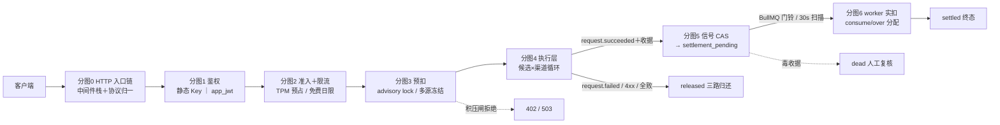
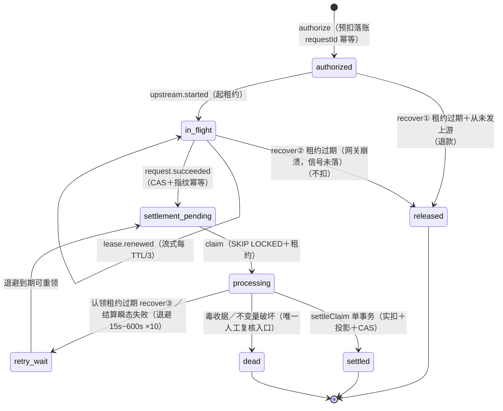

# Gateway 全链路流程图（含全部判定细节）

> 口径：2026-08-21 源码（run-chat 拆分后形态 + BYOK/归属细分改造）。
> 钱的公式与 `billing-flow-deep-dive.md` 对齐；图的约定：`□`＝判定、`──►`＝走向、
> `（→分图N）`＝子流程跳转。除标注外均为**单入口串行**语义。
>
> 2026-08-21 修订（相对 2026-08-20 版）：
> ① 凭证收敛为两形态（playground JWT 随操练场 BYOK 改造退役——用户自持 Key 直连）；
> ② 输入估算拆双口径：BPE 估算（实扣）与 JSON 字节保守上界（仅预扣敞口）；
> ③ 流式缺 usage 的估算归属细分五值（供应商质量 / 故障率 / 停机补偿各取所需）；
> ④ 实扣公式补 cacheWrite 三段互斥段（修正漏写）；
> ⑤ 修正 PAYG 超额描述：`#over` 走 `collectOverage` **允许负余额全额补收**（旧版
> 「不足降级跳过 #over」与代码不符）；套餐核销同改（守卫失败＝事务回滚红灯，
> 无「降级核销」路径）；
> ⑥ 分图 8 状态机改用 Mermaid，新增分图 -1 全链总览。
>
> 分图：-1 总览 / 0 入口链 / 1 鉴权 / 2 准入与限流 / 3 预扣计算 / 4 执行层 /
> 5 收据与信号 / 6 worker 实扣 / 7 异常总表 / 8 状态机 / 9 估算归属附录。

---

## 分图 -1 · 全链总览（一页视角）



---

## 分图 0 · HTTP 入口链（app.ts）

```
客户端请求
│
├─① corsPreflight（跨域源不在白名单→CORS 拒）
├─② securityHeaders
├─③ bodyParserLimit（超限→413）
├─④ requestIdMiddleware（请求 ID）
├─⑤ otelMiddleware（请求根 span；off 模式 no-op）
├─⑥ /v1/* requestLogMiddleware（401/429 也入日志——「记录一切 /v1 请求」）
├─⑦ 路径已注册？──否──► 404 not_found（不是 401——老网关语义）
└─⑧ apiKeyMiddleware（→分图1）
        │
        ▼
   路由适配层（协议归一成 canonical body）：
     /v1/chat/completions、/v1/embeddings 等 JSON 端点 → c.req.json()
     /v1beta/models/:modelAction（Gemini 原生）→ 正则拆 model:action，
        geminiRequestToChat 协议转规范形
     /v1/engines/:model/embeddings（legacy 别名）→ 路径参数取 model
     images/edits、audio/transcriptions、audio/translations → multipart 解析
        （缺字段/类型白名单/超限→400 invalid_body；管线错误不吞成 400）
        │
        ▼ runChat(ctx, auth, body, endpoint)（→分图2）
```

## 分图 1 · 鉴权（middleware/api-key.ts，凭证两形态）

> playground 形态已退役（2026-08-21 BYOK 改造）：操练场改为用户自持 API Key
> 直连同域 `/v1`（client-api 不再持有网关签名密钥——信任根分离）。
> 签名合法的 playground 形态一律 401（final-hardening 退役锁）。

```
Authorization: Bearer <token>
│
├─ token 以 ag_ 开头？
│  ├─ 是【静态 API Key】
│  │   sha256 → keyHash
│  │   □ per-keyHash 爆破锁已锁？→401
│  │   □ per-IP 爆破锁已锁？→401
│  │   □ DB 单语句守卫：api_keys.status=0 且未过期 且 JOIN users.status=0
│  │     （封禁用户的存量 Key 立即失效）
│  │     未命中→双锁记失败→401
│  │     命中→recordSuccess→挂 AuthContext：
│  │       限流维 key:{id}＋user:{uid}；allowedModels=null
│  └─ 否【JWT】（HS256；iss=ai-gateway/aud=ai-gateway-api 强制；算法白名单防混淆）
│      □ per-IP 锁已锁？→401
│      □ 验签失败→IP 记失败→401
│      □ typ=app_jwt？
│      │   □ findActiveAppById：app 与属主 user 双活？否→401
│      │   是→限流维 app:{id}＋user:{uid}；
│      │        allowedModels=scope.models（非空数组才生效，否则 null）
│      □ 其他 typ（含已退役的 playground）→401
│  Redis 爆破锁故障→503 fail-closed（两分支同口径：防护语义不因缓存故障消失）
└─ 无 token/格式错→401
用户维 user:{uid} 对全部凭证形态无条件在列（大 scope App 绕不过管理端用户帽）
```

## 分图 2 · 管线准入＋限流（run-chat.ts 上半场）

```
（接分图0）
□1 模型白名单：allowedModels≠null 且不含 body.model？→403（零副作用）
□2 估算（纯计算）——双口径（2026-08-21 拆分）：
│   bpeInput = estimateInputTokens(body)（BPE 主路径；编码器不可用回落启发式）
│   estInput = max(bpeInput, JSON 序列化字节数)   ←字节上界＝预扣敞口专用
│   ！！实扣口径用 bpeInput（缺 usage 时），字节上界绝不入实扣——
│   否则故障/缺 usage 流的 input 多收 3~6×（残缺交付贵于完整交付）
│   fxPromise = 汇率快照预取（60s 进程缓存；不 await；失败降级 null）
│   kind = chat | embeddings | modality
│   outputCap = embeddings?0 : min((max_completion_tokens ?? max_tokens ?? 配置默认4096) × n,
│                                  GATEWAY_OUTPUT_EXPOSURE_CAP=32768)
│   estimatedTokens = estInput + outputCap          ← TPM 预占口径
│   upstreamBody = 输出钳制：转发体压到 floor(outputCap/n)；未声明不注入
│                   （o 系列拒收 max_tokens 兼容坑；超缺省口径由 #over 兜底）
□3 deps.rateLimit 已装配？（否＝单副本开发形态，③⑥⑦全跳过放行）
│   admitKey（多维一次 Lua 原子判定）：
│     维 = 凭证维 key:{id}|app:{id} ＋ user:{uid}（显式配置才生效，无兜底默认——
│       2026-08-21 删除 DEFAULT_USER_RPM/TPM 黑盒子：未设置=不限）＋ global 并罚
│     RPM：ZSET 滑动窗口（member=requestId）count≥max→429（最老成员算 retryAfter）
│     TPM：actual+reserved+估算 > max→429
│          通过→reserved+=estimatedTokens（EX 600）＋登记 hash{requestId→各维金额}
│     Redis 故障→503 fail-closed（付费面）
□4 buildQuote（DB：外部名→候选链 主+fallback；各带 realModel/mappingId/
│   价格快照/explicitlyFree/coefficient/unitUpperBound）
│   异常→releaseTpm→上抛原错误
│   □5 candidates 空？→releaseTpm→404 model_not_found
□6 reserveModelDims：主＋全部 fallback 的 model:{mappingId} 维 TPM 一并预占
│   （fallback 切换不再二次判定）；限额=userTpmLimit??tpmLimit；超限→429
（□7 免费日限已随 2026-08-21 黑盒子清除删除——免费滥用上界收敛到
   共享渠道预算与渠道 RPM；per-user 日限需要时在管理面显式配置）
□8 billing.authorize（→分图3）
│   拒绝（402/限额/配置）→releaseTpm→上抛
│   通过→void authorization（状态住 DB；signal＋worker 收尾）
▼ 定义收尾闭包：passthrough4xx / startChannel / releaseAndFail / markDead /
  dispatchFailure（见分图4）
▼ 候选×渠道循环（→分图4）
```

TPM 预占三出口（贯穿全程）：

```
reserved += 估算 ──成功──► worker backfillTpm：reserved−=估算 且 actual+=真实值（记入结算分钟）
                ├──无上游执行的失败──► releaseTpm：按登记 hash 逐维减回（幂等；hash 删即 no-op）
                └──漏网──► TTL 600s 自然过期（分钟桶语义：只约束预占当分钟的准入）
```

## 分图 3 · 预扣款计算与落账（domain/pricing + funding + wallet）

```
输入 token 估算（与结算同一校准器，BPE 主路径）：
  主路径：js-tiktoken 按模型族解析编码器（CJK 约 1 token/字）
  兜底：编码器不可用/无模型名 → 启发式特征向量
        （CJK×0.7＋拉丁词×1.1＋数字×1.0＋符号×1.0）
  结构提取：messages.content＋历史 tool_calls＋tools 定义体＋embeddings input
        ＋多模态 part（每媒体≥85）＋供应商模板偏移（DeepSeek≈70/MiniMax≈160）

每候选预估 = ( max(inputPrice, cacheInputPrice, cacheWritePrice) × 输入token上界 ←三价取最贵（缓存写可超输入价）
             ＋ outputPrice × outputCap
             ＋ unitPrice × unitUpperBound ) ÷ 1e6 × coefficient   ←用户侧系数
  防御：负/NaN/Infinity→0；负单价钳 0；cached 夹 ≤ input（算不出负金额）

预估(最终) = max(主模型, fallback₁, …)（候选链取最贵）
           → requiredReservation(·, BILLING_RESERVATION_MAX=¥1000)（单请求预扣上限）
实际冻结额 = MODE=full（缺省）？完整预估
           : MODE=fixed？固定额（仅纯 PAYG；免费请求=0；最终超出走 #over 补扣）
  （日限额 / 在途风险恒用完整预估，不用 fixed 冻结额）

资金规划 probe（两阶段①不动账）：
  逐资金源 take = min(源可用额, 尚缺)；PAYG 可用 = balance＋credit_limit−in_flight
  （assertCanDebit 唯一口径；钱包侧行锁重验——probe 无锁读不构成超扣窗口）
  放行门：full→Σtake 必须＝完整预估（差一分→402 fail-closed，上游零调用）
         fixed→可用额≥固定冻结额

落账（单 DB 事务）：
  1 assertCapacity（结算积压准入——结算系统自我保护）
  2 pg_advisory_xact_lock(user)（日限额 SUM 类并发串行化）
  3 □ 用户日限额 Σ已结算(usage_logs)＋Σ在途(billing_requests,保守预估口径)＋预估 ≤ dailySpendLimit？
      超→402；□ Key 日限额同口径按 apiKeyId 再算一道
  4 INSERT billing_requests（requestId 幂等；同指纹重放幂等 / 异指纹 409）
    status=authorized；quote 列＝价格快照（结算验收锚）
  5 两阶段②：逐源 wallet.authorize（in_flight += take，行锁）＋ billing_reservations 明细
    （免费链 fast-path：0 元空计划，不预留，账单行仅供观测）

渠道敞口（执行前每渠道）：
  upstreamEstimate = 同公式但 coefficient=1（官方价口径＝渠道进货额度）
  □ upstreamBudget − upstreamReserved ≥ upstreamEstimate？
    否→skip 换渠；换渠＝原子「释放旧敞口＋预留新敞口」（CAS 输家全回滚）
```

## 分图 4 · 执行层（run-chat 循环 + attempt-nonstream / attempt-stream）

```
for candidate of 候选链（主→fallback）:
  channels = resolveChannels(realModel)（健康/优先级排序；status=4 死凭据不在列）
  for channel of channels:
    □ 渠道维限流 tryChannel（渠道自身 RPM/TPM；TPM 同为预占）
      超限→lastError=rate_limit_exceeded→skip span→continue 下一渠道
    □ startChannel：
      reserveChannel(channelId, upstreamEstimate) 不允许？
        →lastError=channel_budget_exhausted→continue
      leaseStarted？首次→signal upstream.started（authorized→in_flight＋租约TTL）
    □ stream === true ？
    ├─ A 非流式 attemptNonStream
    │   upstream.chat（deadline 预算内；Idempotency-Key=requestId 防重试双花）
    │   □ ok？──否──► dispatchFailure
    │   │是 □ usage 可信（estimated=false）？
    │   │     是→原样（含 cached/cacheWrite）/ 否→input=bpeInput＋输出按响应体
    │   │        估算（同 BPE 分流），estimatedFor=usage_missing_nonstream
    │   │   buildReceipt（命中候选价格快照＋fx＋units 计量；cacheWriteTokens 透传——
    │   │        结算按缓存写价计费，丢弃＝按输入价错账）
    │   │   signalSucceededWithRetry ×5（500ms 起指数退避）
    │   │     耗尽→503 finalize_unavailable（未交付不结算——宁可重试不白送）
    │   │   □ rawBody？是→200 字节流（不套 JSON）: 200 JSON → respond
    └─ B 流式 attemptStream
        chatStream → 泵式透传（急切读＋缓冲，缓冲只覆盖判定窗口）
        等决定性事件 ∈ {first_chunk | failed | success}
        □ failed？──是──► dispatchFailure（上线前＝换渠窗口）
        │否（上线＝first_chunk 或零块 success）：
        ├ 续租定时器：每 TTL/3 发 lease.renewed（≤100 次防永流；unref；失败仅日志）
        │  （防 recover 按滞留误释放→终态冲突→漏收）
        │  停机宽限 GATEWAY_SHUTDOWN_GRACE_MS=60s（覆盖流式长尾；超时被切的流
        │  归因 server_draining——部分交付计费，可接运营补偿）
        ├ 终态监听（后台；不被 await；不碰字节管道——不影响用户收流速度）：
        │   success → □ usage 可信？
        │              是→原样（含 cacheWriteTokens 透传）
        │              / 否→input=bpeInput＋输出按已交付文本 BPE 估算（cached=0
        │                全价防套利）；estimatedFor 按 terminated 五归属细分（→附录9）
        │            → buildReceipt → signal 重试 ×5（重试期间续租不停——200 已交付）
        │              耗尽→noteError 交 recover 兜底（有界损失）→ streamAlive=false 停表
        └ 立即 return 200 SSE → respond（字节早已缓冲，只差一次事件循环调度）

  outcome＝AttemptOutcome 翻译回循环：
    switch_channel→continue ｜ next_candidate→break ｜ respond→return 终局

dispatchFailure（两形态共用）：
  □ deadCredential？→markDead（事务 status=4 永久退出路由；失败仅记日志）
  □ isChannelSwitchable(code)？（网络/5xx/限流类）
    是→switch_channel
    否→□ status∈[400,500)？
         是→passthrough4xx：releaseTpm＋signal request.failed（三路归还）
              ＋原码透传＋message 脱敏（真实模型名不外泄）→respond
         否→next_candidate（模型级错误试 fallback；参数错误已在上支线返回）

双层循环耗尽→releaseAndFail：
  releaseTpm→signal request.failed（三路归还）
  □ channelExhausted？（lastError==null ∨ channel_budget_exhausted
     ∨ rate_limit_exceeded ∨ rate_limited[上游429 归一]）
    是→503 no_available_channel ｜ 否→502 upstream_failed（脱敏）
```

ai 包传输侧（计量数据生产，与分图4 并行发生）：
- `stream_options` 强制注入 `include_usage:true`（MiniMax 实测缺省不报 usage＝漏计费）
- Anthropic/Gemini 流先转规范 OpenAI 帧，扫描器只面对一种形态
- SSE 扫描器逐帧累计输出内容（4MB 上界）——缺 usage 时输出估算的数据源
- usage 方言归一；自洽性破坏（cached>input、total 对不上）→null 不猜
- 上游流故障帧 → `done` 仍发 success 终态＋`terminated=upstream_error` 随行
  （已交付部分照常计费——见附录 9 政策）

## 分图 5 · 收据与结算信号

```
收据＝命中候选价格快照 ＋ usage（可信/估算）＋ fx ＋ units 计量
     ＋流式四元（estimatedFor / bytesRelayed / stream / streamAborted）
validateReceipt（结算验收——毒收据家族→dead）：
  □ userId 一致 □ 整数非负 □ cached ≤ input
  □ estimated 必须归属白名单 ESTIMATE_ATTRIBUTIONS（六值，→附录9）
  □ 价格快照命中授权 quote 候选（mappingId＋三价＋系数＋策略指纹全等）
signal(request.succeeded)→settlement_pending（CAS＋指纹幂等；竞态输家按指纹判）
→ BullMQ settle-wake 门铃 best-effort（失败不阻断；30s 兜底扫描会捡到）
signal 落库失败→退避重试 ×5（重试期间续租不停）
```

## 分图 6 · worker 结算实扣

```
驱动与认领：
  settle-wake 门铃（固定 jobId 去重）＋30s 定时扫描兜底
  排空循环（连续消费批次直到非满批——积压一次抽干）
  认领＝SKIP LOCKED 批量 CAS→processing＋租约（长批次每 lease/3 续租）

实扣公式（Decimal 全精度永不 round；与预估共用防御；三段互斥）：
  cached = min(cachedInputTokens, inputTokens)
  cacheWrite = min(cacheWriteTokens, input − cached)   ←写价未配置＝回落输入价
  uncached = input − cached − cacheWrite
  calculatedAmount = ( inputPrice × uncached
                     ＋ cacheInputPrice × cached
                     ＋ cacheWritePrice × cacheWrite   ←缓存写段（Anthropic 1.25×/2×）
                     ＋ outputPrice × outputTokens
                     ＋ unitPrice × units ) ÷ 1e6 × coefficient   ←用户侧实扣
  upstreamCost = 同公式 × coefficient=1                        ←渠道进货扣减口径

分配 consume/over（按预扣明细提交序逐条消耗）：
  每条 consume = min(尚待收金额, 该条预留额)；全部预留耗尽后剩余＝over

PAYG 落账：
  □ over>0？→同事务 wallet.authorize(#over, collectOverage)＋wallet.settle(#over)
    ——collectOverage 允许击穿为负余额：总扣款＝consume＋over＝实扣额精确全额
    （fixed 小额冻结模式下的真实超额依赖此路径收全，负余额由运营侧追缴/封禁）
  □ consume=0？（免费模型/上游全 0 usage）→ wallet.release 全额释放
    （零额不走 settle——否则 InvalidAmountError 非死信家族→dead＋预扣永久冻结）
套餐源：trySettleQuota 守卫式核销（used＋consumed ≤ quota－在途差额）
  守卫失败＝BillingStateConflictError 事务整体回滚（红灯，无静默降级路径）；
  纯订阅链超额 → over 转用户余额补扣（同 PAYG collectOverage 语义，可负余额）

投影与收尾（同一事务）：
  usage_logs 落库（requestId 唯一幂等；amount＝calculatedAmount 全精度；
    estimate_reason＝归属值——供应商质量/故障率/停机补偿三类报表各取所需）
  渠道敞口归还→CAS settled（五元组复验）→渠道进货真扣 upstreamCost
  □ 渠道余额≤阈值？→熔断 status=3（SQL 侧 numeric 精确比较；充值后恢复——
    与上游 5xx 熔断器的 cooldown 半开自动恢复是两回事）
  TPM：backfillTpm（reserved 释放＋actual+=真实；projected 标记 24h 防重放）
```

## 分图 7 · 异常×处理方式总表

| 异常 | 判定点 | 处理 | 用户看到 |
|---|---|---|---|
| 凭证无效 / 爆破锁触发 | 分图1 | 401＋失败计数 | 401 |
| playground 形态 JWT（已退役） | 分图1 | 401 unsupported（签名合法也拒） | 401 |
| 模型不在 App scope | 分图2 □1 | 403（零副作用） | 403 |
| RPM / TPM 超限 | □3 / □6 | 429＋retryAfter | 429 |
| 限流 Redis 故障（付费面） | □3 | 503 fail-closed | 503 |
| 模型不存在 / 已下架 | □5 | releaseTpm→404 | 404 |
| 免费日限超 / 计数器故障 | □7 | 429 / 503＋releaseTpm | 429 / 503 |
| 余额不足 / 日限额超 | 分图3 | releaseTpm→402，上游零调用 | 402 |
| 渠道限流 / 渠道预算尽 | 分图4 | 换渠 continue（透明） | 无感（TTFT 变长） |
| 全部渠道竭尽 | releaseAndFail | 三路归还→503 | 503 no_available_channel |
| 上游 4xx（参数类） | dispatchFailure | 原码透传＋三路归还＋脱敏 | 4xx 原码 |
| 上游可换错误（网络/5xx） | dispatchFailure | 换渠（不透给用户） | 无感 |
| 模型级不可换错误 | dispatchFailure | break 换候选模型 | 无感 / 最终 502 |
| 死凭据（401/403 特征） | dispatchFailure | markDead status=4＋换渠 | 无感 |
| 流式上线后错误 | 流内 | 转错误帧＋terminated 标注（不再换渠） | SSE error 帧 |
| 上游流故障截断（无 usage） | 流内估算 | 部分交付计费（upstream_error_partial） | 已收内容＋error 帧 |
| 网关停机切流（宽限 60s 后） | 流内估算 | 部分交付计费（server_draining） | 已收内容＋error 帧 |
| 非流式结算 signal 失败 | attemptNonStream | 503 不交付（未交付不结算） | 503 finalize_unavailable |
| 流式结算重试耗尽 | 终态监听 | 停租约交 recover、记损 | 无感（已收完数据） |
| 网关崩溃（in_flight 租约过期） | recover ② | released 不扣（信号未落＝交付存疑） | 无感 |
| authorized 过期从未发上游 | recover ① | released 退款 | 无感 |
| worker 崩溃（认领租约过期） | recover ③ | retry_wait 立即可重领 | 无感 |
| 结算瞬态失败（PG 抖动等） | worker | 指数退避 15s~600s ×10（≈85 分钟耐受） | 无感 |
| 毒收据 / 不变量破坏 | validateReceipt / 结算 | dead 永不自动处置，人工复核 | 无感 |
| TPM 预占漏网 | 任何 | TTL 600s 自然过期 | 无感 |

## 分图 8 · billing_requests 状态机（Mermaid）



> 终态：`released / settled / dead`。`signal(request.failed)`（4xx 透传／换渠耗尽／
> 任务失败）从 `authorized | in_flight` 直达 `released` 并同事务三路归还预扣。

## 附录 9 · 估算计费政策与归属值（2026-08-21 拍板）

**政策：部分交付即计费**——上游已处理即扣 input（BPE 估算口径）、已交付输出按
文本加扣；**零交付（first_chunk 前失败）不扣**，走换渠/释放。含上游故障截断的
流（渠道成本已发生，网关不吸收损失）。金额口径向精确收敛：input/output 均走
BPE 估算；JSON 字节保守上界只作预扣敞口，不作实扣。

`ESTIMATE_ATTRIBUTIONS` 白名单（signal 验收与 worker 结算共用；白名单外估算
收据一律死信）与 `streamEstimateAttribution` 映射（domain 单一真相）：

| estimatedFor | 触发场景（terminated） | 报表/处置消费方 |
|---|---|---|
| `client_disconnect` | client_disconnect / request_cancelled / aborted（用户侧取消三态归一） | 刷费用审计 |
| `usage_missing_completed` | undefined（正常完成、上游没回 usage 帧） | 供应商质量指标 |
| `upstream_error_partial` | upstream_error / upstream_disconnected / upstream_truncated ＋未知终止值兜底 | 故障率统计、找供应商 |
| `inactivity_timeout` | inactivity（闲置超时网关侧掐流） | 用户行为分析 |
| `server_draining` | server_draining（网关停机宽限 60s 后切流） | 运营补偿候选（宽限调大后应趋近零） |
| `usage_missing_nonstream` | 非流式响应缺 usage（input=bpeInput＋输出 BPE 估算） | 供应商质量指标 |

> 防御性兜底：未知终止值归 `upstream_error_partial`，绝不回落
> `usage_missing_completed`——细分口径不被未来新增的终止原因稀释。
